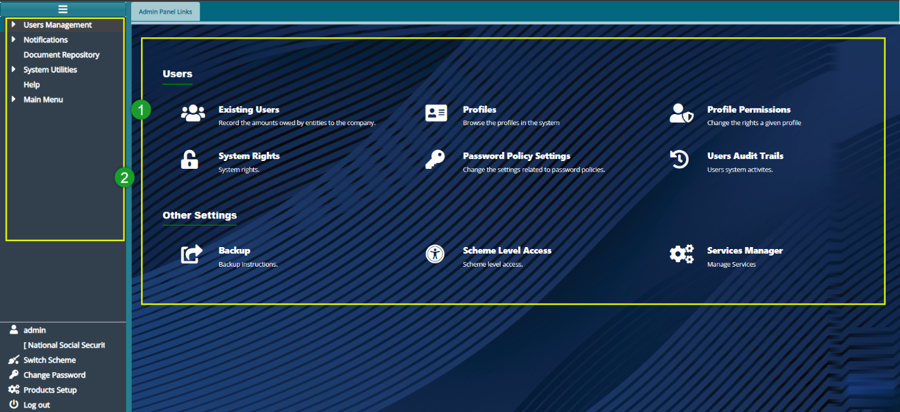

### Introduction to System Adninistration

The administrative panel facilitates the creation and management of system User Profiles and User Accounts. The system administrator is responsible for enabling system Rights and Permissions for specific User Profiles. To access the Administrative Panel, first navigate to the landing page and click on the **\'Administrative Panel\'** hot link.
This action will open the Admin Panel Links window as shown below:

  

**Actions**

-   Navigate to the section labelled 1 and click on the hot links to access shortcut routes to commonly visited links within the administrative panel module.

-   Access the section labelled 2 and click on the menu items listed to configure related settings, including notifications and the scheduler.

-   Locate the icon labelled 3 and click to open the FundMaster AI and prompt it to user your questions.

