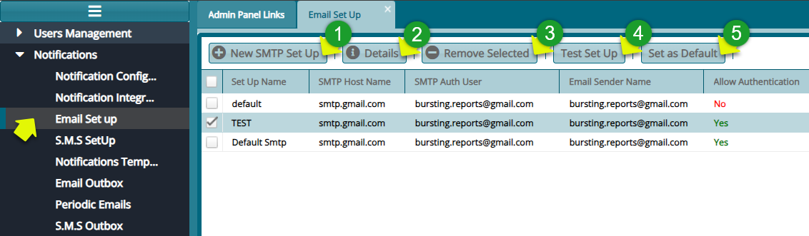

### Notifications

FundMaster employs an advanced notification system that facilitates communication both within the system and externally, utilizing emails, SMS, or a combination of both. This component empowers administrators to customize a notifications matrix, specifying which key system activities warrant notifications. Additionally, administrators can design email
templates to effectively communicate with the target audience, addressing various issues like password reset alerts among other configurations. See screenshot below:

  

### Notification Configuration Matrix

Click on the \'**Notifications Config Matrix\'** menu item to launch the **'Send Notifications Form'** allowing selection of key events and activities for which notification messages should be sent. See screenshot below:

  

**Action**

-   Check the box labeled 1 and choose either Yes or No to decide if you want to send a notification for a particular action.

-   Use the dropdown menu labeled 2 to pick Yes or No, indicating whether the configurations apply only to the current scheme or to all schemes set up in the system.

### Notification Integration

Click on the \'**Notifications Integration\'** menu item to launch the **'Notifications Services'** dialog box. Key in the right configuration details to connect to the notification micro service as shown in the screenshot below:

  

### Email SetUp

The Email Setup feature enables the configuration of different Simple Mail Transfer Protocols (SMTPs) to facilitate email communication within the system. The screenshot below provides a list of previously configured SMTPs:

  

**Action**

-   Click **label 1** button to configure a new SMTP set up.

-   Click **label 2** button to view the details of a selected Set Up record from the list.

-   Click **label 3** button to delete a selected record from the list.

-   Click **label 4** button to test a selected email set up.

-   Click **label 5** button to set a selected email set up as the default email set up.

### New SMTP Set UP

Clicking '**Email Set Up'** button labeled 1 will open a dialog box to configure email set up parameters as shown below:

  

### S.M.S Set Up

This setup feature allows for the configuration of SMS service providers, enabling the system to send and receive SMS messages. Refer to the screenshot below for details:

  

**Action**

-   Click **label 1** button to configure a new SMS Set Up.

-   Click **label 2** button to view the details of a selected SMS Set Up from the list.

-   Click **label 3** button to test a selected SMS Set Up.

-   Click **label 5** button to set a selected SMS Set Up as the default Set up.

-   Click **label 4** button to delete a selected SMS Set Up from the list.

### New SMS Set Up

Clicking on the **'New SMS Setup**' button labeled 1 opens an 'External API Details' dialog box for configuring a new SMS setup as shown in the screenshot below:

  

### Notifications Templates

The system provides the flexibility to customize notification templates. Simply click on the \'**Notifications Templates\'** menu item to access a grid table displaying all available templates, as illustrated in the
screenshot below:

  

**Action**

-   Click **label 1** button to add a new template.

-   Click **label 2** button to view the details of a selected template.

-   Click **label 3** button to delete a selected template from the system.

-   Click **label 4** text box to type key words to search for a template quickly.

-   Click **label 5** button to add an attachment to a template.

-   Click **label 6** button to view the details of a selected template from the list.

### New Notification Template

Click the '**New'** button to open a dialog box where a new email notification template can be configured as shown below:

  

**Tip**

-   Make use of reserved keywords.

### Add Notification Attachment

Click the '**Add Notification Attachment'** button to open the Attachment configuration dialog box where the attachment details are configured as shown below:

  

### Email Outbox

Click the **'Outbox'** link to open the outbox window where all outgoing email triggered from the system at the initiation of certain processes are listed as shown below:

  

**Action**

-   Click **label 1** button to view the details of a selected mail from the list.

-   Click **label 2** button resent a mail if it is marked as 'No' in the delivery column.

-   Click **label 3** text box and provide an email address to filter the records by email.

-   Click **label 4** text box and type the mail subject to filter records based of the mail subject.

-   Click **label 5** date filter and select a date to filter records by date.

-   Click **label 6** dropdown menu to filter mails on delivery status.

### Periodic Emails

  

### S.M.S Outbox

  