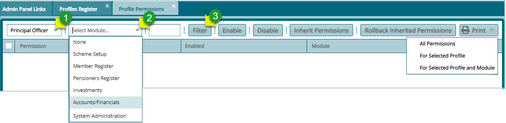
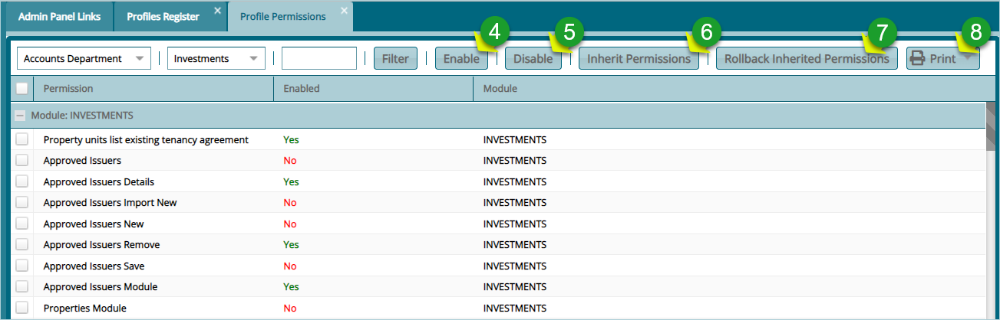

## Profile Permissions

Once a profile is created, the next step is to allow access to certain sub-functions in the system to a newly created profile. The permissions given enable the new profile to access system modules and rights to certain functions in an
individual module.

Clicking the **Profile Permissions** link will open the profiles permission grid table where permissions are assigned to profiles. The table provides drop-down menus to choose profiles and the modules whose permissions are to be assigned to
a profile among others as shown below:

 

**Action**

-   Click the list box **labelled 1** to display a drop-down list of Profiles and select a profile.

-   Click the list box **labelled 2** to display a drop-down list and select a Module.

-   Click the filter button **labelled 3** to populate a list of Permissions related to the Module selected.
  

### Enabling Permissions

After clicking the **Filter** button, a grid table listing all **Permissions** in a selected Module will be displayed. Select Permission from the list and click the **Enable** button to activate the sub-functions in that Profile. Otherwise, click the **Disable** button to deactivate a Permission. 

 

**Action**

-	Select a Permission from the list and click button **labelled 4** to activate it if it is labelled No in the Enabled column.

-	Select a Permission from the list and click button **labelled 5** to deactivate it if it is labelled Yes in the Enabled column.

-	Click the button **labelled 6** to inherit Permissions from another Profile.

-	Click the button **labelled 7** to undo the inherited process.

-	Select an option from the print drop-down menu **labelled 8** to view a print layout copy of Permission details.

## How to video

The following video shows how to create a user profile and enable/disable permissions: 

<video width="640" height="340" controls>
  <source src="../.vuepress/public/videos/users-profiles.mp4" type="video/mp4">
</video>