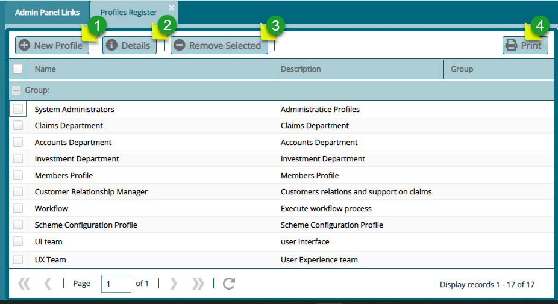
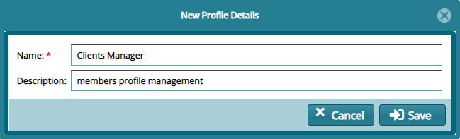

## Profiles Register

A profile denotes a group of users with specific privileges in the system. The system supports profiling of users and by default creates a **System Administrator Profile** from which other profiles are created. 

Profiles store specific users or groups of users with separate roles, e.g., management, pension administration, and others as will be demonstrated in this section.

Clicking the **Profiles** link will open the profile’s grid table where profiles created in the system to date are listed. A user can browse through the list, create a new profile, view details of a selected profile and remove a profile from the system as shown in the screenshot below:

 

**Action**

-   Click **label 1** button to add a new profile to the system.

-   Click **label 2** button to view the details of a selected profile.

-   Click **label 3** button to delete a selected profile from the system.

-   Click **label 4** button to save a copy of the profile register.
  

## Creating a New Profile

Clicking the **New Profile** tab will open a dialogue box. Through this, a new profile can be created by providing the profile name and a description as shown below:

 