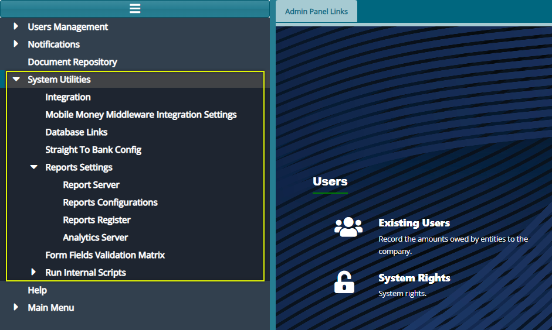
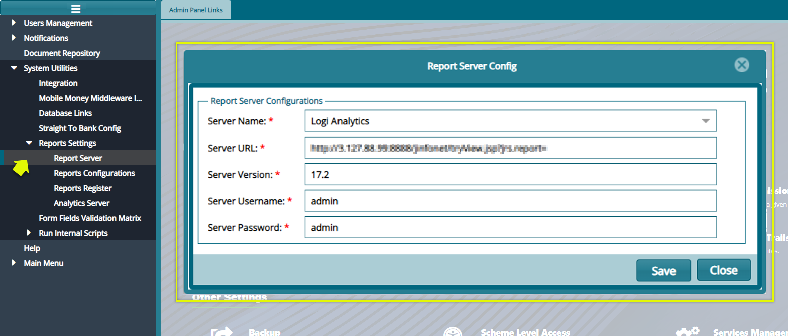
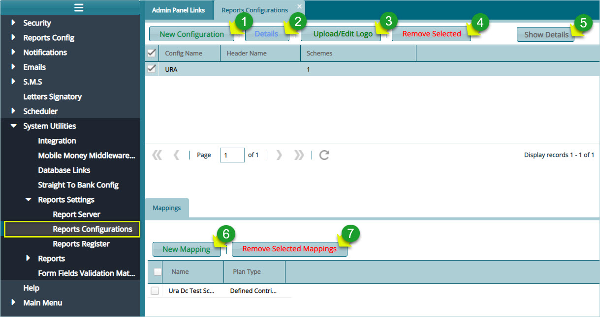
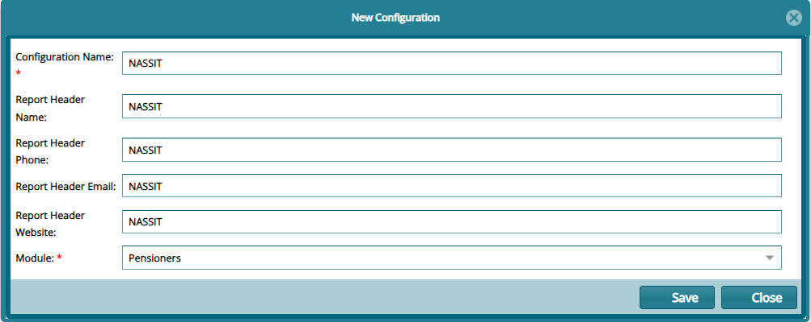
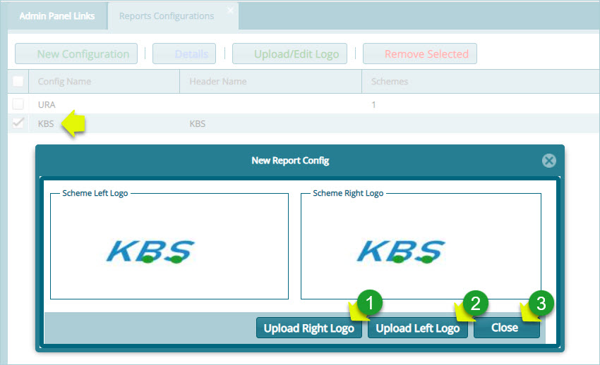
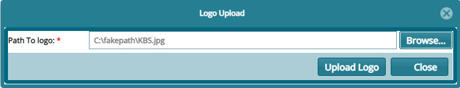
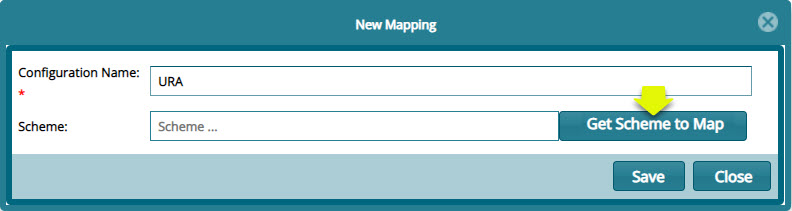
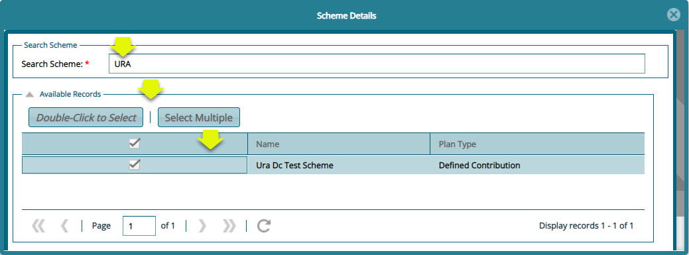
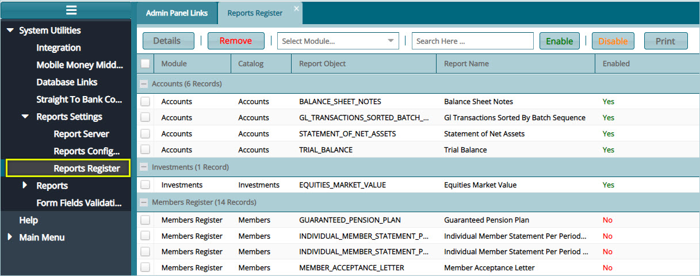
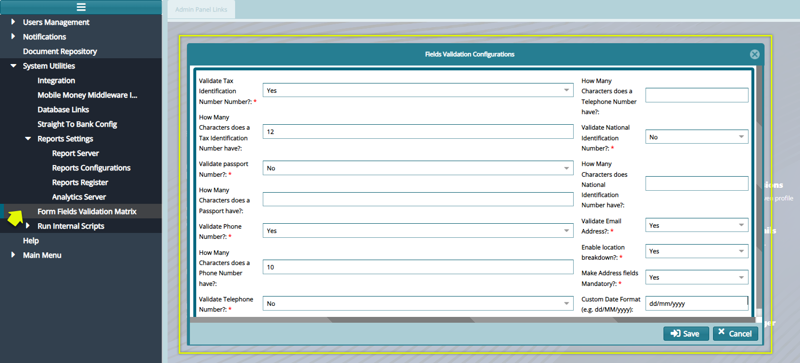

## System Utility 

System utility feature enables configurations related to FundMaster integration with other systems. To configure specific utilities, click the menu items to open configuration dialog boxes as shown below:

  

**Note:** system utility configurations are confidential settings and therefore has not been demonstrated using sample system screenshot.

## Integration

Click this link to open a dialog box to configure parameters related to FundMaster integration with other external systems.

### Mobile Money Middleware Integration Settings

Click this link to open a dialog box to configure parameters related to FundMaster integration with other various mobile money service providers.

### Database links

Click this link to open a dialog box to configure parameters related to connecting FundMaster to vender-based databases.

### Straight To Bank Config

Click this link to open a dialog box to configure IPAs related to FundMaster integration with partnering banking institution for money transactions.

## Report Settings

### Report Server

Click the '**Report Server'** menu item to open a Report Server Config dialog box to configure settings that enables FundMaster to connect to a report server as shown in the screenshot below:

  

### Reports Configurations

Click the '**Reports Configurations'** menu item to open a reports configurations dialog box to configure settings that enable a scheme to connect to a report server as shown in the screenshot below:

  

**Action**

-   Click **label 1** button to open a dialog box where a new configuration is done.

-   Click **label 2** button to view the details of a select report configuration.

-   Click **label 3** button to upload or edit logos that are used on the header of generated reports.

-   Click **label 4** button to remove selected configurations from the list.

-   Click **label 5** button to show the Mapping section on the lower side of the window where an individual scheme is mapped to a report configuration.

-   Click **label 6** button to create a new mapping: connect a scheme to the selected report configuration.

-   Click **label 7** button to remove a selected scheme mapping.

### New Configuration

Click the **'New Configuration'** button to open a dialog box where settings for a new report configuration are done as shown below:

  

### Uploading report logos

To upload logos for use in the system-generated reports, select the configuration whose reports need logos. Locate the list in the report's configuration window. Then click the **'Upload/Edit logo'** button to open a dialog box and upload the logos as shown below:

  

**Action**

-   Click **label 1** button to upload the logo that goes to the right side of the report's header.

-   Click **label 2** button to upload the logo that goes to the left side of the report's header.

-   Click **label 3** button to close the window after a successful upload.

Click either of the **'Upload'** buttons to open a Logo Upload dialog box through which a path to locate the logo from a user's device is provided. Click the **'Upload logo'** button to move the selected logo to the system as shown below:

  

### Mapping Scheme to a Configuration

To map a scheme to a specific report configuration, select the configuration you want to map a scheme to from the list of
configurations on the upper section of the window, then click the **'New Mapping'** button located in the lower section of the window to open a new mapping dialog box. Type the name of the new mapping and click the **'Get Scheme to Map'** button to map the scheme to the set report configuration as shown below:

  

Click the **'Get Scheme to Map'** button to open the scheme details window. Search for the scheme you want to map and click the Double-Click to Select button to select the scheme. You can also select multiple schemes by clicking the **'Select Multiple'** button as shown below:

  

### Reports Register

Click the **'Reports Register'** link to open the Reports Register window where a list of all report objects from the various module are listed. From this window a particular report can be selected and **'Enables'** or **'Disabled'** as shown in the screenshot below:

  

**Tip**

Select a report from the list and click the **'Enable'** button to have the report activated so that it can be generated. Otherwise Click **'Disable'** button means the report cannot be generated.

## Form Fields Validation Matrix

The Form Fields Validation Form enables the configurations of various fields validations in a form. See screenshot below:

  
