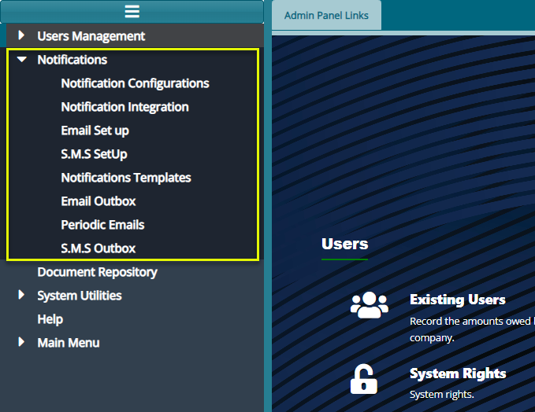

# Section 2: Administrative Panel

The administrative panel facilitates the creation and management of system User Profiles and User Accounts. The system administrator is responsible for enabling system Rights and Permissions for specific User Profiles. To access the Administrative Panel, first navigate to the landing page and click on the **\'Administrative Panel\'** hot link.
This action will open the Admin Panel Links window as shown below:

  

**Actions**

-   Navigate to the section labelled 1 and click on the hot links to access shortcut routes to commonly visited links within the administrative panel module.

-   Access the section labelled 2 and click on the menu items listed to configure related settings, including notifications and the scheduler.

-   Locate the icon labelled 3 and click to open the FundMaster AI and prompt it to user your questions.

## User Management

User accounts are individual accounts for system users, assigned to specific profiles that dictate permissions for accessing specific system functions.

### Users Register

To view current system users, navigate to the '**Users Register**' menu on the left side panel and click to open the \'**Existing Users**\' window as shown below:

  

This window displays a grid table listing all system users along with their specific details, as shown below:

  

**Actions**

-   Click the label 1 button to load a drop-down menu and initiate an operation-related process.

-   Click the label 2 button to load a drop-down menu and initiate an account control-related process.

-   Click the label 3 button to load a drop-down menu and initiate an authorization-related process.

-   Click the label 4 and type the name of user to quickly filter the records.

-   Click the label 5 and select a user profile from the drop-down menu to filter records and display only users under the specified user profile.

-   Click the label 6 button to view a print copy of the user's details.

-   Click the label 7 button to open a section on the lower side of the window, revealing various details of a selected user.

#### Operations

##### New User

To add a new user, find the \'**Operations**\' menu, and from the drop-down list, click \'**New User**' as shown below:

  

Clicking the '**New User**' will open '**User Details**' form where the details of the new user are captured. See the screenshot below:

  

**Action**

-   Click button labeled 1 to capture the details as typed.

-   Click button labeled 2 to attach the user's signature.

-   Click button labeled 3 to remove the current signature from the user's records.

-   Click button labeled 4 to exit the user details dialog box.

##### Users Details

To access adsditional details about a user\'s account, including user role, schemes, sponsors, modules, and member classes allowed for access, click '**Details**' from the Operations menu as shown below:

  

This action will open a lower section displaying comprehensive information about the selected user, as depicted below:

  

**Action**

-   Click button labeled 1 to view the scheme the user is allowed to access.

-   Click button labeled 2 to view the sponsors the user is allowed to access.

-   Click button labeled 3 to view the member classes the user is allowed to access.

-   Click button labeled 4 to view the modules the user is allowed to access.

-   Click button labeled 5 to view the roles the user is allowed to play.

###### Allowing Schemes Access to Users

To grant specific schemes access to a user profile, locate the '**Allowed Scheme**' tab, and click to reveal a table listing the user\'s current schemes. Click the '**Assign Schemes to User**' button to view all schemes available in the system, as depicted in the following screenshot:

  

**Action**

-   Click the button **labeled 1** to open a dialog box listing all available schemes from which new schemes can be selected and added to a user's account as to be shown in the following screenshot.

-   Click the button **labeled 2** to open a dialog box listing all available schemes from which new schemes can be selected and added to the profile category of the user.

-   Click the button **labeled 3** to remove select schemes from a user's assigned schemes.

###### Assigning Schemes to a User

Click the '**Assign Scheme to User'** tab to open a grid table listing all the schemes that can be added to a user account as shown below:

  

**Action**

-   Click the **label 1** button after typing a scheme name in the search box and selecting the Plan Type from the drop-down menu to quickly find a scheme from the list.

-   Click the checkboxes to select schemes, then click **label 2** button to allow a user access to the chosen schemes.

-   Click **label 3** button to provide a user access to all available schemes.

**Note:** To allow a user access to **Sponsors, Member Classes,** follow the steps taken to add schemes to a user as shown in the previous section.

###### Assigning Modules to a User

To assign specific modules to a user, click the **'Module Access'** tab to open a grid table column showing the modules that can be added to a user account as shown below:

  

Click **'Assign Module(s) to User'** to open a dialog box for selecting the modules to allow a user access. Select the modules and click 'Assign' to allow a user access as shown below:

  

### Profiles Register

User profiles representing distinct groups of users with specific privileges. A system Administrator profile is created by default and serves as a foundational template from which other profiles are derived.

To engage with profiles, click **Profiles Register'** and access the Profile Register window with a grid table listing the profiles created within the system as shown below:

  

**Action**

-   Click **label 1** button to create a new profile to the system.

-   Click **label 2** button to view the details of a selected profile.

-   Click **label 3** button to delete a selected profile from the system.

-   Click **label 4** button to initialize permissions for a profile.

#### New Profile

Click "**New Profile"** tab to open a dialog box. Through this, a new profile can be created by providing the profile name and a description as shown below:

  

### Reasons For Suspension

The **'Reason for Suspension Register'** window displays a list of reasons why system users can be suspended from using the system. New reasons for suspension can also be added as shown below:

  

**Action**

-   Click **label 1** button to add a new reason for suspension

-   Click **label 2** button to view the details of a selected record from the list

-   Click **label 3** button to delete a selected record from the list

#### New Reason for Suspension

Click the '**New Reason for Suspension'** button to open a dialog box. Through this, a reason for a member's suspension from using the system is recorded as shown below:

  

### System Rights

Click '**System Rights'** to open a window listing all the system rights grouped based on modules. A user can create a new system permission, view the details of a selected permission in the list, and remove one among other actions. See the screenshot below:

  

**Action**

-   Click **label 1** button to create a new system permission identifier

-   Click **label 2** button to view the details of a selected record from the list

-   Click **label 3** button to delete a selected record from the list

-   Click **label 4** button to filter records by key words typed on the adjacent text box

#### New Permission 

Click the **'New Permission'** button to open a dialog box. Through this, a new permission is created by providing details of the new permission as shown below:

  

### Profile Permissions

Once a system user profile is created, the next step is to allow access to specific system rights to a newly created profile. The permissions given enable a user profile access to certain system functionalities.

#### Step 1: Assigning Permissions to a user profile

To assign permissions to a profile, click the **'Profile Permissions'** menu to open the profiles permission window with a grid table where permissions are assigned to profiles. The table provides drop-down menus to choose profiles and the modules whose permissions are to be assigned to a profile among others as shown below:

  

**Action**

-   Click the list box **labelled 1** to display a drop-down list of User Profiles and select a profile.

-   Click the list box **labelled 2** to display a drop-down list and select a Module.

-   Click the filter button **labelled 3** to search for a record based on the name typed on the adjacent search box.

#### Step 2: Enabling Permissions

Select **'Permission'** from the list and click the **'Enable'** button to activate the permissions in that profile as shown below:

  

**Action**

-   Click to select Permission(s) from the list and click button **labelled 4** to activate. See records labelled **No**.

-   Click to select Permission(s) from the list and click button **labelled 5** to deactivate. See labelled **Yes**.

-   Click the button **labelled 6** to inherit Permissions from another user profile.

-   Click the button **labelled 7** to undo the inherit process.

-   Click to select an option from the print drop-down menu **labelled 8** to view a print layout copy of permission details.

### Password Policy Settings

Click **'Password Policy Settings'** to open a dialog box. Adjust the password policy settings based on the configuration provided below:

  

**Action**

-   Enter the required details into the form text fields and click the **'Proceed'** button to apply the policy changes. If you wish to discard the changes, click **'Cancel'** to exit the process.

### Current Sessions

Click on **'Current Sessions'** to open the respective window. Inside this window, you will find a list displaying all currently logged-in users, as illustrated in the screenshot below:

  

**Action**

-   Click the list box **labelled 1** to log out a selected user from the system.

-   Click on the date filters **labelled 2** to pick the start and end date to filter records.

-   Click the filter button **labelled 3** to filter records based on the set dates.

### Take Notes

Click on **'Take Notes'** to open the Notes window. Inside this window, you will find a list displaying all current notes written by various system users as shown in the screenshot below:

  

**Action**

-   Click **label 1** button to create a new note in the system.

-   Click **label 2** button to view the details of a selected Notes record from the list.

-   Click **label 3** button to delete a selected Notes record from the list.

-   Click **label 4** search box and type key words to filter records.

#### New Note

Click the **'New'** button to open a dialog box. Within this window, enter the details of the new Note as illustrated below:

  

### Audit Trail

Click **'Audit Trail**' to open the corresponding window. In this window, a list of all key activities within the system, attributed to active users, is generated, as shown in the screenshot below:

  

**Action**

-   Click on the **label 1** textbox to open a drop-down menu. Select the module (e.g., pensioners, accounts) to filter log records.

-   Click on the **label 2** textbox to open a drop-down menu. Select the type of operation (e.g., update, create, delete) to view logs for that specific operation.

-   Click on the **label 3** date fields and choose dates to filter records based on the selected time range.

-   Click on **the label 4** text field and enter keywords to filter logs in the list based on specific criteria.

-   Click on the **label 5** button to filter records according to the set parameters.

-   Click on the **label 6** button to repopulate the list after using the filter.

-   Click on the **label 7** button to view the details of a selected log record from the list.

-   Click on the **label 8** button to access links for printing audit reports and other operations.

## Notifications

FundMaster employs an advanced notification system that facilitates communication both within the system and externally, utilizing emails, SMS, or a combination of both. This component empowers administrators to customize a notifications matrix, specifying which key system activities warrant notifications. Additionally, administrators can design email
templates to effectively communicate with the target audience, addressing various issues like password reset alerts among other configurations. See screenshot below:

  

### Notification Configuration Matrix

Click on the \'**Notifications Config Matrix\'** menu item to launch the **'Send Notifications Form'** allowing selection of key events and activities for which notification messages should be sent. See screenshot below:

  

**Action**

-   Check the box labeled 1 and choose either Yes or No to decide if you want to send a notification for a particular action.

-   Use the dropdown menu labeled 2 to pick Yes or No, indicating whether the configurations apply only to the current scheme or to all schemes set up in the system.

### Notification Integration

Click on the \'**Notifications Integration\'** menu item to launch the **'Notifications Services'** dialog box. Key in the right configuration details to connect to the notification micro service as shown in the screenshot below:

  

### Email SetUp

The Email Setup feature enables the configuration of different Simple Mail Transfer Protocols (SMTPs) to facilitate email communication within the system. The screenshot below provides a list of previously configured SMTPs:

  

**Action**

-   Click **label 1** button to configure a new SMTP set up.

-   Click **label 2** button to view the details of a selected Set Up record from the list.

-   Click **label 3** button to delete a selected record from the list.

-   Click **label 4** button to test a selected email set up.

-   Click **label 5** button to set a selected email set up as the default email set up.

#### New SMTP Set UP

Clicking '**Email Set Up'** button labeled 1 will open a dialog box to configure email set up parameters as shown below:

  

### S.M.S Set Up

This setup feature allows for the configuration of SMS service
providers, enabling the system to send and receive SMS messages. Refer
to the screenshot below for details:

{width="6.268055555555556in"
height="1.8493055555555555in"}

{width="0.2952296587926509in"
height="0.2952296587926509in"}**Action**

-   Click **label 1** button to configure a new SMS Set Up

-   Click **label 2** button to view the details of a selected SMS Set
    > Up from the list

-   Click **label 3** button to test a selected SMS Set Up

-   Click **label 5** button to set a selected SMS Set Up as the default
    > Set Pp

-   Click **label 4** button to delete a selected SMS Set Up from the
    > list

#### New SMS Set Up

Clicking on the **\'New SMS Setup**\' button labeled 1 opens an
\'External API Details\' dialog box for configuring a new SMS setup as
shown in the screenshot below:

{width="6.00462489063867in"
height="2.1388057742782154in"}

### Notifications Templates

The system provides the flexibility to customize notification templates.
Simply click on the \'**Notifications Templates\'** menu item to access
a grid table displaying all available templates, as illustrated in the
screenshot below:

{width="6.268055555555556in"
height="1.5763888888888888in"}

{width="0.2952296587926509in"
height="0.2952296587926509in"}**Action**

-   Click **label 1** button to add a new template.

-   Click **label 2** button to view the details of a selected template.

-   Click **label 3** button to delete a selected template from the
    > system.

-   Click **label 4** text box to type key words to search for a
    > template quickly.

-   Click **label 5** button to add an attachment to a template

-   Click **label 6** button to view the details of a selected template
    > from the list.

#### New Notification Template

Click the '**New'** button to open a dialog box where a new email
notification template can be configured as shown below:

{width="5.989130577427821in"
height="3.5652121609798777in"}

**Tip**

-   Make use of reserved keywords.

#### Add Notification Attachment

Click the '**Add Notification Attachment'** button to open the
Attachment configuration dialog box where the attachment details are
configured as shown below:

{width="5.913343175853019in"
height="1.5015923009623797in"}

### Email Outbox

Click the **'Outbox'** link to open the outbox window where all outgoing
email triggered from the system at the initiation of certain processes
are listed as shown below:

{width="6.268055555555556in"
height="2.3680555555555554in"}

{width="0.2952296587926509in"
height="0.2952296587926509in"}**Action**

-   Click **label 1** button to view the details of a selected mail from
    > the list.

-   Click **label 2** button resent a mail if it is marked as 'No' in
    > the delivery column.

-   Click **label 3** text box and provide an email address to filter
    > the records by email.

-   Click **label 4** text box and type the mail subject to filter
    > records based of the mail subject.

-   Click **label 5** date filter and select a date to filter records by
    > date.

-   Click **label 6** dropdown menu to filter mails on delivery status.

### Periodic Emails

{width="6.268055555555556in"
height="2.1645833333333333in"}

### S.M.S Outbox

{width="6.268055555555556in"
height="1.9361111111111111in"}

## System Utility 

System utility feature enables configurations related to FundMaster
integration with other systems. To configure specific utilities, click
the menu items to open configuration dialog boxes as shown below:

{width="4.506626202974628in"
height="2.7011800087489064in"}

**Note:** system utility configurations are confidential settings and
therefore has not been demonstrated using sample system screenshot.

### Integration

Click this link to open a dialog box to configure parameters related to
FundMaster integration with other external systems.

### Mobile Money Middleware Integration Settings

Click this link to open a dialog box to configure parameters related to
FundMaster integration with other various mobile money service
providers.

### Database links

Click this link to open a dialog box to configure parameters related to
connecting FundMaster to vender-based databases.

### Straight To Bank Config

Click this link to open a dialog box to configure IPAs related to
FundMaster integration with partnering banking institution for money
transactions.

### Report Settings

#### Report Server

Click the '**Report Server'** menu item to open a Report Server Config
dialog box to configure settings that enables FundMaster to connect to a
report server as shown in the screenshot below:

{width="6.268055555555556in"
height="2.6805555555555554in"}

#### Reports Configurations

Click the '**Reports Configurations'** menu item to open a reports
configurations dialog box to configure settings that enable a scheme to
connect to a report server as shown in the screenshot below:

{width="6.268055555555556in"
height="3.321527777777778in"}

{width="0.2952296587926509in"
height="0.2952296587926509in"}**Action**

-   Click **label 1** button to open a dialog box where a new
    > configuration is done.

-   Click **label 2** button to view the details of a select report
    > configuration.

-   Click **label 3** button to upload or edit logos that are used on
    > the header of generated reports.

-   Click **label 4** button to remove selected configurations from the
    > list.

-   Click **label 5** button to show the Mapping section on the lower
    > side of the window where an individual scheme is mapped to a
    > report configuration.

-   Click **label 6** button to create a new mapping: connect a scheme
    > to the selected report configuration.

-   Click **label 7** button to remove a selected scheme mapping.

#### 

#### New Configuration

Click the **'New Configuration'** button to open a dialog box where
settings for a new report configuration are done as shown below:

{width="6.268055555555556in"
height="2.527083333333333in"}

#### Uploading report logos

To upload logos for use in the system-generated reports, select the
configuration whose reports need logos. Locate the list in the report's
configuration window. Then click the **'Upload/Edit logo'** button to
open a dialog box and upload the logos as shown below:

{width="5.363888888888889in"
height="3.269083552055993in"}

{width="0.2952296587926509in"
height="0.2952296587926509in"}**Action**

-   Click **label 1** button to upload the logo that goes to the right
    > side of the report's header.

-   Click **label 2** button to upload the logo that goes to the left
    > side of the report's header.

-   Click **label 3** button to close the window after a successful
    > upload.

Click either of the **'Upload'** buttons to open a Logo Upload dialog
box through which a path to locate the logo from a user's device is
provided. Click the **'Upload logo'** button to move the selected logo
to the system as shown below:

{width="5.566666666666666in"
height="1.0762226596675415in"}

#### Mapping Scheme to a Configuration

To map a scheme to a specific report configuration, select the
configuration you want to map a scheme to from the list of
configurations on the upper section of the window, then click the **'New
Mapping'** button located in the lower section of the window to open a
new mapping dialog box. Type the name of the new mapping and click the
**'Get Scheme to Map'** button to map the scheme to the set report
configuration as shown below:

{width="5.591666666666667in"
height="1.4899136045494312in"}

**\
**Click the **'Get Scheme to Map'** button to open the scheme details
window. Search for the scheme you want to map and click the Double-Click
to Select button to select the scheme. You can also select multiple
schemes by clicking the **'Select Multiple'** button as shown below:

{width="6.505780839895013in"
height="2.411017060367454in"}

### Reports Register

Click the **'Reports Register'** link to open the Reports Register
window where a list of all report objects from the various module are
listed. From this window a particular report can be selected and
**'Enables'** or **'Disabled'** as shown in the screenshot below:

{width="6.268055555555556in"
height="2.4722222222222223in"}

**Tip**

Select a report from the list and click the **'Enable'** button to have
the report activated so that it can be generated. Otherwise Click
**'Disable'** button means the report cannot be generated.

### Form Fields Validation Matrix

The Form Fields Validation Form enables the configurations of various
fields validations in a form. See screenshot below:

{width="6.268055555555556in"
height="2.8465277777777778in"}
