### Claim Initialization and Processing

Before Claim Initialization for any member confirm if the member bank details are provided. Here are the steps to follow:

**Step 1: First Confirm a Member's Bank Details**

  -   Open the **"Member Register"**

  -   On the register that opens **"Sponsor Register".** Shows the list of employers in the scheme and members can be viewed by **Double Clicking** on the Sponsor.

  -   Search and select for the member to be processed.

  -   Show additional member Details by clicking on the expert links on your right and then "**Show Details"** on the dialog that pops up.

  -   Locate the **"Bank Details"** Tab.

  -   If member has no bank details click on **"Add"**

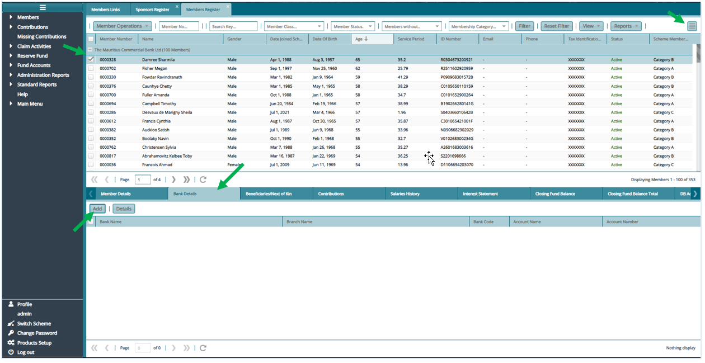

 -   On the window that opens, input the member bank details and **"Save"**

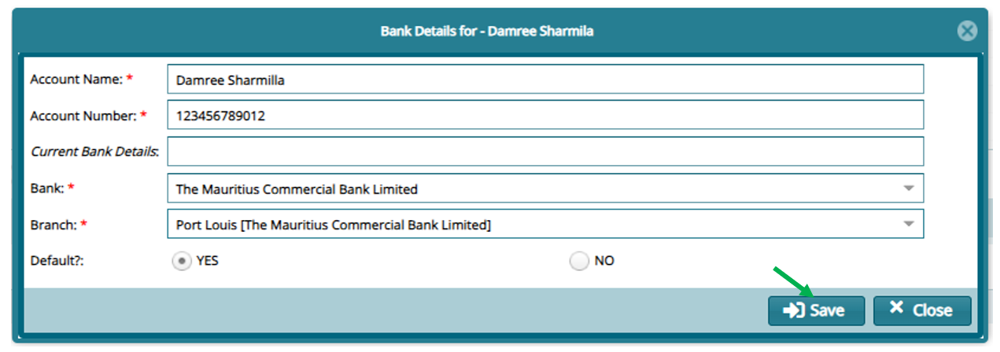

**Step 2: Approve Change in Memebr's Bank Details** 

On addition or change of bank details, Proceed to **"Registers"** and then on **"Member Items for Approval"**

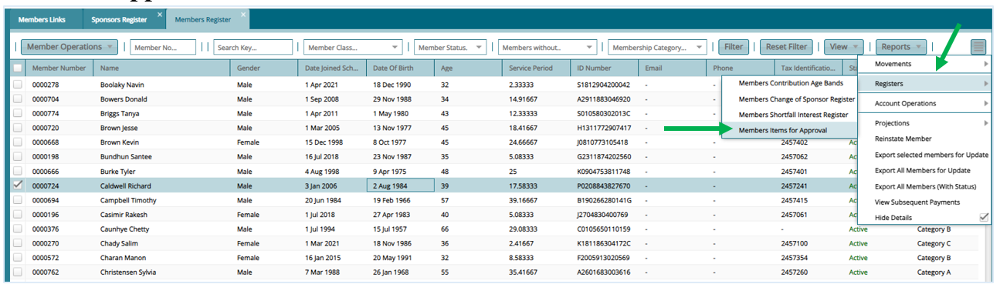

-   From The Register that opens: Select the record and proceed to do certification

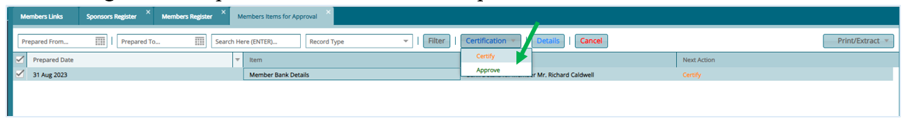

**Step 3:  Initiate a Member's Claim for Processing**

To initiate the claim for a member - Active (apart from a death claim)**

a.  Click on the expert links on your right. Then click on **"Movements"** then **"Initiate Movement/Claim"**

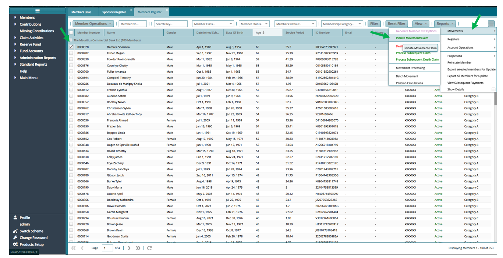

For Deferred Members:

-   Click on the expert links on your right. Then click on **"Movements"** then **"Process Subsequent Claim"** apart for Death claim.

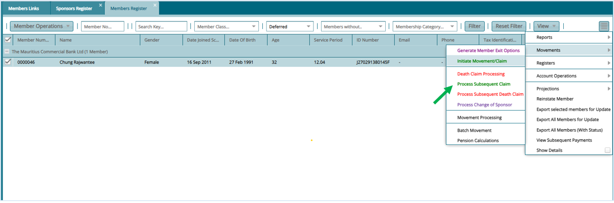

b.  On the Window that opens input the required information and **"Save"**

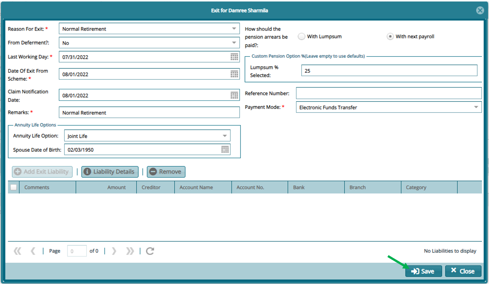

*Notice that the change of the member status upon save*

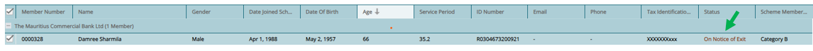

**Step 4: Initate Movement Processing**

Proceed to the **"Movement Processing"** register to process the claim for the member**

-   This register can be accessed from either the hotlinks or can also be accessed from the left panel **"Claim Activities"** then **"Movement Processing"**

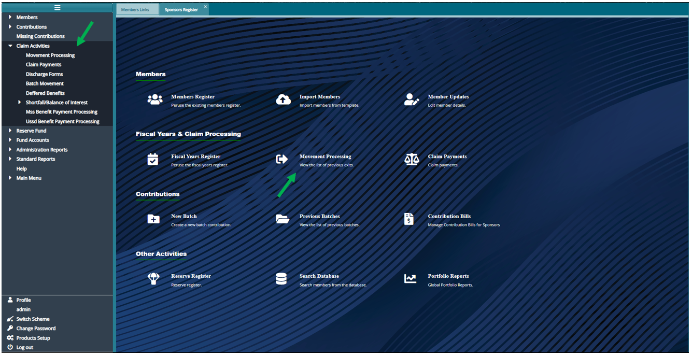

-   Or from the **"Members Register"**

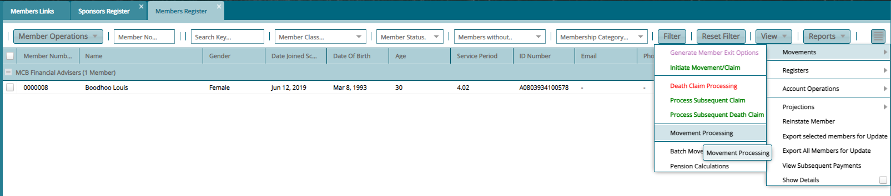

From the register that opens **"Movement Processing",** all claims will be listed here, and you can proceed to view details or do calculation for a selected claim.

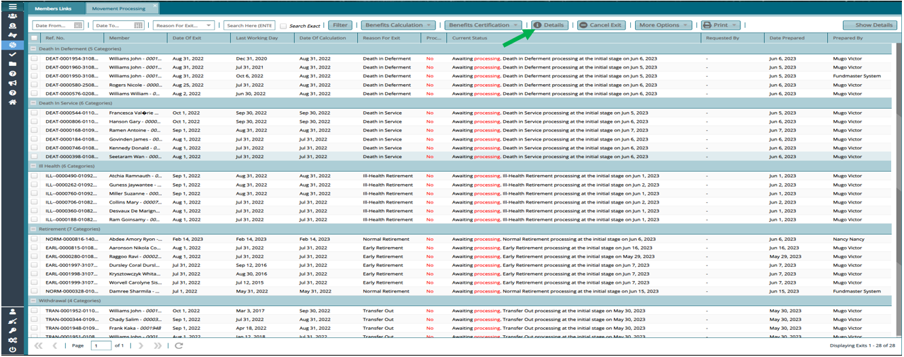

**Step 5: Process Claim Benefits**

 To calculate a claim, select on the claim you wish to calculate double click to show calculation or click on **"Benefit Calculation"** then **"Show Benefit Calculation"**

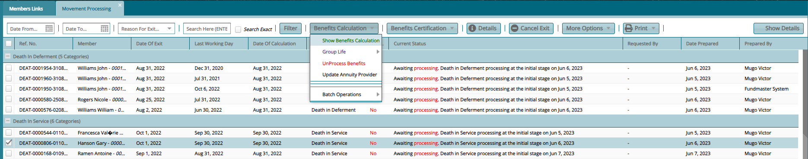

**Step 6: Verify Benefit Calculation** 

Scroll to verify calculation and if the calculation is correct click on **"Proceed Now"**

 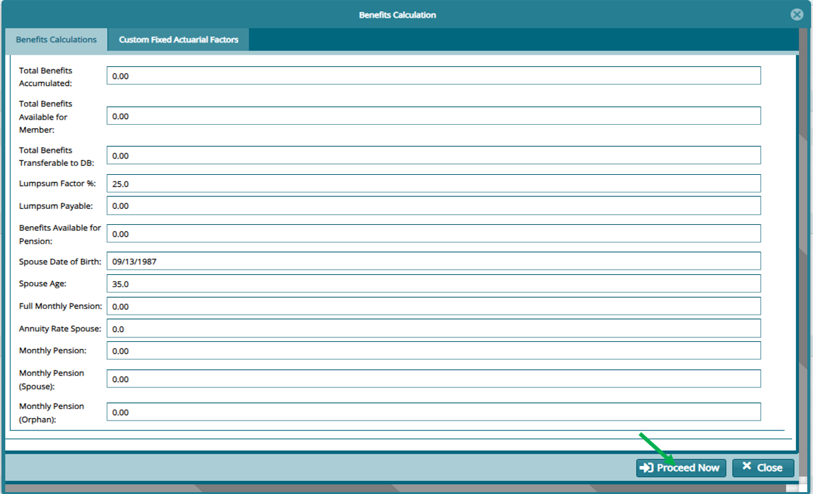

 
 If the calculations require any custom factors click on the **"Custom Fixed Actuarial Factors"**. Click on **"New Custom Actuarial Factor"** to add the factor. Close the calculation window and double click on it to recalculate.

 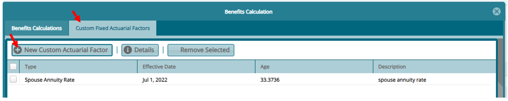

 Notice the change of status on calculated claim

 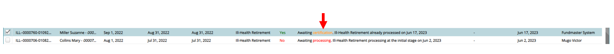

**Step 7: Certify and Authorize a Claim**

Last step is to Certify and Authorize this claim

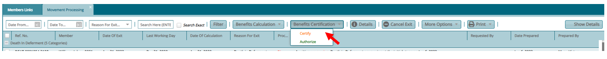

**Step 8: Process Claim in Batch**

For Batch Exits:

i. Open the **"Member Register"**

ii. On the register that opens **"Sponsor Register".** Shows the list of employers in the scheme and members can be viewed by **Double Clicking** on the Sponsor.

iii. Search and select for the member to be processed.

iv. Show additional member Details by clicking on the expert links on your right and then **"Movements"** and then **"Batch Movement"** on the dialog that pops up.

v. Or under Claim Activities on the left pane, Click on Batch Movement

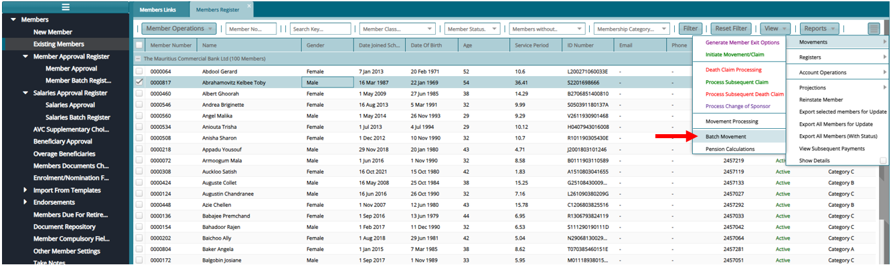

vi.   Download the latest template

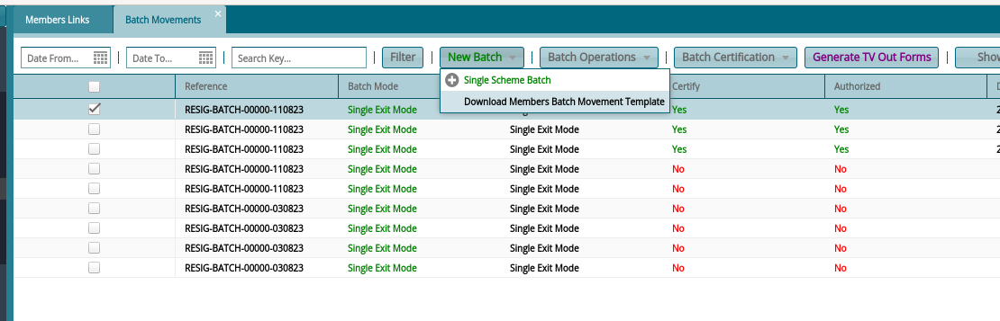

-   Prepare the template based on the reason of exit

-   Import the template under New Batch \>\> Single Scheme Batch

-   After a successful import, Process certification under Batch Certification \>\> Certify \>\> Authorize

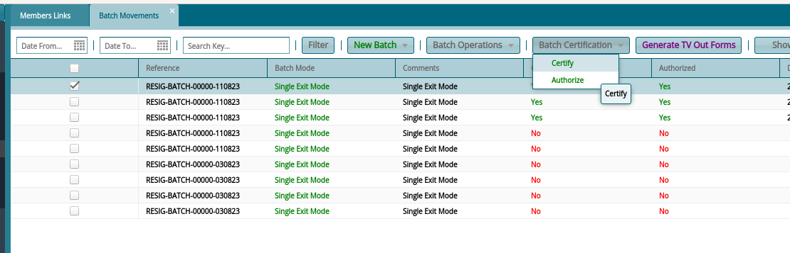

After this step, you may proceed to the movement processing register as shown above (step 3- 6 above).

**Step 9: Death Claim Initialization**

  For Death Claim Initialization: Click on the expert links on your right. Then click on **"Movements"**

-   For active members -- **"Death Claim Processing"**

-   For Deferred - **"Process Subsequent Death Claim"**

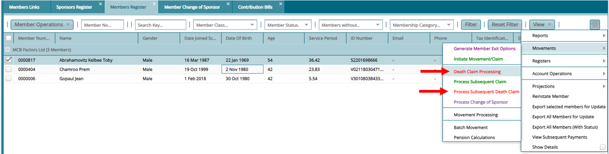

On the Window that opens input the information required and click on save. Proceed to **"Movement Processing"** to do the actual calculation as in the steps above.

**Step 10: Add memebr Beneficiaries**

-   click on **"Benefit Calculation"** then **"Show Benefit Calculation"**

-   On the Window that opens click on the beneficiaries' tab and then on **New Beneficiary**

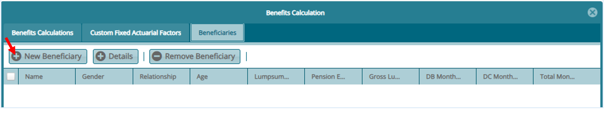