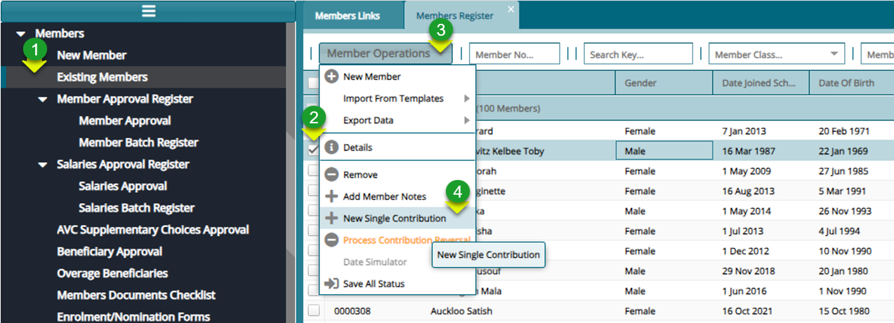
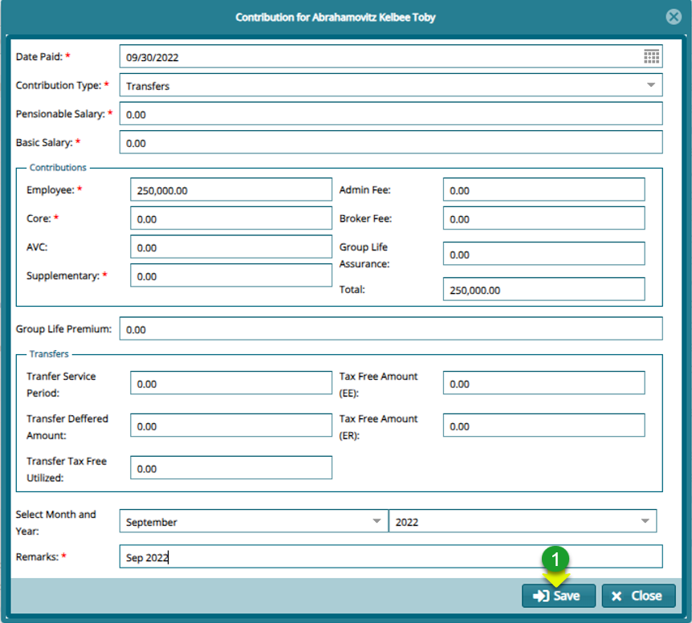
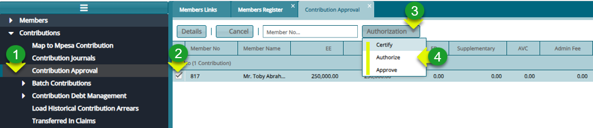
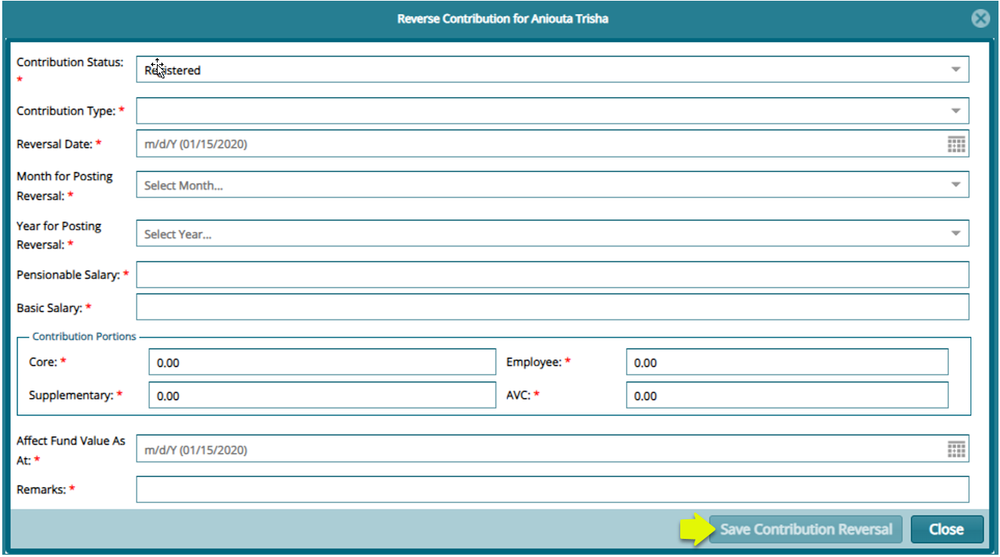

### Adding Single Contribution

**Step 1: Navigate to the Members Single Contributions Form**

**Action**

1.  Click "**Existing Members**" menu to open Members register

2.  Click the "**Check Box**" to select a member from the list

3.  Click **"Batch Operation**" menu to open drop-down menu

4.  Click "**New Single Contribution**" to load the contributions dialog form

**Step 2: Navigate to the Members Single Contributions Form**

**Action**

1.  Click on "**Mandatory text fields**" to provide needed information

2.  Click on "**Save**" button to complete the process

**Step 3: Authorizing the Single Contribution**

**Action**

1.  Click on "**Contribution Approval"** menu on the left pane

2.  Click on "**Check Box**" to select a member contribution record from the list

3.  Click on" **Authorization"** menu to open a drop-down menu

4.  Click on "**Certify, Authorize** and **Approve**"

**Step 4: Authorizing the Single Contribution**

**Action**

1.  Click on "**Post**" button

:memo:**Note**: On approval the contribution will be posted to the member account.

**Step 5: For Contribution Reversal**

**Action**

1.  On the members register, search, and click to select the member to add contribution for

2.  Click on **"Member Operations"** menu and on the drop-down, click **"Process Contribution Reversal"**

3.  Fill in the mandatory fields on the reverse form

4.  Click **"Save Contribution Reversal"** to commit changes

5.  Proceed to contribution approval and approve window