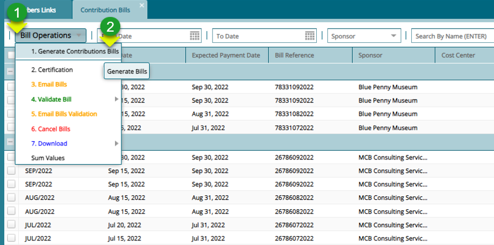

### Contribution Billing

### Pre-Requisite

Before preparing the contribution bill for any month, confirm that the following have been don:

-   New Members have been Uploaded and Process the member Contribution age bands

-   Movements for the previous month have been processed (Exits and Transfers)

-   Cash Supp configs for new members have been done and confirm for the members who have made new selections for their rates

-   Upload the Member salaries for the month

### Billing process for the month

**Step 1: Navigate to the contribution billing window**

**Actions**

1.  Click on the **"Contributions"** menu to load a drop-down menu

2.  Click on the **"Contribution Receivables/Receipts"** menu

3.  Click **"Contribution Billing"**

**Step 2: See all generated bills categorized by employer**

**Step 3: Navigate to the new bill details form**

**Actions**

1.  Click on **"Bill Operations"** to load a drop-down menu

2.  Click **"Generate Contribution Bills"** to open the billing details form

**Step 4: Process a new bill**

**Actions**

1.  Click on **"Update Member Salaries"** for the process to use the latest salaries that have been uploaded

2.  Click on **"Run Contributions Billing"**

**Note:** Specify if the bill generation is for all the schemes (Bills for all Schemes?) and if the bill is for all sponsors (Bill for all Sponsors? If NO select the Sponsor that you wish to generate the bill for)

In case of any exceptions, the process will fail, and the exceptions will be listed in the window as shown below:

**Note:** Correct the listed Exceptions accordingly and rerun until the process is successful for the given month.

**Step 5: Authorize the newly created contribution bill**

**Action**

1.  Click to select a batch file from the list

2.  Click **"Bill Operations**" menu to open drop-down menu

3.  Click "**Certification**" from the drop-down menu

4.  Click "**Certify** and **Approve**" respectively to authorize the bill

**Step 6: Validate the authorized bill**

**Action**

1.  Click to select a batch file from the list

2.  Click **"Bill Operations**" menu to open drop-down menu

3.  Click "**Validate Bill**" from the drop-down menu

4.  Click "**Import Bill Validation"**

5.  Click **"Perform Discretional Validation"**

**Step 7: Download Contribution Bills**

**Action**

1.  Click to select a contribution bill record from the list

2.  Click **"Download**" menu to open drop-down menu

3.  Click "**Generated Bill**" or other options from the drop-down menu

**Step 8: Convert the Bill to Contribution Batches**

**Action**

1.  Click to select a contribution bill record from the list

2.  Click **"Posting**" menu to open drop-down menu

3.  Click "**Convert Contribution Schedule to Batch**" from the drop-down menu

**Step 9: Navigate to Previous Batches**

**Action**

1.  Click on the "**Previous Batches**" hotlink on the Members link window

**Note:** Clicking the "**Previous Batches"** link will open the Batch Contributions Register

**Step 10: Confirm Batch exception before posting to members**

**Action**

1.  Click to select a contribution batch record from the list

2.  Click **"Batch Operation**" menu to open drop-down menu

3.  Click "**Confirmations**" from to open a drop-down menu

4.  Click "**Confirm All Exceptions**"

**Step 11: Authorize batch before posting**

**Action**

1.  Click **"Batch Operation**" menu to open drop-down menu

2.  Click "**Certifications**" from to open a drop-down menu

3.  Click "**Certify** and **Approve**" Respectively

**Step 12: Post the Contributions to Member Accounts**

**Action**

1.  Click to select a contribution batch record from the list

2.  Click **"Batch Operation**" menu to open drop-down menu

3.  Click "**Posting to Members**" from to open a drop-down menu

4.  Click "**Post Contributions**" to post contributions to individual member accounts

