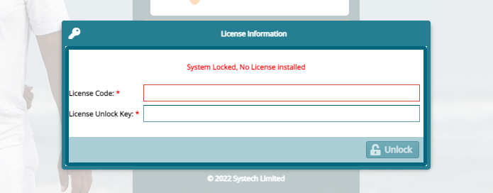

### Installation Guide


## 1. Introduction

The guide details the prior requirements and deployment process for FundMaster Xe (and its peripherals - Member Self-Service portal (MSS) and Unstructured Supplementary Service Data (USSD)) on servers. If executed correctly, the instructions herein will lead to successful installation of FundMaster on the oracle database.

Please follow this link: <https://systechafrica.github.io/#/> to access the System documentation and read more on the FundMaster core system.


## 2. Software Prerequisites

Before deploying FundMaster and its peripherals, the system requirements must be met:
-   For Server required specification, refer to the [server and software requirements (on premise and on clouds
    hosting)bdocument](https://docs.google.com/document/d/1zGpBqDdy2Hp2P5gWXAyh2H0yGtdGg-DRjNpU3shHUPo/edit)
    for the detailed requisite environment specification.
-   Note that FundMaster supports all types of base Operating Systems including Windows, Linux, and macOS. But in this document, we have used Linux as the base OS.


## 3. Deployment Expertise

For successful deployment of the system and running of all server-side operations, the personnel ought to have the following minimum qualifications:

-   Qualified System Admins.

-   Proven mastery of Linux command line.

-   Qualified Database Administrators.
  

### Follow these steps to deploy FundMaster Xe on Oracle

### *i.  Install jdk preferred version and Maven*

As at the date of writing this guide, the most stable version to run Xe is jdk 11.

To install JDK on Linux, visit the [oracle official website](https://www.oracle.com/java/technologies/downloads/) and download jdk 11. The downloaded zipped file must in a specified directory and pointed to the right path, as demonstrated in the following link: [Step-by-step installation of Java on RPM based Linux system.](https://docs.oracle.com/en/java/javase/11/install/installation-jdk-linux-platforms.html)

To install Maven on Linux/Unix, visit the [Apache Maven official website](https://maven.apache.org/) and download the latest version of Maven binary tar.gz file. Extract the archive to the folder you want to use Maven in.

Open the terminal and run the following commands to set the environment variables; for example, if *apache-maven-3.3.9-bin.tar.gz* file was downloaded, the commands would be:

````bash
    export M2_HOME=/usr/local/apache-maven/apache-maven-3.3.9

    export M2=＄M2_HOME/bin

    export MAVEN_OPTS=-Xms256m -Xmx512m

    export PATH=＄M2:＄PATH
````

### *ii. Install intellij Ultimate*

After a successful installation of Java, see previous step, visit [jetbrain.com](https://www.jetbrains.com/help/idea/installation-guide.html#98d0a3d8) to learn how to install ultimate version. Note that this version of intellij is premium, and therefore the activation key is needed. Contact your administrator for more details.


### *iii. Install Oracle database*

There are many resources online that can help in the installation of Oracle databases. This guide is for Linux/Mac users, although there are similarities with Windows users. The article [Install Oracle 19C on Centos8](https://www.centlinux.com/2020/04/install-oracle-database-19c-on-centos-8.html) provides clear step-by-step instructions on how to install oracle successfully.


### *iv. Install & Configure wildfly*

> ``` To be filled by John Oenga ```


### *v. Clone Backend (Xe) and Frontend(extjs)*

Go to your working directory and clone xe and extjs:

````bash
    git clone \<xe-repository url\> 

    git clone  \<xe-url\>
````

### *vi. Install Sencha and configure Extjs*

Visit Sencha support official site (provide link) and login with Systech's provided details.

Download Sencha CMD and extjs framework. As at the time of writing this document, Xe uses SenchaCMD-7.6.0 and extjs-7.5.1. Assuming you are on Linux, unzip the Sencha CMD and run the resulting installer script. Follow the setup wizard to install sencha.

Type sencha command, to see an output starting with "Sencha....". If however you get "command not found" error, take the installation path,and add to \$PATH manually:


### *Install Sencha and configure Extjs*

````bash
    vim .bashrc file using vim/vi/gedit
    export PATH="/home/<your user>/bin/Sencha/Cmd:$PATH"
    source .bashrc
    Unzip the ext-framework (in our case ext-7.5.1) 
    cd <your-extjs project> 
    sencha app install <the path to your ext framework>
````

Done. You can now build your project. Run the following command:

### Deploy FundMaster

````bash
    cd <your-wildfly-server>/bin
    sh standalone.sh (starts the wildfly app server)
    cd /<your-xe-project>
    mvn clean compile package wildfly:deploy; or
    mvn clean compile package
    cp xe/target/Xe.war /<your-wildfly>/standalone/deployments
````

**NB:** To compile Ext-7, run the following steps in building, then redeploying the application.

````bash
    cd <Your-ext-project>
    sencha app build production
    cd to /your-extjs-project/build/production/<your project>
````

copy all the contents in the folder to the java backend. For example, in the case of xe, copy all the extjs content to \<your project\>/src/main/webapp.

Note: Remove all the previous contents from the web app except the WEB-INF/ folder.

Rebuild and redeploy your project.

````bash
    mvn clean compile package
    cd <your-project>/target
    cp xe/target/Xe.war /<your-wildfly>/standalone/deployments
````

### Follow these steps to deploy FundMaster Xe on Postgress

 ### *Install Postgres  version >= 12.6*
 ````bash
  psql -V 
````
### *Confirm version installed*


### Find newest guide on postgres official site

````bash
    sudo dnf install -y https://download.postgresql.org/pub/repos/yum/reporpms/F-37-x86_64/pgdg-fedora-repo-latest.noarch.rpm
    sudo dnf install -y postgresql15-server
    sudo /usr/pgsql-15/bin/postgresql-15-setup initdb
    sudo systemctl enable postgresql-15
    sudo systemctl start postgresql-15
````

````blockquote

    Now cd /var/lib/pgsql/15/data/
    edit pg_hba.conf
    from  
    local   all             all                                     peer
    host    all             all             0.0.0.0/0                   scram-sha-256
    To
    local   all             all                                     trust
    host    all             all             0.0.0.0/0                   trust
````

### Edit postgresql.conf

### *Find and uncomment line #listen_addresses = 'localhost' and edit to*

````
       listen_addresses = '*'
       Uncomment also:
       #port = 5432
       #password_encryption = scram-sha-256     # scram-sha-256 or md5
````

### *Exit from root and restart the service*

````
    sudo systemctl restart postgresql-15.service

````

### *Login to postgres*

````
    psql -U postgres
    run command:
    alter user postgres with password 'YOURPASSWORD';
````

### *Exit from postgres session*
   
````
    Now cd /var/lib/pgsql/15/data/
    edit pg_hba.comf
    from
    local   all             all                                     trust
    host    all             all             0.0.0.0/0                   trust
    To
    local   all             all                                     scram-sha-256
    host    all             all             0.0.0.0/0                   scram-sha-256

````
   
### *Exit from root and restart the service:*

````
    sudo systemctl restart postgresql-15.service
````

### login to Postgres using 'YOURPASSWORD'

### *Install Wildfly  version >= 18.0 Final*

### *Configure Datasource & Setup Driver*

````xml
 <datasource jndi-name="java:jboss/datasources/PostgresXe" pool-name="PostgresXe" enabled="true" use-java-context="true">
                    <connection-url>jdbc:postgresql://localhost:5432/fm</connection-url>
                    <driver>postgresql</driver>
                    <security>
                        <user-name>postgres</user-name>
                        <password>postgres</password>
                    </security>
                </datasource>
````

** NB: Replace above with your database name and connection credentials. Use [fm] as database name for smooth run**

### *Run or Deploy Xe*

````bash
git checkout xe-postgres
mvn clean compile wildfly:deploy
````

### *Confirm Creation of Tables*

````bash
 psql -U your_postgres_user
 #Enter Your password
 \l #show databases
 \c your_db #switch to db
 \dt #show tables
 \q #Quit
````

### *Create These Tables*

```SQL
create domain clob as text;

create table USERS_SCHEMES
(
    USERS_ID          bigint not null
        constraint FKI664IMXO4SPEB8J43W9RUKF1S
            references USERS,
    ALLOWEDSCHEMES_ID bigint not null
        constraint FKMQV6UDXD3PCOR5T8U6X8DBNX2
            references SCHEMES
);

create table USERS_MEMBER_CLASSES
(
    USERS_ID
        bigint
        not
            null
        constraint
            FK9TGKRTT6A6RH2FHRHBQU0EX0V
            references
                USERS,
    MEMBERCLASSES_ID
        bigint
        not
            null
        constraint
            FKM6XCAGUW6K14CQ9BHUG1DNOPV
            references
                MEMBER_CLASSES
);

create table USERS_SPONSORS
(
    USERS_ID
        bigint
        not
            null
        constraint
            FKT3JSM9FJL7S6UWOMIO41YD0BV
            references
                USERS,
    ALLOWEDSPONSORS_ID
        bigint
        not
            null
        constraint
            FKK7GMGB78K7MSQ912GKO8UIBVU
            references
                SPONSORS
);

```

### Import Functions and Procedures and Views

````bash
# locate routines_64.sql and views_349.sql in ../resources/pg_scripts/ in project folder
 psql -U your_postgres_user
 # Enter Your password
 \l # show databases
 # You may require to run this next two steps severally to ensure all views and routines are created
 \c your_db # switch to db
 \i path_to_routines_64.sql # import routines, repeat until no errors
 \i path_to_views_349.sql # import views,  repeat till no errors
 \df #confirm routines
 \dv #confirm views
 \q # Quit
````

All set, now continue the normal setup of Xe.


### ORACLE - POSTGRES MIGRATION

### *Target*
````
To have Fundmaster XE run on PostgreSQL Database 
````
### *Why*
````
    1.Cost: Oracle license costs, using Oracle databases incurs additional costs for features like partitioning and high availability, and expenses can add up quickly. Open-source PostgreSQL is free to install and use.
    2.Flexibility: PostgreSQL has open-source licensing and is easily available from public cloud providers, including AWS. With PostgreSQL, you’re not at risk of vendor lock-in.
    3.Customizability: Because PostgreSQL is open-source, there are countless extensions and add-ons that can improve database performance markedly, and many of them are free to use. With Oracle, similar features quickly add up in cost.
  SOURCE: https://www.enterprisedb.com/blog/the-complete-oracle-to-postgresql-migration-guide-tutorial-move-convert-database-oracle-alternative
````

### DO WE NEED ORACLE DATABASE TO POSTGRES DATABASE MIGRATION
````
NO. With JPA/HIBERNATE technology, On Installation Fundmaster XE generates tables from entities.
````
### Conversion Process
```
1. Modify Models/Entities to be postgres compatible . Eg using SEQUENCE generation type IDs
   source: https://vladmihalcea.com/jpa-entity-identifier-sequence/
   https://thorben-janssen.com/hibernate-postgresql-5-things-need-know/
   Changing column precision scales from 20 to 16 for Bigdecimals
2. Convert DTOs variables to lower case, postgres converts everything to lower case. Do not use \"xxx\" in sql statements.
3. Replace NVL with coalesce.
4. Replace sysdate() with aws_oracle_ext.sysdate().
5. Cast to BigInteger all select count resultsets and single column results whose datatype is bigint, same to any other datatype else will throw an error.
6. Replace all `hibernate_sequence.nextval` with nextval('hibernate_sequence').
7. Replace list_agg with string_agg.
8. Use appropriate date functions.
9. Check all native queries
10. Cast to BigInteger all select nextval('hibernate_sequence') resultsets
11. All sub-queries must have an alias
12. Use 'yyyy-MM-dd' in to_date() function, and convert all first arguments to string. Use custom function dateformat to achieve this. see examples below
13. Remove force keyword in create view sql

```

### PROCESS

- [x] Set up PostgresSQL Database
- [x] Set up data sources and persistence
- [x] Make initial XE deployment
- [x] Fix the models/entities
- [x] Redeploy
- [ ] Migrate Views & Routines
- [ ] Migrate Native Queries
- [x] Data Migration, From Oracle cloud to postgres db
- [ ] Testing


**WEBAPP FOLDER**
~~~~
-user_doc
-WEB-INF
-XiManual
-backup.txt
template_instructions.txt
~~~~

### CHANGES MADE IN CODE

### MUST HAVE SCHEMAS
````
aws_oracle_context
aws_oracle_data
aws_oracle_ext
pg_catalog
````

### IMPORTANT SCRIPTS

### MODELS
```java
//@GeneratedValue(strategy = GenerationType.IDENTITY)
@GeneratedValue(strategy = GenerationType.SEQUENCE)
private Long id;
//@Column(name = "spot_rate", precision=16,scale=20)
@Column(name = "spot_rate")
private BigDecimal spotRate;

//DTO
//used BigInteger and Long for Ids, all variables in lowercase for mapping using transformers
```
### NATIVE QUERIES
### UPDATE
```sql
-- update MEMBERS m set m.EXIT_ID=NULL where m.ID=:memberId and m.EXIT_ID=:exitId and m.MBSHIP_STATUS='ACTIVE';
update MEMBERS m set EXIT_ID=NULL where m.ID=:memberId and m.EXIT_ID=:exitId and m.MBSHIP_STATUS='ACTIVE';
```
### SELECT
```sql
-- select m.MBSHIP_STATUS status, mb.GENDER gender from members m INNER JOIN MEMBERS_BIOS mb on m.MEMBERBIO_ID = mb.ID where m.ID=7165;
select m.MBSHIP_STATUS AS status, mb.GENDER AS gender from members m INNER JOIN MEMBERS_BIOS mb on m.MEMBERBIO_ID = mb.ID where m.ID=7165;
```
### hibernate sequence
````sql
select nextval('hibernate_sequence');
````
### ADD MONTHS
```sql
select add_months(cast(sysdate() as date),10);
```
### MONTHS BETWEEN
```sql
-- select months_between(:startPeriod,sysdate) 
select DATE_PART('year', :startPeriod::date) - DATE_PART('year', current_timestamp::date) --Returns number of Years
use  months_between(date, date) function
Eg select months_between('2022-07-29 05:14:48'::date,current_date::date);
```
### DATE TIME
```sql
-- SELECT sysdate
select current_timestamp;

use aws_oracle_ext.sysdate();
```
### TO_DATE
```sql
select to_date('2021-08-26', 'YYYY-MM-DD') ;
```
### DATE DIFF IN DAYS
```sql
select (current_date-'2021-08-01') as dys;
select daterange_subdiff(current_date,'2021-08-01') as dys;
```
### LAST_DAY
```sql
-- Created custom function last_day(date)
use select last_day(now()::date);

```
### ROWNUM
```sql
-- select  ROWNUM FROM MEMBERS m;
select row_number() over (order by m.id) FROM MEMBERS m;
-- select  ROWNUM FROM MEMBERS m where rownum=1;
select row_number() over (order by m.id) FROM MEMBERS m LIMIT 1;
```
### NVL
```sql
-- select nvl(c.ee, 0);
select coalesce(c.ee,0);
```

### INSTR
```sql
-- select INSTR('xxx.xxx', '.');
select position('.' in 'xxx.xxx');
```
### Lob
```java
  //add @Type for postgres to know what type of lob ie ImageType/TextType etc
  @Lob
  @Type(type = "org.hibernate.type.TextType");
```
### DESCRIBE TABLE
~~~sql
SELECT table_name, column_name, data_type FROM information_schema.columns WHERE table_name = 'members';
~~~
### List all procedures
~~~sql
select n.nspname as schema,
       p.proname as procedure
from pg_proc p
join pg_namespace n on p.pronamespace = n.oid
where n.nspname not in ('pg_catalog', 'information_schema')
	and p.prokind = 'p'
~~~
### FORMAT DATE
~~~sql
SELECT TO_CHAR(NOW() :: DATE, 'Mon dd, yyyy');
~~~

### Examples
~~~sql
select todate(current_date::date);
select to_date('30-Sep-2021','dd-Mon-yyyy');
select todate(to_char('2021-09-30'::date,'dd-MON-yyyy'));
select todate('30-Sep-2021');
select dateformat(now()::date);
select to_date(to_char(now()::date,'dd-Mon-yyyy'),'dd-Mon-yyyy');
select to_date('2020-08-30'::date,'dd-Mon-yyyy');
select todate(current_date);
select date_trunc('month',current_date);
select todate(date_trunc('month',current_date));
select to_timestamp('2022-01-01','YYYY-MM-DD');
~~~

### ERROR
- [x] NonUniqueDiscoveredSqlAliasException: Encountered a duplicated sql alias
  `sql has more than one column with same name, introduce alias
  `
- [x] Could not resolve PropertyAccess for dateAcquired on class com.systech.fm.dto.accounts.FixedAssetsDto
  `Find the attribute in the DTO and change to lowercase`

### POSTGRES LOGIN USER
~~~bash
psql -U posgres
pwd [postgres]
psql -V psql [ psql (PostgreSQL) 12.6 ]
~~~
### IMPORT DB
~~~bash
pg_restore -U postgres --dbname=fm --create --verbose c:\pgbackup\fm.tar
~~~
### RUN SQL
~~~bash
#LOGIN TO PSQL
\i path_to_sql_file
~~~

### IMPORT MILLION RECORDS FASTER
~~~postgresql
create table peopleNames(
    name varchar(255),
    sex varchar(255),
    sex_1 varchar(255),
    count bigint,
    year bigint
);
--FROM TERMINAL
COPY peopleNames FROM '/path/to/pp-complete.csv' with (format csv, encoding 'utf-8', header false, null '', quote '"');
~~~

### SPLIT DELIMITED STRING 
~~~postgresql
select unnest(string_to_array('1,2,3,4,5',',')) as id;
--or
SELECT regexp_split_to_table('1,2,3,4,5',',') AS ID;
--https://medium.com/swlh/three-routes-convert-comma-separated-column-to-rows-c17c85079ecf
~~~
### DROP ALL VIEWS SQL
~~~sql
SELECT 'DROP VIEW ' ||  (table_name) || ' cascade;'
FROM information_schema.views
WHERE table_schema IN ('public');
 --copy and save to file and execute
~~~
### show ALL tables in schema SQL
~~~sql
SELECT table_name FROM information_schema.tables
WHERE table_schema = 'public'
  and table_name like 'act_%';
  ----------------------------
SELECT 'DROP TABLE ' ||  (table_name) || ' cascade;' as qry
FROM information_schema.tables
WHERE table_schema IN ('public')
  and table_name like 'act_%';
~~~
### IMPORTANT SCRIPTS
~~~sql

ALTER SEQUENCE hibernate_sequence RESTART WITH 12879141;

select VIEW_NAME,OWNER from all_views where OWNER='FM'; --ORACLE DB

select viewname from pg_catalog.pg_views where schemaname='public'; --get all views in schema

select count(viewname) from pg_catalog.pg_views where schemaname='public';

SELECT pg_terminate_backend (pg_stat_activity.pid) FROM pg_stat_activity WHERE pg_stat_activity.datname = 'Xe';

SELECT * FROM pg_stat_activity WHERE datname = 'Xe';

SELECT datname FROM pg_database;--get database names

DELETE FROM pg_catalog.pg_database WHERE datname='Xe';

SELECT * FROM pg_catalog.pg_tables WHERE schemaname != 'pg_catalog' AND schemaname != 'information_schema';

SELECT tablename FROM pg_catalog.pg_tables WHERE schemaname != 'pg_catalog' AND schemaname != 'information_schema';
~~~

### INSTALLING AN EXTENSION
~~~
   We will be installing tsm_system_rows extension for quick randomizing rows in a table.
   1.   Download postgres source from [https://www.postgresql.org/ftp/source/]
   2.   Unzip and cd to folder.
   3.   bash# sudo ./configure --without-readline --with-pgconfig=/usr/pgsql-14/bin/pg_config
   4.   bash# make
   5.   cd ./contrib/tsm_system_rows/
   6.   bash# sudo make install
   7.   We need to know where to paste the output, run (CREATE EXTENSION tsm_system_rows;) and note the error path
   8.   Copy tsm_system_rows--1.0.sql & tsm_system_rows.control to [/usr/pgsql-14/share/extension]
   9.   Copy tsm_system_rows.so to [/usr/pgsql-14/lib]
   10.  Lauch psql shell [psql -U postgres]
   11.  psql# create extension tsm_system_rows;
   12.  Test psql# SELECT * FROM my_table TABLESAMPLE SYSTEM_ROWS(100);
   
   Installing pg_cron extension
    git clone https://github.com/citusdata/pg_cron.git
    cd pg_cron
    # Ensure pg_config is in your path, e.g.
    export PATH=/usr/pgsql-11/bin:$PATH
    make && sudo PATH=$PATH make install
~~~

### IMPORTANT SCRIPTS

````sql
select 'alter table '||owner||'.'||table_name||' disable constraint '||constraint_name||';' from user_constraints;
select 'alter table '||owner||'.'||table_name||' enable constraint '||constraint_name||';' from user_constraints;

SELECT pg_terminate_backend (pg_stat_activity.pid) FROM pg_stat_activity WHERE pg_stat_activity.datname = 'Xe';

SELECT * FROM pg_stat_activity WHERE datname = 'Xe';

SELECT datname FROM pg_database;

DELETE FROM pg_catalog.pg_database WHERE datname='Xe';

SELECT * FROM pg_catalog.pg_tables WHERE schemaname != 'pg_catalog' AND schemaname != 'information_schema';

SELECT tablename FROM pg_catalog.pg_tables WHERE schemaname != 'pg_catalog' AND schemaname != 'information_schema';
````

### ALTER TABLE COLUMNS

````sql
with mitables
       as (select unnest(ARRAY ['closing_balances','BENEFITS','BENEFIT_PAYMENTS','PROV_BEN_BAL','FUND_VALUES']) as tb)
select 'alter table ' || (select tb from mitables where lower(tb) = table_name) || ' alter column ' || column_name ||
       ' type numeric(19,10);'
from information_schema.columns
where table_name in (select lower(tb) from mitables)
  and data_type = 'numeric';

select *
from information_schema.columns
where table_name = 'closing_balances'
  and data_type = 'numeric';

select 'update closing_balances set ' || column_name || '=0 where ' || column_name || ' is null and id=1283097;'
from information_schema.columns
where table_name = 'closing_balances'
  and data_type = 'numeric';
````

### Good Practices

    [https://stackoverflow.com/questions/45782327/org-postgresql-util-psqlexception-error-column-user0-id-does-not-exist-hibe](https://stackoverflow.com/questions/45782327/org-postgresql-util-psqlexception-error-column-user0-id-does-not-exist-hibe)
1 Don't use Upper letters in the name of database, schema, tables or columns in PostgreSQL. Else you should to escape this names with quotes, and this can cause Syntax errors, so instead you can use :

        @Table(name="table_name", schema = "schame_name")
        ^^^^^^^^^^             ^^^^^^^^^^^

2 the keyword USER is reserved keyword in PostgreSQL take a look at

    **+----------+-----------+----------+-----------+---------+
    | Key Word |PostgreSQL |SQL:2003  | SQL:1999  | SQL-92  |
    +----------+-----------+----------+-----------+---------+
    |  ....        ....       ....       ....       ....    |
    +----------+-----------+----------+-----------+---------+
    | USER     |  reserved |reserved  | reserved  | reserved|**
    +----------+-----------+----------+-----------+---------+

3 To difference between Dto and Entity its good practice to use Entity in the end of the name of your Entity for example UserEntity

### Important Links

https://www.postgresqltutorial.com/
[https://postgrescheatsheet.com/#/tables](https://postgrescheatsheet.com/#/tables)
[https://medium.com/coding-blocks/creating-user-database-and-adding-access-on-postgresql-8bfcd2f4a91e](https://medium.com/coding-blocks/creating-user-database-and-adding-access-on-postgresql-8bfcd2f4a91e)
https://www.postgresqltutorial.com/postgresql-reset-password/


## **4. Runtime Maintenance**

### *Software Release & Versioning*

Systech Ltd rolls out FundMaster software upgrades in versions periodically. At the time of publishing this guide, the latest and LTS support version was Xe.

FundMaster upgrades and releases are done every month. This process is done after **code reviews** and **testing** (all types of tests) has been done. We use version control to keep track of various releases. Every release has a release tag and notes/documentation. We also make maximum use of docker in doing the deployments.

Upgrades are based on:

-   What has been fixed?

-   What has improved?

-   What has been deprecated?

Various upgrades have release tags or versions that help to give meaningful releases, since each feature/release is a combination of commits to be grouped under a release tag.

The versioning type that we used in semantic versioning. Semantic versioning works by structuring each version identifier into three parts, **MAJOR**, **MINOR,** and **PATCH**, and then putting these together using the familiar "MAJOR, MINOR, PATCH\'\' notation. Each of these parts is managed as a number and increment according to the following rules:

-   **PATCH** is incremented for bug fixes or other changes that do not change the behaviour of the software (Backward compatible bug fix).

-   **MINOR** is incremented for backward-compatible changes of the software, meaning that existing consumers can safely ignore such a version change (Backward compatible new features).

-   **MAJOR** is incremented for breaking changes, i.e., for changes that are not within the backward compatibility scope. Existing consumers must adapt to the new software.

Most of these changes are client-driven and some are invented by the technical team.

### *Licensing*

There is a feature on FundMaster where you can view the remaining number of days before the system license expires and request for a new one. See the screenshot below:

<!--  -->


**Note** Once the license expires, you should get an error requiring you to get a new License as shown in the screenshot below:



