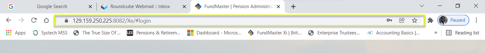
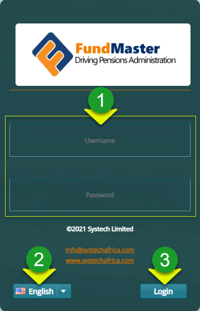
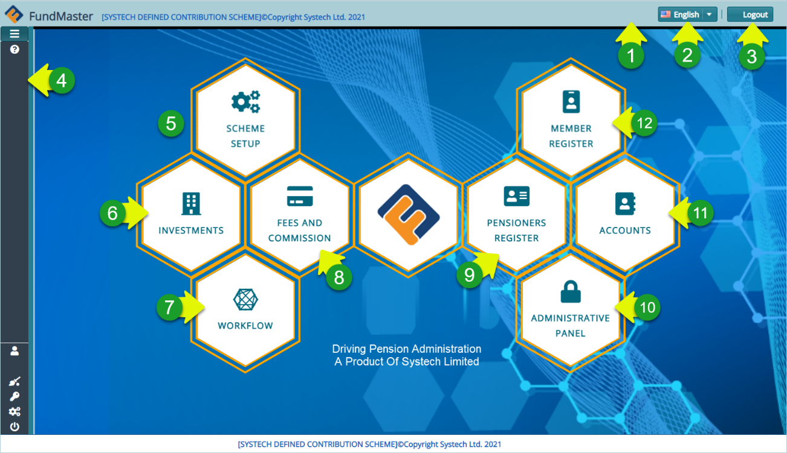
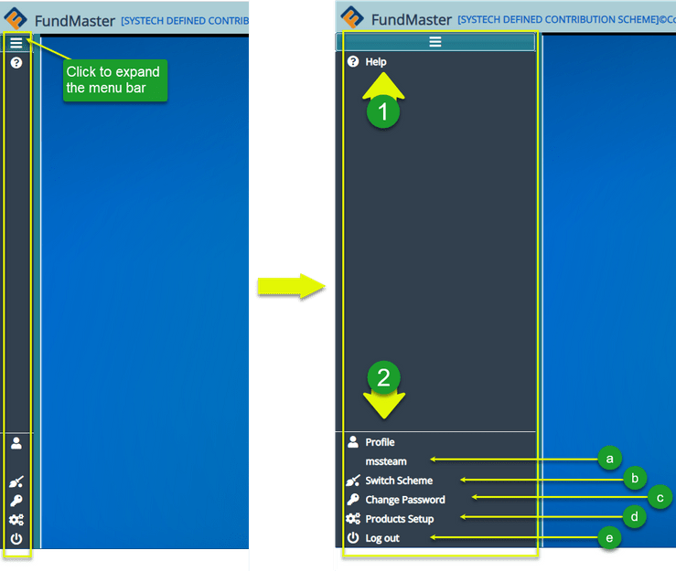

### Login Process User Guide

#### Introduction

To access FundMaster on your device, launch your preferred internet browser and input the web Internet Protocol address provided by your system administrator as shown below:

After inputting the access IP address, a user is directed to the login page where one is supposed to enter login credentials for authentication.

**Note:** to successfully access the login page, the IP address must be correct and the local area connection stable. The following is a screenshot of the login page:

  

  
**Action**

-	Type Username and Password respectively in text boxes **labelled 1**.

-	Click and select a preferred access language from the drop-down menu **labelled 2**.

-	Click the login button **labelled 3** to log in to the system.

**Tip** 

- The system is set to allow a user only three attempts at log in after which the account is locked. The locked account can only be reactivated by the system administrator.

## Landing Page

This is the dashboard (with the main menu and other controls) seen on a user’s screen when one successfully logs in to FundMaster. See the screenshot below:

 

The circled numbers in the screenshot above correspond to the numbers in the following table that describe the key navigation clickable elements on the FundMaster landing page:

| **No.** 	| **Interface Elements**    	| **Description**                                                                                                                                   	|
|---------	|---------------------------	|---------------------------------------------------------------------------------------------------------------------------------------------------	|
| 1.    	| Top menu bar              	| This is the bar where the system version trademark, the name of the running scheme, language drop-down menu, and logout button is located.    	|
| 2.     	| Language drop-down menu   	| Click to select a language of choice. This will render the navigation and content in the selected language.                                       	|
| 3.    	| Logout button             	| Clicking this button will terminate all the running processes and close the system.                                                               	|
| 4.    	| Main menu bar             	| This is the location of the major menu. Click to expand and display more menu items.                                                                                    	|
| 5.    	| Scheme Setup link         	| A shortcut to launching the scheme setup module. Click to open the setup page.                                                                    	|
| 6.    	| Investments link          	| A link to the Investments Module.                                                                                                                 	|
| 7.    	| Workflow link             	| A link to the Workflow Module.                                                                                                                    	|
| 8.    	| Fees and Commission link  	| A link to the Fees and Commission Module.                                                                                                         	|
| 9.    	| Pensioners Register link  	| A link to the Pensioners Register Module.                                                                                                         	|
| 10.   	| Administrative Panel link 	| A link to the Administrative Panel Module.                                                                                                        	 |
| 11.   	| Accounts link             	| A link to the Accounts Module.                                                                                                                    	|
| 12.   	| Member Register link      	| A shortcut to the Members Register Module.                                                                                                             |

## Main Menu Bar

Clicking the hamburger icon on the upper-left corner of the landing page will enable a user to expand the menu bar, allowing access to more controls. The expanded menu bar displays a help tab, on the uppermost side, for accessing the help documentation.

Located on the lowermost side of the menu bar are more controls that enable other configurations for a user account. See screenshot below:

  

 
| **No.**  | **Element**         | **Description**                                                                                                                                                                  |
|----------|---------------------|----------------------------------------------------------------------------------------------------------------------------------------------------------------------------------|
| 1.        | Help link           | A link to the help documentation for user reference. Click to open the page.                                                                                                     |
| 2.        |   Account config    | A section with links for configuring user account details.                                                                                                                       |
| 2(a). |   Profile           | This is where the logged in user's profile name is displayed.                                                                                                                      |
| 2(b). |   Switch Scheme     | Allows a user to change from the currently running scheme to another without terminating a session. Note that a successful switch will change the scheme name on the uppermost bar |
| 2(c). |   Change Password   | Allows a user to change password for security reasons.                                                                                                                          |
| 2(d). |   Products Setup    | Clicking on this link will open the products page to view available products and create new.                                                                        |
| 2(e). |   Logout            | Click to terminate all the running processes and close the current profile account ready to log in as a new user.                                                                |
 
 