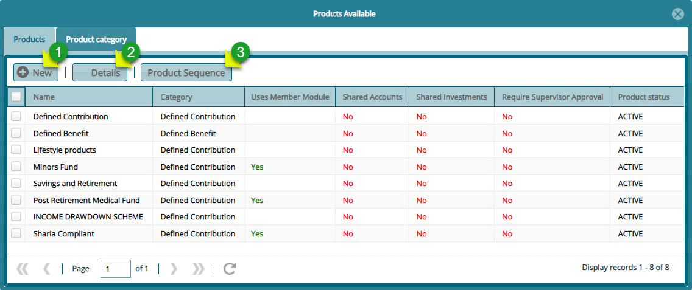
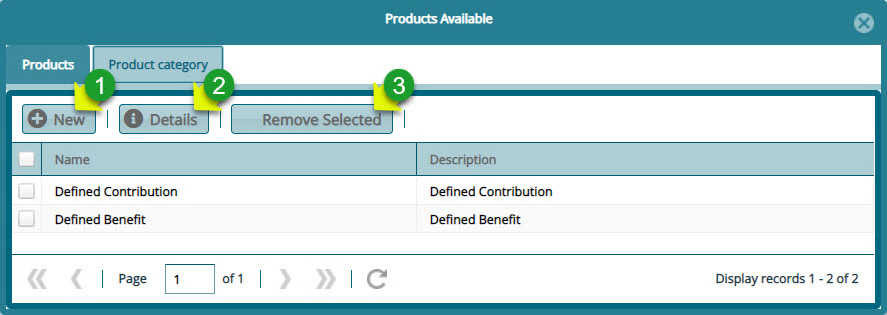

 ## Product Setup

Clicking the **Product Setup** link labelled 2(d), will open a window displaying a list of all fund products in the system under the product tab and a list of product categories as shown in the next screenshot.

## Products

Clicking the **Product** tab will open a window displaying a list of all fund products in the system. From this window, the details of each product can be viewed, new products added, and the product sequence seen as shown below:

  

**Action**

- Click **label 1** button to add a new fund product.

- Click **label 2** button to view the details of a product.

- Click **label 3** button to see the product sequence.

## Product Categories

Clicking the **Product Category** tab will open a window displaying a list of all fund product categories. From this window, the details of each product category can be viewed, new product category added and removed from the
system as shown below:

**Action**

  -   Click **label 1** button to add a new product category.

  -   Click **label 2** button to view the details of a product category.

  -   Click **label 3** button to remove a selected product category.

