### Onboaring Members in Batch to the Member Register

**Step 1: Navigate to FundMaster Landing Page:**

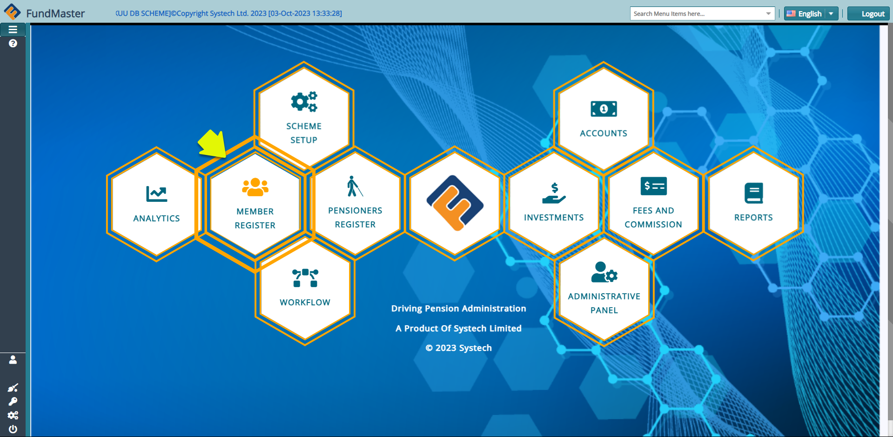

**Action**

1.  Click the Members Register hot link

**Step 2: Locate the Members menu:**

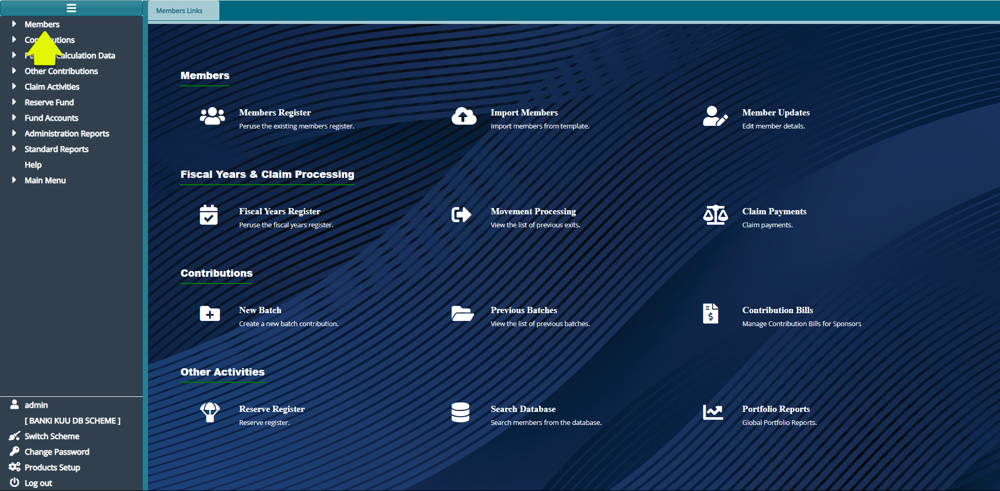

**Action**

1.  Click on the **"Members"** drop-down menu 

**Step 3: Navigate to Upload the Member Batch**

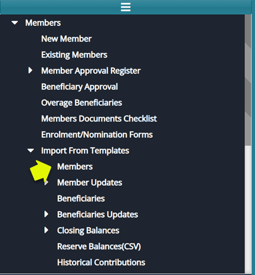

**Actions:**

1.  Click on **"Import from Templates"** drop-down menu

2.  Then click on **"Members"**

**Step 4: Upload and Confirm Batch Members**

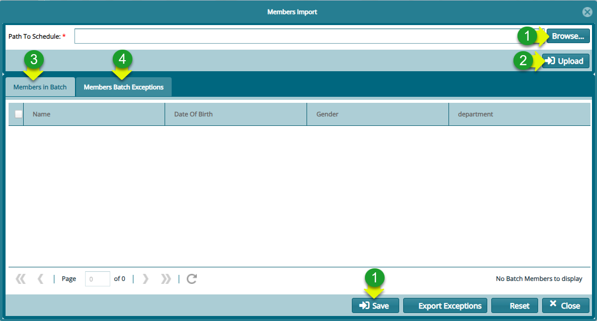

**Actions**

1.  Click on **"Browse"** to locate the new member template that you have prepared

2.  Click on **"Upload"** to add the members to the system

3.  Click to confirm the **"Member in batch"** are the same number as those in your template

4.  If not click to confirm the **"Member Batch Exceptions"**

5.  If there is no exception, click on **"Save"**

**Step 5: Navigate to the Members Batch Register for Approval Process**

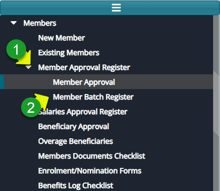

**Action**

1.  Click on **"Member Approval Register"**

2.  Click on **"Member Batch Register"**

**Step 6: Authorize the Newly Onboarded Members:**

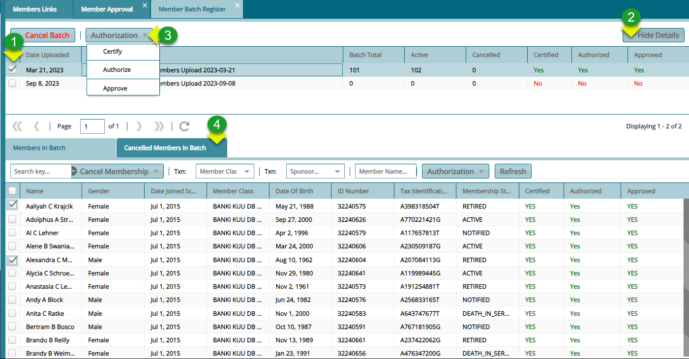

**Actions**

1.  Click to select the batch record from the list of batches

2.  Click on the "**Show Details**" button to see all members uploaded

3.  Click on the **"Authorization"** drop-down menu to Certify, Authorize and Approve

4.  Click on the **"Cancel Members"** in Batch to delete the selected members from the batch

**Step 7: View the Newly Uploaded Members:**

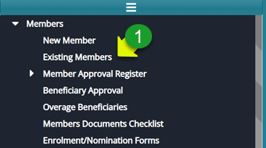

**Action**

1.  Click on "Existing Members"

**Step 8: View Listed Employers on the Sponsor Register:**

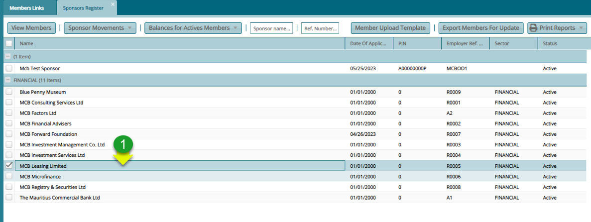

**Actions**

1.  Double Click on a selected **Sponsor** from the list to open the member register

**Step 9: View all the Members Under an Employer:**

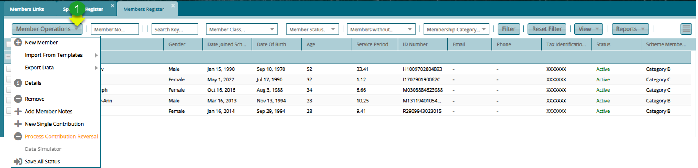

**Actions**

1.  Click on the "**Members Operations"** drop-down and select an action such as creating a new member

**Step 10: Navigate to View the Details of a Selected Member:**

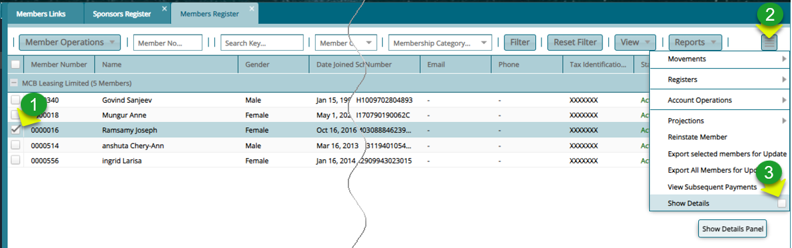

**Actions**  

1.  Click to select an individual member from the list

2.  Click the "**Hamburger**" icon on the upper right side to open the drop-down menu

3.  Click the "**Show Details**" checklist to load a section with the members details and select an action such as creating a new member

4.  Alternatively **Double Click** on the selected member record to view the details

**Step 11: View the Details of a Selected Member as shown below:**

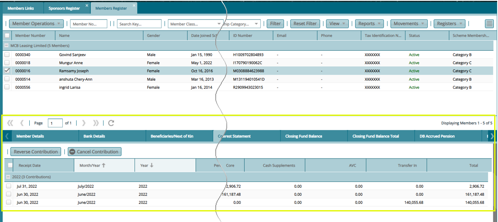