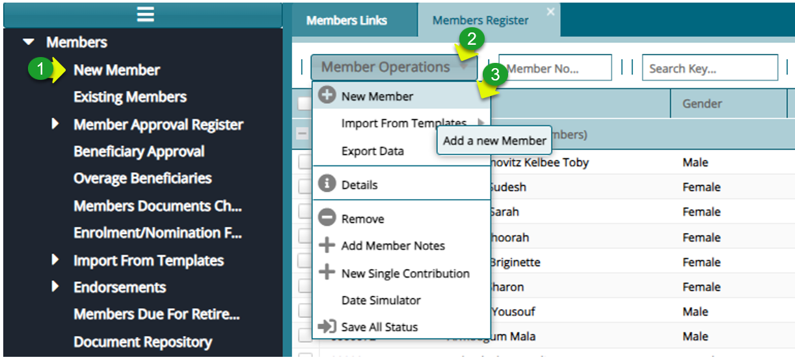
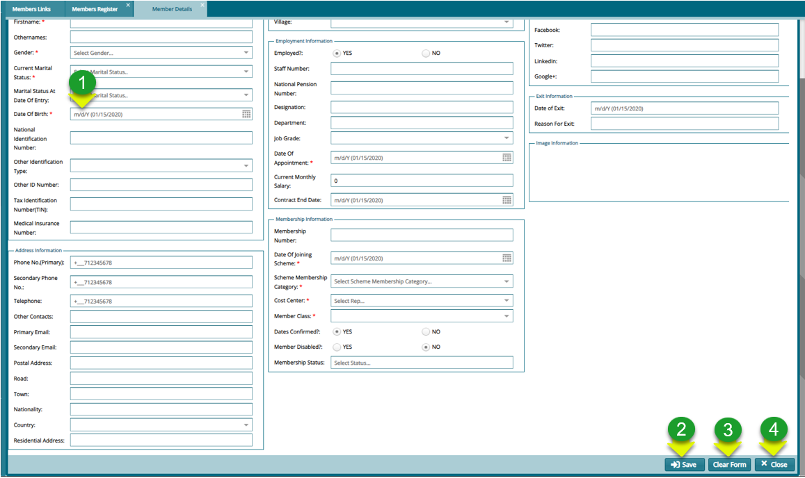
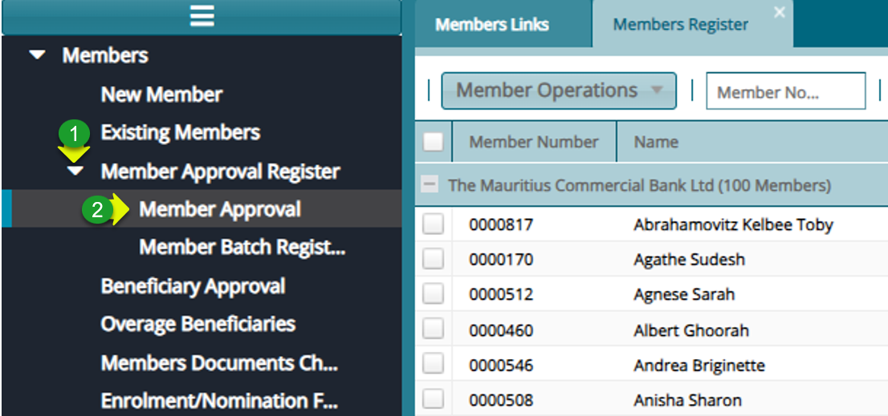
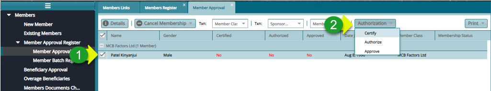

### Onboarding a Single Member to the Members Register

**Step 1: Navigate to the New Member Registration Form**

**Actions**

1.  Click the "**New Member**" menu item on the left side pane

2.  Click on the "**Members Operations"** drop-down

3.  Click on the "**New Member**" to open a membership form

**Step 2: Fill in the Details to Register a New Member:**

**Actions**

1.  Click on the "**Mandatory fields**" to key in details

2.  Click on the "**Save**" button to register the new member

3.  Click on the "**Clear**" button to start filling the form a fresh

4.  Click on the "**Close"** button to exit the form

**Step 3: Navigate to the Members Approval Register:**

**Actions**

1.  Click on the "**Member Approval Register"** drop-down menu

2.  Click on the "**Member Approval**" menu item to open the approval window

**Step 4: Approval the New Membership:**

**Actions**

1.  Click to select a member from the list

2.  Click on the "**Authorization**" drop-down menu to Certify, Authorize and Approve the member
