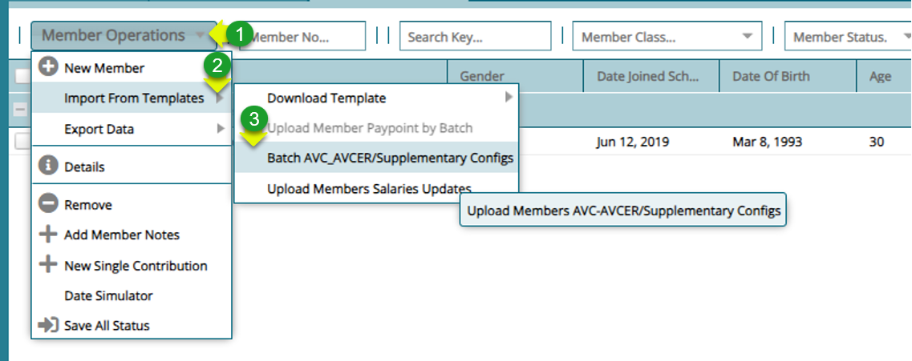
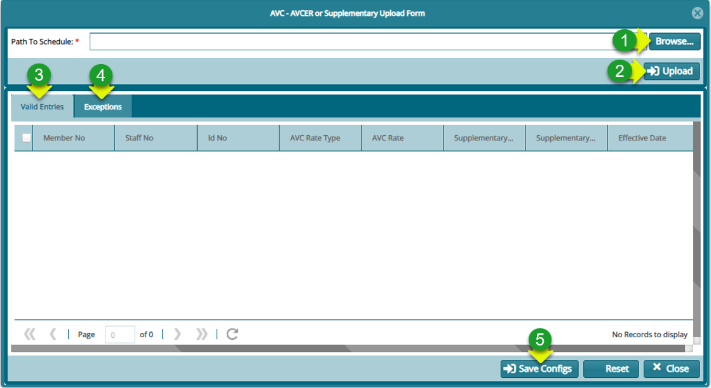
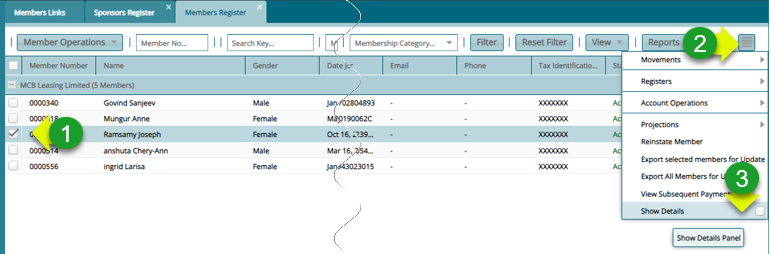
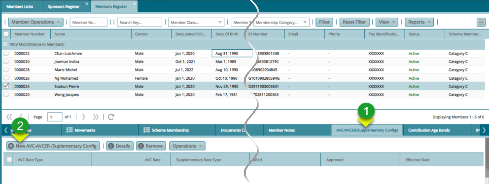
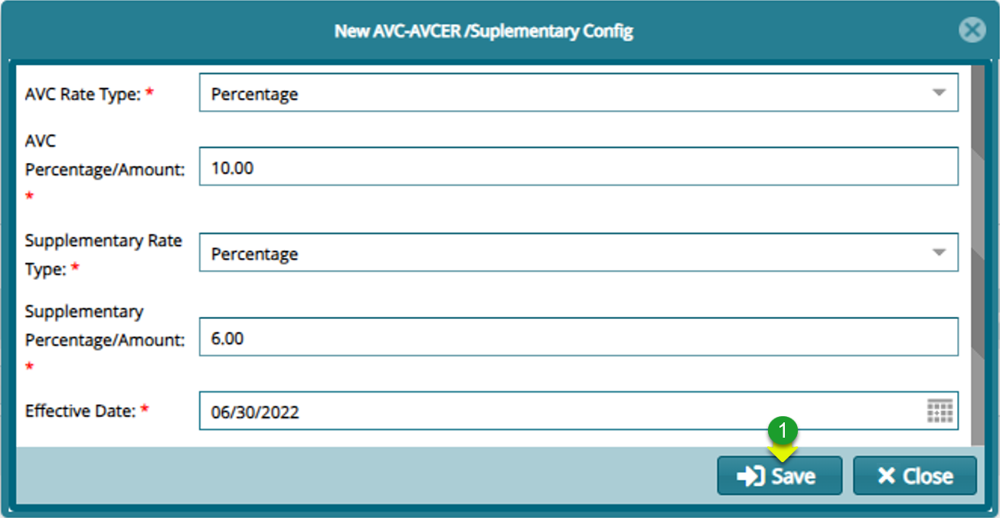
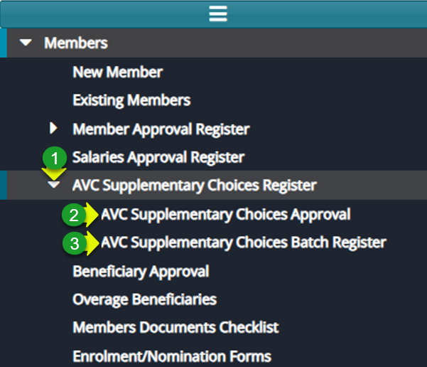
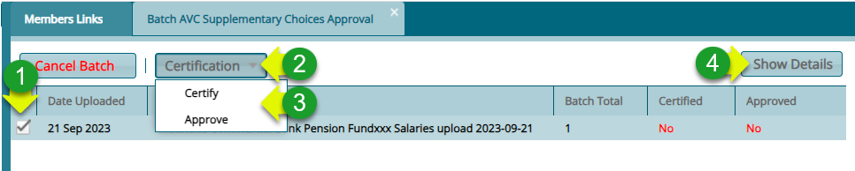

###  Cash Supplementary Rates

### Updating Cash Supplementary Rates in batch

**Step 1: Navigate to AVC_AVCER/Supplementary Configs window**

**Actions**

1.  Click "**Members Operations**" menu

2.  Click "**Import from Templates"** from the drop-down menu

3.  Click "**Batch AVC_AVCER/Supplementary Configs**" to open a dialog window

**Step 2: Upload AVC_AVCER/Supplementary Configs records**

**Actions**

1.  Click on "**Browse**" button to load the file

2.  Click on "**Valid Imports**" tab to view imported records

3.  Click on "**Import Exceptions**" tab to confirm import exceptions

4.  Click on "**Save**" button to update salary records

### Update Cash Supplementary Rates for a Single Member

**Step 1: Navigate to AVC_AVCER/Supplementary Configs window**

**Action**

1.  Click to Select on the Member from the Member Register

2.  Click "**Hamburger icon**" on the upper right corner

3.  Click "**Show Details**" check box

**Step 2: Open AVC_AVCER/Supplementary Config dialog box**

**Action**

1.  Click "**AVC_AVCER/Supplementary Config**" tab 

2.  Click "**New AVC_AVCER/Supplementary Config**" button to open a dialog box

**Step 3: Adding a New AVC_AVCER/Supplementary Config**

**Action**

1.  Click "**Form fields**" select and provide the right values

2.  Click "**Save**" button to confirm the values

### Approving Cash Supplementary Rates -- in Single and Batch 

**Step 1: Navigate to the Salaries Approval Register Menu**

**Action**

1.  Click "**AVC Supplementary Choices Register**" menu

2.  Click "**AVC supplementary Choices Approval**" item for single approval

3.  Click "**AVC supplementary Choices Batch Approval**""item for batch approval

**Step 1: Approve a single members Supplementary Rates**

**Action**

1.  Click to select a member from the register

2.  Click "**Operations**" menu to open drop-down menu

3.  Click "**Certify**" and "**Approve**" respectively to authorize the rates

**Step 2: Approve Members Supplementary Rates in Batches**

**Action**

1.  Click to select a batch file from the register

2.  Click "**Certification**" menu to open drop-down menu

3.  Click "**Certify** and **Approve**" respectively to authorize the rates

4.  Click "**Show Details**" to view individual members details in the batch