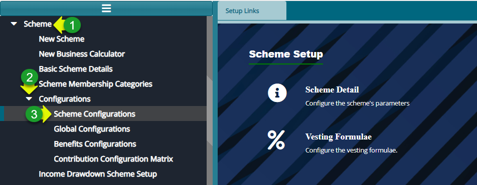
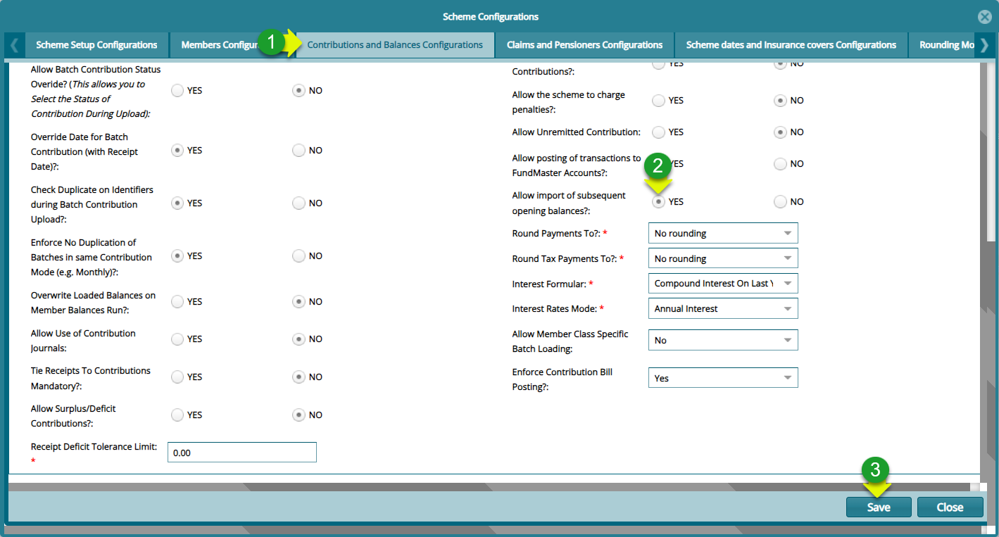
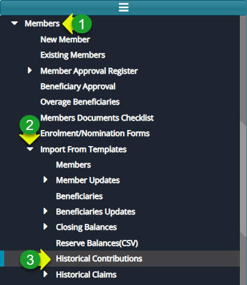
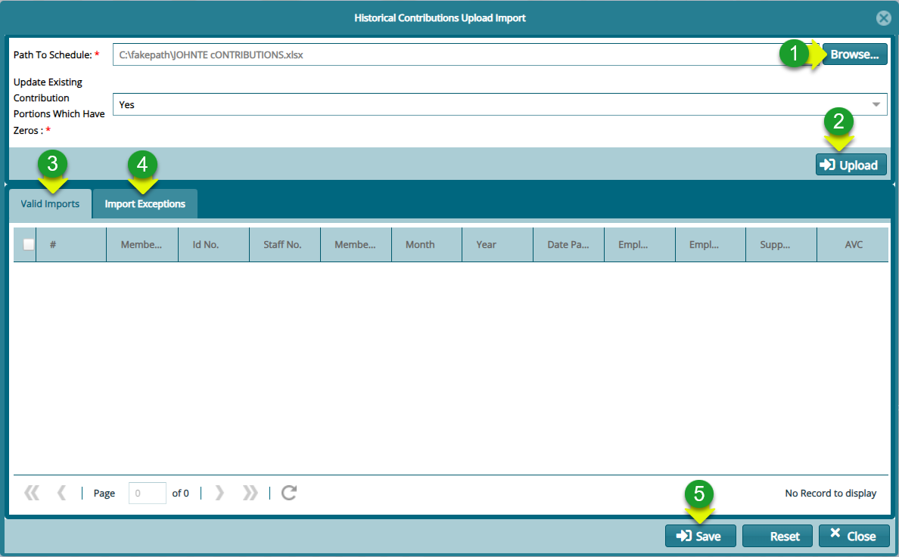

### Members Opening PMA

### Loading Members Opening PMA into the System

**Step 1: locate the contribution and balance configurations dialog window** 

**Action**

1.  Navigate to the Scheme Set up module and click on "**Scheme**" menu

2.  From the drop-down menu, click on "**Configurations**"

3.  From the Configurations drop-down menu, click on "**Scheme configurations**" to open a scheme configurations dialog box

**Step 2: Config the System to Allow importation of Subsequent Opening Balances**

**Action**

1.  Click on the **"Contribution and Balances Configurations"** tab

2.  Click to check **"YES"** to activate the Allow Importation of Subsequent opening balances

3.  Click on the **"Save"** button and refresh your browser for changes to take effect

**Step 3: Navigate to the Historical Contributions Menu**

**Actions**

1.  Click on **"Members"** menu

2.  Click on **"Import from Templates"** menu to open a drop-down menu

3.  Click on **"Historical Contributions"** to load the upload dialog window

**Step 4: importing Historical Contributions using a template**

**Actions**

1.  Click on **"Browse"** button to pick the template from your device

2.  Click on **"Upload"** button to load the template into the system

3.  Click on **"Valid Imports"** to view the records

4.  Click on **"Import Exceptions"** to confirm import exceptions

5.  Click on **"Save"** button to complete the process
