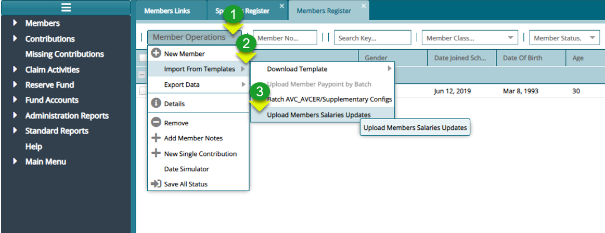
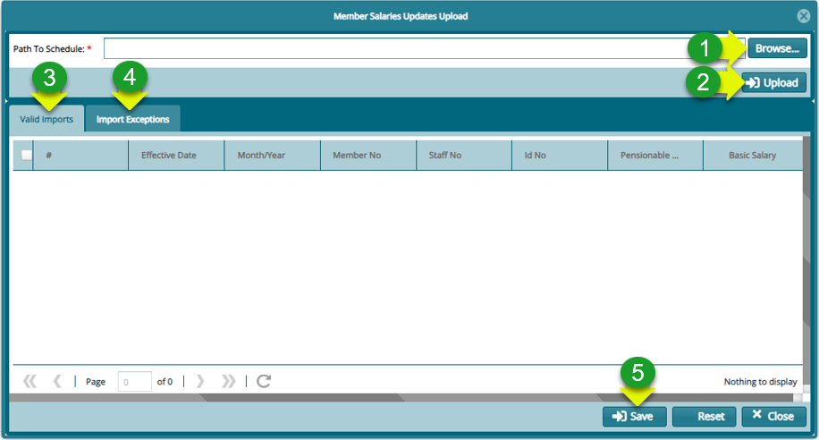
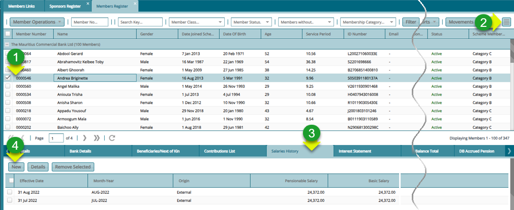
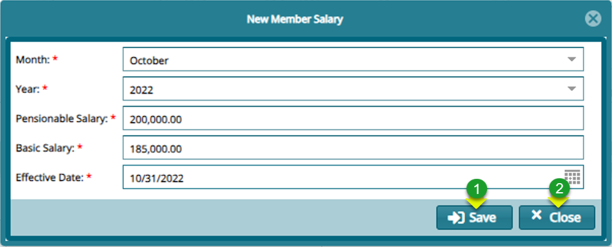
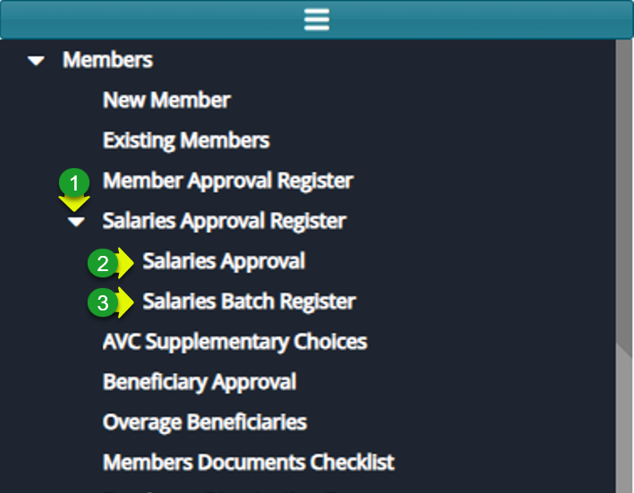
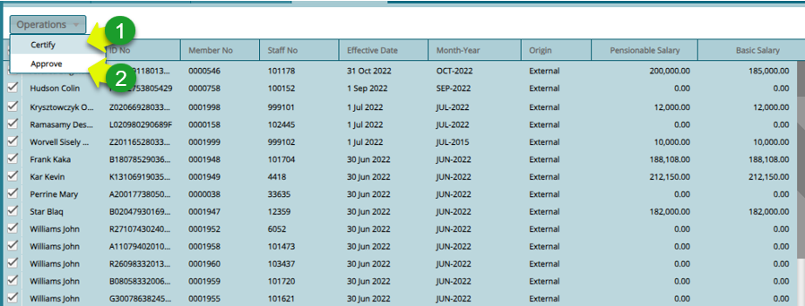

### Member Salary Update Process

### Updating Member Salaries in Batch

**Step 1: Upload the Members salary template from the Members Register** 

**Actions**

1.  Click on the "**Members Operations**" drop-down menu

2.  Click on **"Import From Template"** drop-down menu

3.  Click on "**Upload Members Salaries Updates**" menu item

**Step 2: Upload members salary and validate records**

**Actions**

1.  Click on "**Browse**" button to load the file

2.  Click on **"Valid Imports"** tab to view imported records

3.  Click on "**Import Exceptions**" tab to confirm import exceptions

4.  Click on "**Save**" button to update salary records

### Updating a Single Member's Salary

**Step 1: Navigate to the members register**

**Actions**

1.  Click to select a member from the list

2.  Click on **"Show Details"** hamburger icon to load a lower section

3.  Click on "**Salary History**" tab

4.  Click on "**New Salary**" button to load a dialog box

**Step 2: Fill in members salary details**

### Approving Members salary updates

**Step 1: Navigate to the Salaries Approval Register Menu**

**Actions**

1.  Click the "**Salaries Approval Register**" from the left side pane

2.  Click "**Salaries Approval**" for salaries created from salaries History

3.  Click "**Batch Salaries Approval**" for salaries uploaded as a batch

**Step 2: Certify and Approve the updated salaries**

**Actions**

1.  Click "**Certify**" from the Operations menu

2.  Click "**Approve**" from the Operations menu

