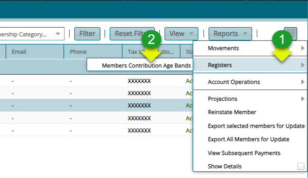
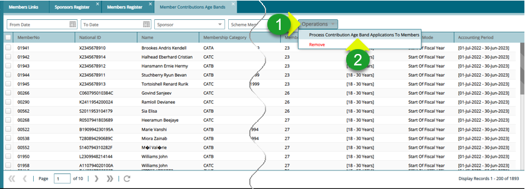
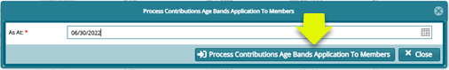

### Processing a Members Contribution Age Bands

**Step 1: Select a member's contribution age band**

**Actions**

1.  Click on the "**Register**" drop-down menu

2.  Click **"Member Contribution Age Bands"** menu item

**Step 2: Process contribution age band**

**Actions**

1.  Click on the "**Operations**" drop-down menu

2.  Click **"Process Contribution Age Bands Application to Members"** menu item

**Step 3: Confirm the date of processing**

