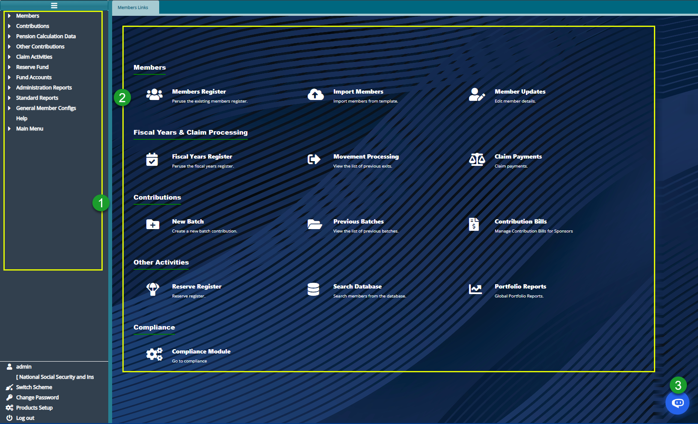

### Members Module

The Members Module simplifies the onboarding of individual contributing members into a scheme by establishing a connection between contributors and their respective establishments. This linkage enhances the management of multiple establishments, their members' contributions, and associated operational processes.

The module is designed to not only ensure efficient onboarding but also offers additional functionalities, including:

- Viewing and managing existing members.
- Uploading contributions.
- Initiating and tracking claim processes.
- Accessing other essential features for seamless operations.

Below is a screenshot of the Members Module dashboard, with the left-side pane expanded to reveal menu links to various configuration windows for easy navigation.

**Action**

1.  Navigate to the left-side pane and click on the menu item links listed under **label 1** to configure all settings related to members.

2.  Utilize the hot links located under **label 2** to access shortcut routes leading to frequently visited links within the members module.

3.  Click on the button **labeled 3** to access the system's Intelligent Assistant (IA) chatbot.
    
<!--

## Prerequisites

**Scheme Data Importation Guidelines**

To ensure an efficient upload of members' details, their beneficiaries, contributions, and opening balances into a new scheme setup in the system, scheme administrators should prepare templates with the following data:

1.  **Member Details Template:** Contains members' details with three unique columns: member number, member class code, and cost center code.

2.  **Beneficiary Details Template:** Contains beneficiaries' details with the member number column linking each beneficiary to a specific member.

3.  **Opening Balances Templates:**

    -   Consist of two templates - registered and unregistered opening balances.

    -   Each template has balances with a unique member number column, attaching the balances to specific members.

4.  **Member Contributions Template:**

    -   Includes members\' contributions and salary details.

    -   Contains a unique member number column that ties the contribution amounts to specific members.

-->

### Member Onboarding Methods

There are two ways to upload members into the system's member register:

1.  **Single Member Onboarding**

    -   Fill in details in a member's details form for individual members.

    -   The added member must be approved via the Member Approval window to be officially saved in the member's register.

2.  **Batch Member Onboarding**

    -   Utilize a template file (e.g., MS Excel) filled with member details.

    -   Upload the file into the system to add more than one member in a batch.
    

**Note:**For now NASSIT has restricted member registration to the Single Member Onboarding Method. 