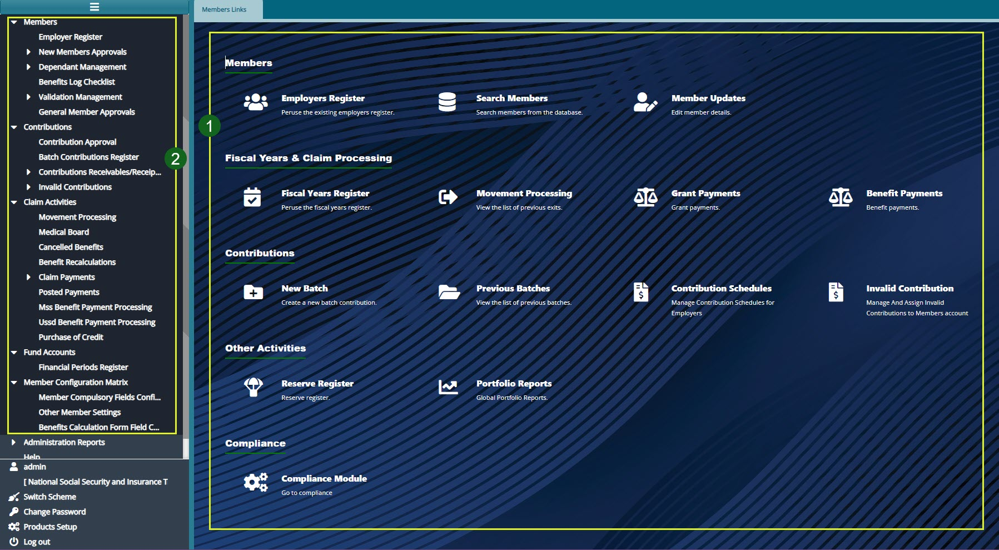

### Members Module

The Members Module simplifies the onboarding of individual contributing members into a scheme by establishing a connection between contributors and their respective establishments. This linkage enhances the management of multiple establishments, their members' contributions, and associated operational processes.

The module is designed to not only ensure efficient onboarding but also offers additional functionalities, including:

-   Viewing and managing existing members.
-   Uploading contributions.
-   Initiating and tracking claim processes.
-   Accessing other essential features for seamless operations.

Below is a screenshot of the Members Module dashboard, with the left-side pane expanded to reveal menu links to various configuration windows for easy navigation.

**Action**

1.  Navigate to the left-side pane and click on the menu item links listed under **label 1** to configure all settings related to members.

2.  Utilize the hot links located under **label 2** to access shortcut routes leading to frequently visited links within the members module.    