## Claim Activities

The activities under this menu are related to claim processing. To start an activity, click the appropriate link from the enclosed drop-down menu to open the respective window as shown in the screenshot below:

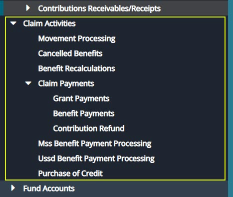

## Initiating Claim Movement

To initiate a claim for a member, navigate to the **'Members Register'** and select the Member record from the list. Click the **Movements** menu to access the **Initiate Movement/Claim** tab as shown in the following sample screenshot:

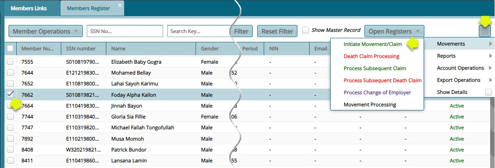

### Reasons for Exit

To initiate a claim whose **'Reason for Exit'** is ill health, Click the **'Initiate Movement/Claim'** link to load an exit form (see the following screenshot) where configurations for processing the claims are set.

Fill out the form with the required details and then click the **'Confirm Exit Documents Checklist'** button (as shown in the next screenshot but one) to receive and confirm receipt of relevant documents from the member. After confirming receipt of documents, click the **'Save'** button to proceed with the claim process as shown below:

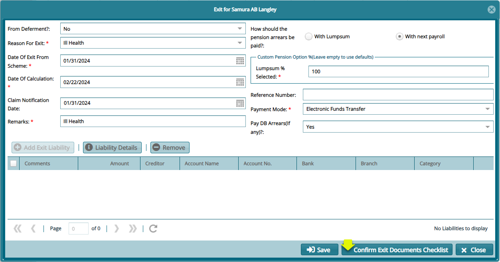

Click the **'Confirm Exit Documents Checklist'** button, as shown in the previously, to open the **'Benefits Log Checklist Confirmation'** window**.** Select a document from the list and double-click to confirm receipt of the document. Otherwise, click the **'Receive Document'** button to upload the document as shown below:

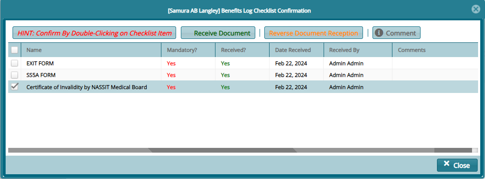

A successful configuration of the exit form and confirmation of receipt of relevant claim documents is noted on the status column where a member's status is changed from **'Active'** to **'On Notice of Exit'** as shown in the following screenshot:

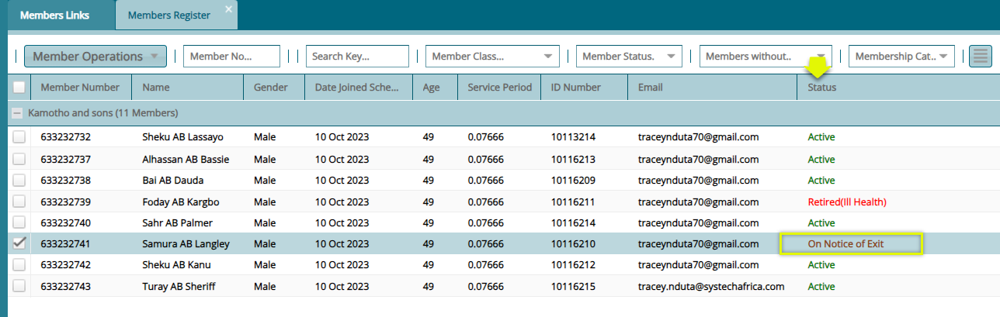

After a successful initialization of a claim, the claim record is pushed to the **'Movements processing'** window. Click the '**Movement Processing'** link to open the Movement Processing window. See screenshot below:

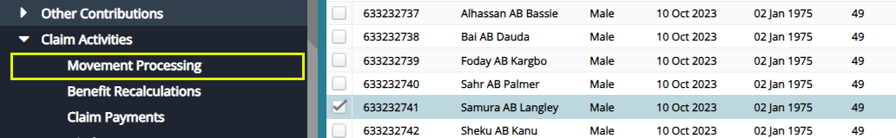

Clicking the **'Movement Processing'** menu will open the movement processing window where all the initiated claims are listed awaiting verification and benefits calculation as shown below:

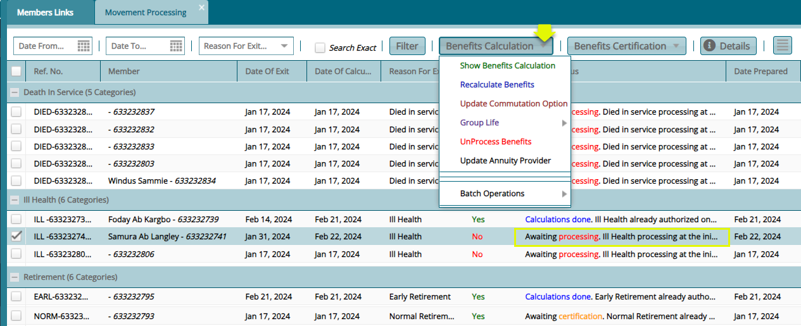

## Benefits Calculation

Click the **'Show Benefits Calculation'** tab from the **'Benefits Calculation'** drop-down menu to load the **'Benefits Calculation'** form. This shows the member's benefits tabulations as shown in the screenshot below:

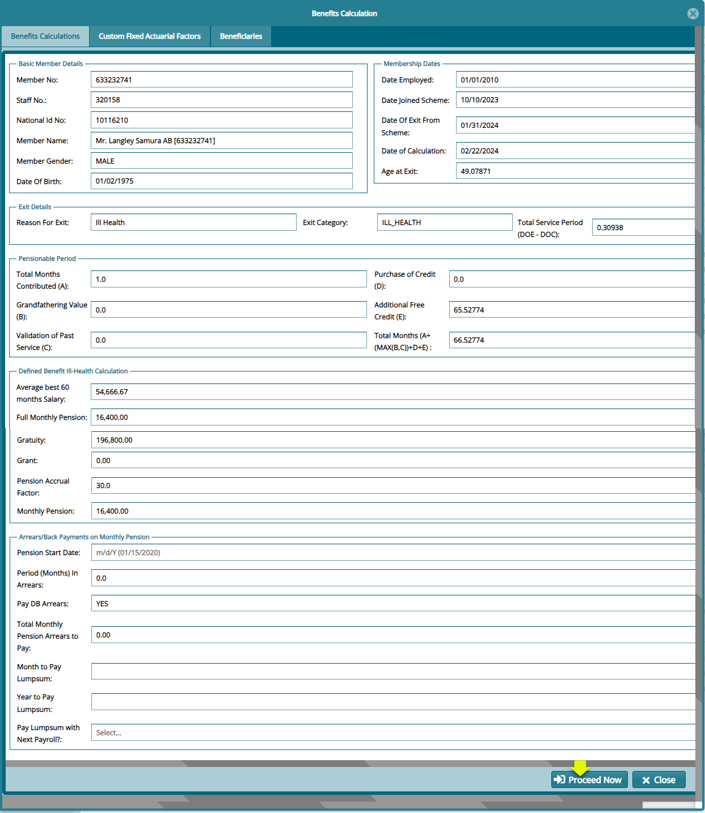

Next, click the **'Proceed Now'** button to process the payment and save the records **'Awaiting Certification'** towards the disbursement of money from the scheme accounts. See the screenshot below:

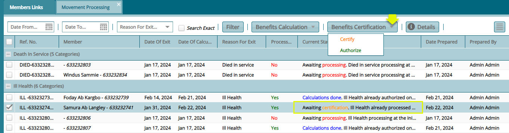

After the **'Certification'** is done, the record status in the movement processing window will turn from **'Awaiting Certification'** to **'Calculation done'** as shown in the screenshot below:

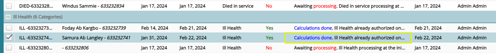

## Movement Processing

The **'Movement Processing window'** window lists all the claims that have been successfully initiated from the members register. From this window, benefits for a selected claim record from the list can be calculated, the transaction certified and a notification sent to the member or the nominated beneficiaries. See screenshot below:

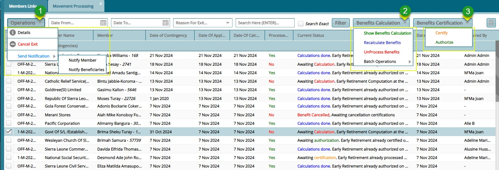

**Action**

-   Click **label 1** button and from the drop-down menu select either to send a notification message to the member or his/her beneficiaries among other actions.

-  Click **label 2** button and from the drop-down menu click to launch the benefits calculation dialog box and run calculations among other actions.

-  Click **label 3** button and from the drop-down menu click to certifcy and approve the benefit calculation towards payment.

## Cancelled Benefits

The **'Cancelled Benefits'** window lists detailed records of cancelled benefit transanctions after processing due to wrong details input or other reasons. From this window the a cancelled benefits  transaction record can be certified or certification rolled back. See screenshot below:

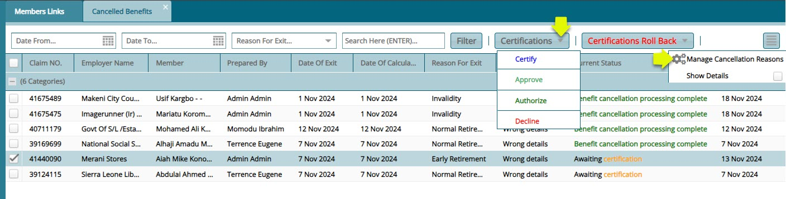

**Action**
- clicking the **'Manage Cancellation Reasons'** menu item from the hamburger button on the top-right side of the menu bar will open a dialogue box where reasons for a benefits cancellation are listed. Click the **Add Reason** button to add a new reason for cancellation as shown in the screenshot below: 

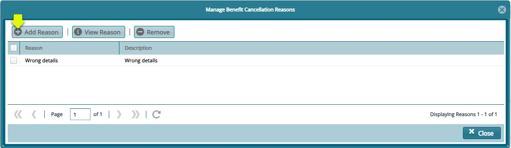

## Benefits Recalculation

The **'Benefits Recalculation'** window lists all the benefits transactions that have undergone recalculation. The transactions listed here are also subject to the certification process. See screenshot below:

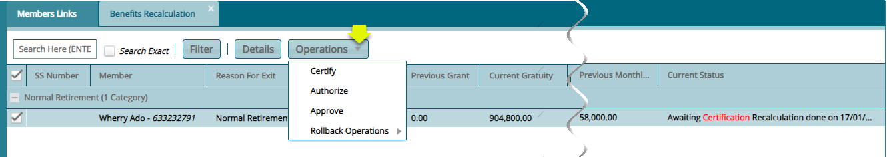

## Claim Payments

The **'Claims Payments'** menu allows accesss to windows where different types of payment transaction records are listed. From drop-down menu the grand payments, benefits payment and contribution refund windows are accessible as shown in the screenshot below:

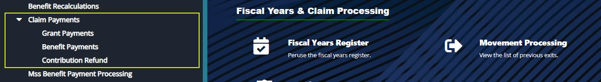

### Grants Payments

The **'Grants Payments Register'** list all the grant payment processed waiting for payment. See screenshot below:  

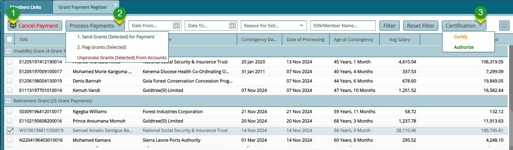

**Action**

-   Click **label 1** button to cancel a grant payment from the list.  

-   Click **label 2** button and from the drop-down menu select to send the grant for payment, flag the payment or unprocess the payment.   

-  Click **label 3** button and from the drop-down menu click **'Certify'** and **'Authorize'** to okay payment of record selected.

### Benefits Payments

The **'Benefit Payments Register'** list all the benefit payment processed waiting for payment. See screenshot below:  

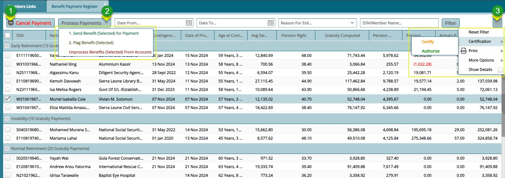

**Action**

-   Click **label 1** button to cancel a selected benefit payment from the list.  

-   Click **label 2** button and from the drop-down menu select to send the benefit for payment, flag the payment or unprocess the payment.   

-  Click **label 3** button and from the drop-down menu click Certification to ertify and authorize selected payment from the list among other actions.

<!--

## Registers

The **'Registers'** menu provides access to finance registers and claim payments postings as shown below:

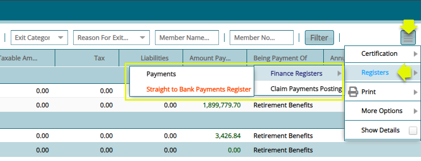

## Payments

After claim processing and payment of benefits to members, all the payment transactions are saved in a **'Finance Register'**. To check records of payments, from the **'Registers'** drop-down menu, select **'Payments'** from the Finance Registers submenu, as shown in the previous screenshot, to open the Payments window.

Click the '**Payment Processing'** drop-down menu to allow a selected payment from the list to be **'Certified'** and **'Posted to the ledger**, **Unposted'** or '**Rejected'** among other actions as shown in the following screenshot:

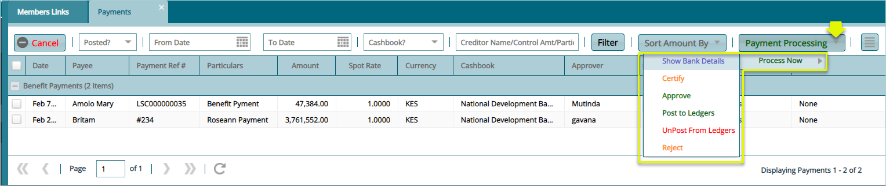

### Print

The **'Print'** menu provides access to different types of reports related to benefits payments as shown below:

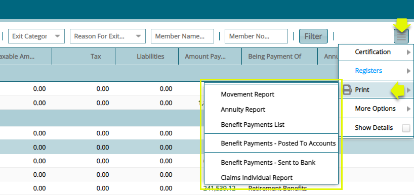

### More Options

The **'More Options'** menu provides access to edit and update actions as shown below:

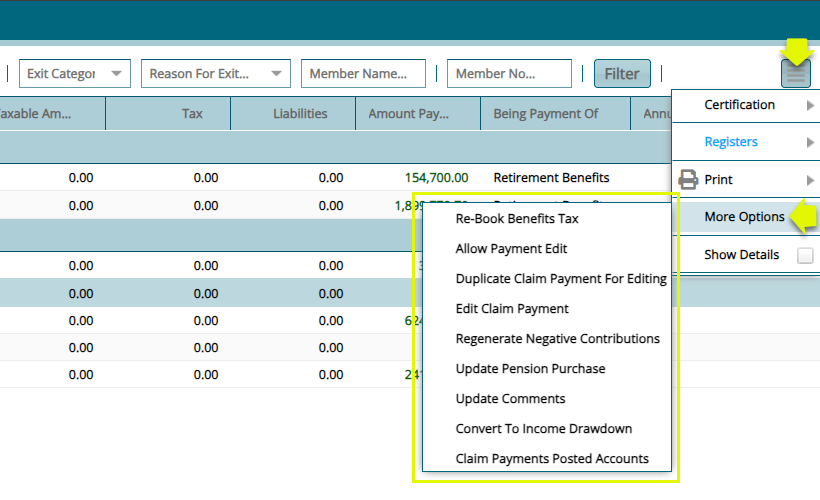

## Discharge Forms

**'Discharge Forms'** are configured to document members' exit details from a scheme after claiming his/her benefits.

To access the list of claim forms in a scheme, click the **'Discharge Forms'** link to open a window where all exited members' forms are listed in a grid table. Click the **'Print'** button on the upper right side to allow you to view various '**Exit Declaration Forms'** and **'Payment Confirmation Letters'** for selected members form on the list as shown below:

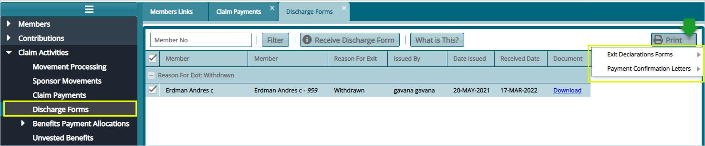

-->
