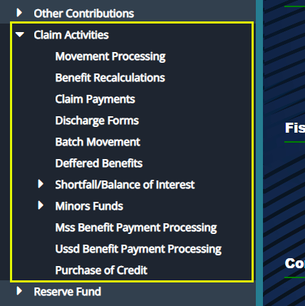
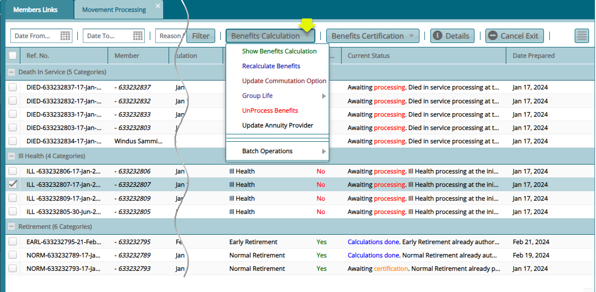
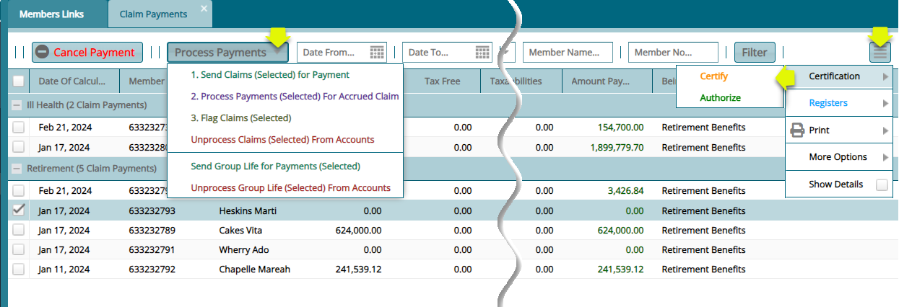
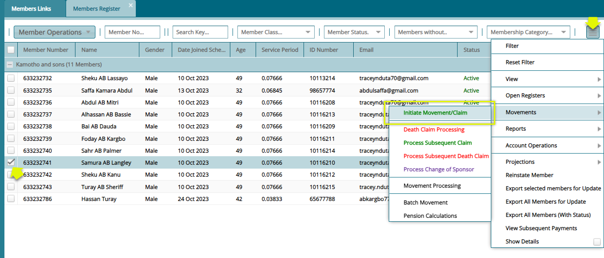
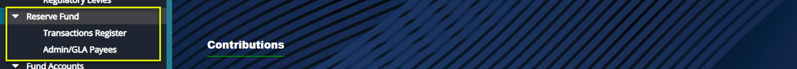
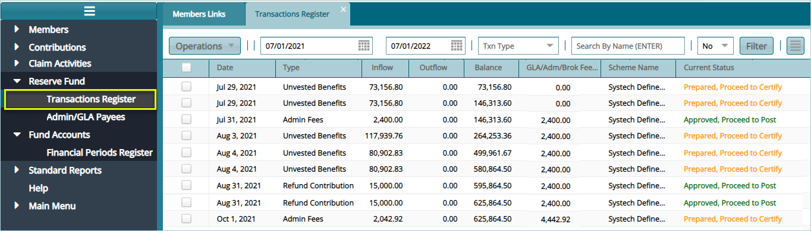

## Claim Activities

The activities under this menu are related to claim processing. To start
an activity, click the appropriate link from the enclosed drop-down menu
to open the respective window as shown in the screenshot below:

### Movement Processing

The **'Movement Processing'** window lists all the claims that have been
initiated from the members register. From this window, benefits for
claim record are calculated and transactions are certified. See
screenshot below:

### Benefits Recalculation

The **'Benefits Recalculation'** window lists all the benefits
transactions that have undergone recalculation. The transactions listed
here are also subject to the certification process. See screenshot
below:

### Claim Payments

After benefits calculations and processing, all claim records for
different members under different exit categories are listed in the
**'Claim Payments'** window awaiting disbursement of money. See
screenshot below:

**Action**

-   Locate the **'Process Payments'** menu and from the drop-down menu
    select '**Send Claims (selected) for Payment'** or select
    '**Unprocessed Claim (selected) From Accounts'** among other
    actions in the list.

-   From the '**Certification'** drop-down menu**,** click **'Certify'**
    and **'Authorize'** the payment of record selected.

-   Click the '**Registers'** menu and from the drop-down, access
    windows where all effected payments are listed.

-   Click the **'Print'** menu and from the drop-down menu select the
    type of report to view.

-   click the **'More Options'** menu and from the drop-down menu,
    select an action to execute.

### Registers

The **'Registers'** menu provides access to finance registers and claim
payments postings as shown below:

### Payments

After claim processing and payment of benefits to members, all the
payment transactions are saved in a **'Finance Register'**. To check
records of payments, from the **'Registers'** drop-down menu, select
**'Payments'** from the Finance Registers submenu, as shown in the
previous screenshot, to open the Payments window.

Click the '**Payment Processing'** drop-down menu to allow a selected
payment from the list to be **'Certified'** and **'Posted to the
ledger**, **Unposted'** or '**Rejected'** among other actions as shown
in the following screenshot:

### Print

The **'Print'** menu provides access to different types of reports
related to benefits payments as shown below:

### More Options

The **'More Options'** menu provides access to edit and update actions
as shown below:

### Discharge Forms

**'Discharge Forms'** are configured to document members' exit details
from a scheme after claiming his/her benefits.

To access the list of claim forms in a scheme, click the **'Discharge
Forms'** link to open a window where all exited members' forms are
listed in a grid table. Click the **'Print'** button on the upper right
side to allow you to view various '**Exit Declaration Forms'** and
**'Payment Confirmation Letters'** for selected members form on the list
as shown below:

### Initiating Claim Movement

To initiate a claim for a member, navigate to the **'Members Register'**
and select the Member record from the list. Click the **Movements** tab
to access the **Initiate Movement/Claim** tab as shown in the following
sample screenshot:

### Processing a Claim

To initiate a claim whose **'Reason for Exit'** is ill health, Click the
**'Initiate Movement/Claim'** link to load an exit form (see the
following screenshot) where configurations for processing the claims are
set.

Fill out the form with the required details and then click the
**'Confirm Exit Documents Checklist'** button (as shown in the next
screenshot but one) to receive and confirm receipt of relevant documents
from the member. After confirming receipt of documents, click the
**'Save'** button to proceed with the claim process as shown below:

Click the **'Confirm Exit Documents Checklist'** button, as shown in the
previously, to open the **'Benefits Log Checklist Confirmation'**
window**.** Select a document from the list and double-click to confirm
receipt of the document. Otherwise, click the **'Receive Document'**
button to upload the document as shown below:

A successful configuration of the exit form and confirmation of receipt
of relevant claim documents is noted on the status column where a
member's status is changed from **'Active'** to **'On Notice of Exit'**
as shown in the following screenshot:

After a successful initialization of a claim, the claim record is pushed
to the **'Movements processing'** window. Click the '**Movement Processing'** link to open the Movement Processing window. See
screenshot below:

Clicking the **'Movement Processing'** menu will open the movement
processing window where all the initiated claims are listed awaiting
verification and benefits calculation as shown below:

Click the **'Show Benefits Calculation'** tab from the **'Benefits
Calculation'** drop-down menu to load the **'Benefits Calculation'**
form. This shows the member's benefits tabulations as shown in the
screenshot below:

Next, click the **'Proceed Now'** button to process the payment and save
the records **'Awaiting Certification'** towards the disbursement of
money from the scheme accounts. See the screenshot below:

After the **'Certification'** is done, the record status in the movement
processing window will turn from **'Awaiting Certification'** to
**'Calculation done'** as shown in the screenshot below:

## Reserve Funds

FundMaster maintains records of balances (overpayments and
underpayments) in different transactions. See relevant Reserve Fund
links in the enclosed drop-down menu below:

### Transactions Register

Click the **'Transactions Register'** link to open the Transactions
Register where different transaction balances are listed. The
transactions are normally recorded as **Inflows**, which denotes
overpayments. These inflows can later be used to settle deficits, say
later underpayments from the same sponsor account.

The movement of money from the Fund accounts to bridge the deficit is
treated as an **Outflow**. The screenshot below shows a sample of a
Reserve Funds Transactions Register in FundMaster:

## Fund Accounts

From the **'Fund Accounts'** menu, the **'Financial Periods Register'**
is accessed enabling the creation of the different financial periods.
This allows different activities related to the fiscal financial
transactions.

### Financial Periods Register

Click the **'Financial Periods Register'** link to open the Financial
Periods Register window where all financial periods in a scheme are
listed. You can also create periods by Click the '**Create Periods'**
drop-down menu as shown below:

