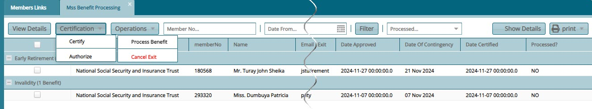
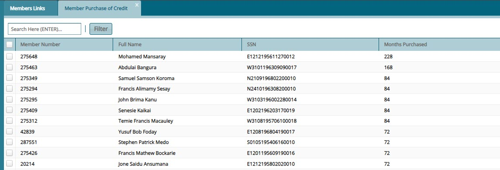

## Claim Activities

The **Claim Activities** menu list links to activities related to benefits claim processing. To start an activity, click the appropriate
link from the enclosed drop-down menu to open the respective window as shown in the screenshot below:

 

### Movement Processing

The **Movement Processing** window lists all the claims that have been initiated by the members register. From this window, benefits for claim
records are calculated and transactions are certified. See screenshot below:

 

**Action**

-   Click **label 1** drop-down menu to select an operation to initiate e.g. viewing the details of a selected record.

-   Click **label 2** text fields and select dates to filter records by date.

-   Click **label 3** drop-down menu to initiate benefits calculation among other activities.

-   Click **label 4** drop-down menu to certify and authorize a claim whose benefits have been calculated. 

-   Click **label 7** button to view more details of a selected claim record.

### Medical Board

The **Medical Board Register** lists all the benefits invalidity claims that have been processed for benefits payment. The transactions listed
here await paperwork and medical board approval before payment. They are also subjected to the certification process. See screenshot below:

 

**Action**

-   Click **label 1** button to load a dialog box for typing the message to notify the member about the claim progress. 

-   Click **label 2** text fields and select dates to filter records by date.

-   Click **label 3** drop-down menu to certify and authorize a transaction. 

-   Click **label 4** button to terminate a transaction. 

-   Click **label 5** button to hide the extra details section on the lower part of the window. 

-   Click **label 6** tab to track the status of a selected record. 

-   Click **label 7** tab see benefits documents checklist.  

Clicking **Benefits Documents Checklist** tab will load a section as shown below. Clicking the **Receive Documents** button will load a
dialog window to aid in uploading the required document.

 

### Cancelled Benefits

The **Cancelled Benefits** window lists all the calculated benefits that were later cancelled for a number of reasons. From this window the
certification process can be rolled back and these rollbacks certified.See screenshot below:

 

**Action**

-   Click **label 1** text fields and select dates to filter records by date.

-   Click **label 2** drop-down menu to certify and authorize a transaction. 

-   Click **label 3** drop-down menu to carry out rollback actions. 

-   Click **label 4** button to open a window that aids the management of reasons for cancellation.  

-   Click **label 5** button to view more details for a selected record.   

### Benefits Recalculation

The **Benefits Recalculation** window lists all the benefit transactions that have undergone recalculation. See screenshot below:

 

**Action**

-   Click **label 1** button to load a window showing comprehensive details of a selected transaction.

-   Click **label 2** button to filter the records based on the keywords entered into the preceding search box. 

-   Click **label 3** drop-down menu to certify, approve or rollback benefits recalculation process. 

-   Click **label 4** button to disapprove a transaction recalculation.   

### Claim Payments

After claim benefits are calculated, all transaction records are pushed to different registers such as Grants, Benefits or Contributions refund
Registers. From the left side pane shown below, these registers can be accessed:

 

### *Grants Payments*

The **Grant Payment Register** displays all the claim benefits paid in lump sum: Different actions can be taken from this window such as
sending selected records for payment. See screenshot below:

 

**Action**

-   Click **label 1** button to revoke a selected grant transaction.

-   Click **label 2** drop-down menu to send a grant record for payment among other options. 

-   Click **label 3** button to filter the records based on set search parameters. 

-   Click **label 4** button to repopulate the records in the grid table.  

-   Click **label 5** drop-down menu to certify and approve the grant ready for payment.  

-   Click **label 6** drop-down menu to view a print copy of benefits payments.   

-   Click **label 7** drop-down menu to write comments on the grant payment transaction.   

-   Click **label 8** button to expand a lower section with tabs for more details of a selected record. 

### *Benefit Payments*

The **Benefits Payment Register** displays all the pensionable claim benefits payable. Different actions can be taken from this window such
as sending selected records for payment. See screenshot below:

 

**Action**

-   Click **label 1** button to revoke a selected grant transaction.

-   Click **label 2** drop-down menu to send a transaction for payment among other options. 

-   Click **label 3** button to filter the records based on set search parameters. 

-   Click **label 4** button to repopulate the records in the grid table.  

-   Click **label 5** drop-down menu to certify and approve the grant ready for payment.  

-   Click **label 6** drop-down menu to view a print copy of benefits payments.   

-   Click **label 7** drop-down menu to write comments on the grant payment transaction.   

-   Click **label 8** button to expand a lower section with tabs for more details of a selected record. 

### *Contribution Refund*

The **Contributions Refund Register** displays all the refundable contribution transactions. Different actions can be taken from this window such as sending selected records for payment. See screenshot below:

 

### Claim Processing

**Normal Retirement Claim**

***Step 1: Claim Initiating Process***

To initiate a claim for a member, navigate to the **Members Register** and select the Member record from the list. Click the **Movements** tab
to access the **Initiate Movement/Claim** tab as shown in the following sample screenshot:

 

**Note**

For a members claim to be proceeded successfully the following should be done:

-   All mandatory documents to support a claim must be uploaded into the system.

-   The bank details of the claimant should be filled.

-   Beneficiaries details are captured.

***Step 2: Selecting Reason for Exit***

Clicking the **Initiate Movement/Claim** link will load an exit form where parameters for processing the claims are set. Set the **Reason for Exit** among other details as shown below:

 

**Action**

-   Click **label 1** button to load a dialog box to confirm the benefits calculations.

-   Click **label 2** button to load a dialog box to confirm the beneficiaries details.

-   Click **label 3** button to load a dialog box for uploading required exit documents. 

-   Click **label 4** button to Save confirmed exit details.   

Clicking **Validate Member Statement** will open a dialog box showing a member\'s benefits details. Make sure to confirm the member statement by
selecting **Yes** as shown below:

 

Clicking **Validate Member Beneficiary Statement Information** will open a dialog box showing a member\'s nominated beneficiaries. Make sure to
confirm the member statement by selecting **Yes** as shown below:

 

After a successful initialization of a claim, the claim record is pushed to the **Movements processing** window. See screenshot below:

 

***Step 3: Benefits Calculation***

From the same **Movement Processing** window locate the **Benefits Calculation** menu and from the drop-down, click **Show Benefits Calculation** menu item as shown below:

 

Clicking the **Show Benefits Calculation** link will open the **Benefits Calculation** form showing the member's benefits tabulations as shown in
the screenshot below:

 

 

**Action**

-   Click **label 1** button to view the member's nominated beneficiaries.

-   Click **label 2** button to view the member's contribution tabulations.

-   Click **label 3** button area to scroll down the form to view other details. 

-   Click **label 4** button to move on to the next step of benefits calculation. 

-   Click **label 5** button to download a copy of the members pension arrears in MS Excel format. 

Clicking the **Proceed Now** button will confirm the calculation of the members benefits. Check the members **Current Status** from the
**Movement Processing** window to see the next step that awaits in the process. As seen in the following screenshot then members status has
changed to **Awaiting Certification...**. Locate the **Benefits Certification** menu and from the drop-down click to **Certify** and
**Authorize** the process: 

 

After the **Certification** is completed, the record status in the **Movement Processing** window will turn from **Awaiting Certification** to **Calculation done** as shown in the screenshot below:

 

At this point this transaction will be listed in the **Benefits payments Register** since this member qualifies for a lump sum and pension payment. See screenshot below:

 

**Note:** The demonstrated claim processing steps apply to other **Reasons for Exit**, such as **Early Retirement**, **Invalidity**, and others.

**Death Claim Processing**

In case of a death in service the benefits of the members need to be processed for payment to be made to his/her family. This section demonstrates how to process a death claim.

***Step 1: Death Claim Initiating Process***

To process a death claim, select the member from the Members Register and locate the Movements menu and from the drop-down menu, click **Death Claim Processing** as shown below:

 

***Step 2: Selecting Reason for Exit***

Clicking the **Death Claim Processing** link will load an exit form where parameters for processing the claims are set. Set the **Reason for Exit** among other details as shown below:

 

***Step 3: Benefits Calculation***

Navigate to the **Movement Processing** window and locate the **Benefits Calculation** menu and from the drop-down, click **Show Benefits
Calculation** menu item as shown below:

 

### Mss Benefits

The Mss Benefits register shows all the claims initiated from the MSS Portal. See screenshot below: 

 

### Purchase of Credit

The Purchase of Credit register shows all the members with purchased credits. See screenshot below: 

 
