## Contributions

Once **Establishments** and their **Employees** are successfully onboarded to the scheme, the next step involves uploading their Contributions. These contributions are subsequently allocated to the respective members' accounts. This section provides a detailed walkthrough of all processes related to contributions, ensuring clarity and accuracy at every step.

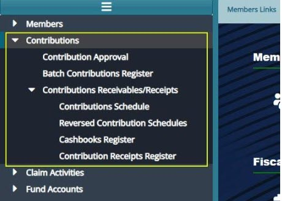

## Contribution Approval

The **'Contribution Approval'** window lists individual member contributions that have been received and need to be approved as a way of confirming their receipt. See screenshot below:

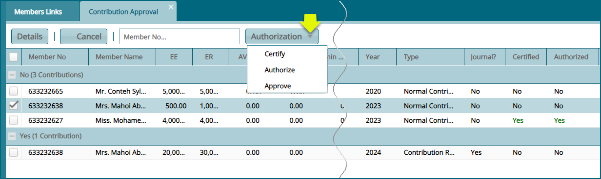

## Batch Contributions Register

After batch contributions are successfully uploaded into the system, they are collectively saved in the **Batch Contributions Register** where all the batch contributions are grouped based on the different establishments. To open this register, click the Batch Contributions Register as shown in the screenshot below:

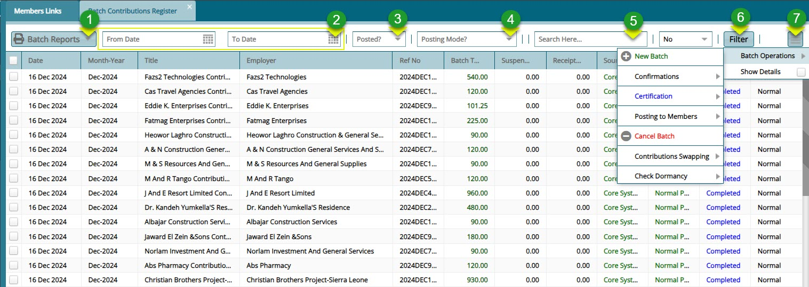

**Action**

-   Click **label 1** button to view a list of options that are appliable on a selected batch record or create a new batch.

-   Click **label 2** button to view a list of batch related reports that can be accessed for print.

-   Click **label 3** and pick a date range to filter batch records from the list.

-   Click **label 4** to select either to filter records based on those posted or not posted yet.

-   Click **label 5** to select the posting mode such as 'normal mode' to filter records by.

-   Click **label 6** and type a key word upon which records can be filtered.

-   Click **label 7** and from the dropdown menu check the **Show Details** button to load a new section showing more details of a selected batch record from the list.

Clicking the **Show Details** checklist will open a new section on the lower part of the window showing extra information concerning the selected batch. The information is organized in tabs.

### Batch Details

To view the details of a selected batch record, click on the **Batch Details** tab as shown below:

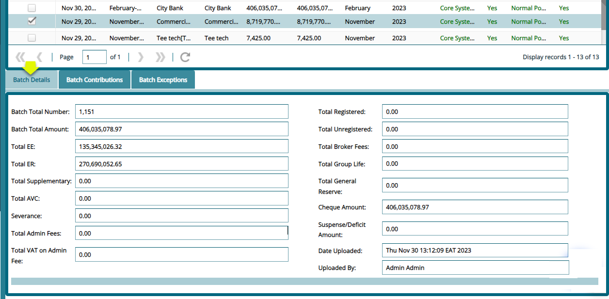

### Batch Contribution

To view batch contributions distribution to member's accounts, click the **Batch Contributions** tab as shown below:

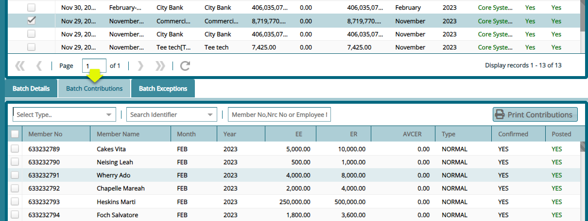

### New Batch Contribution

After downloading the contributions template and filling it with data. Click the **New Batch Contribution** link to open the window through which the template is uploaded back into the system. The following screenshot shows an example of a successful upload:

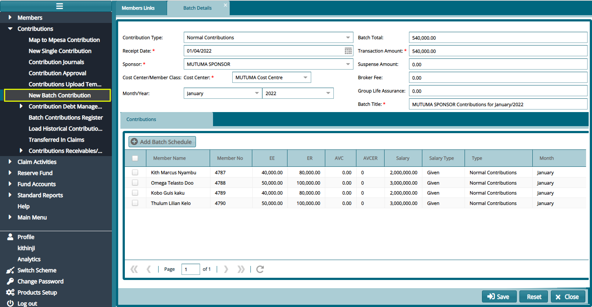

**Tip:** In the event of unagreeable data or tempered with template settings,  the system to reject the upload through an error alert message in the troubleshooting window.

## Contribution Receivables/Receipts

The links under this category give access to windows where the Contributions Billing, Receivables Register, and Receipts Register configurations are set. Click on the drop-down submenu links enclosed below to load the respective windows and set configurations appropriately:

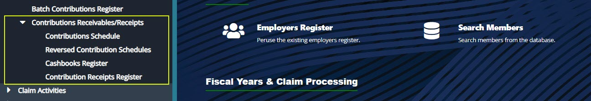

## Contribution Schedules

The **Contribution Schedules** window lists all the contribution schedules generated in the system to date. Through the window, a new contribution schedule can be generated and emailed to establishments or downloaded among other operations. See screenshot below:

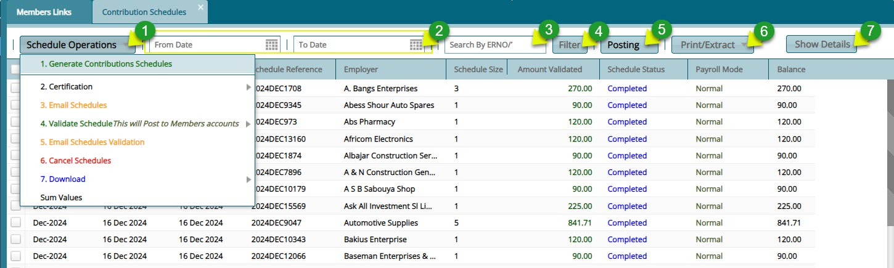

**Action**

-   Click **label 1** drop-down menu to select an operation to initiate e.g. to generate a contribution schedule.

-   Click **label 2** text fields and select dates to filter records.

-   Click **label 3** text field and type the ERNo to filter a contribution record. 

-   Click **label 4** button to filter the records by set parameters.

-   Click **label 5** button to post a selected contribution schedule from the list.

-   Click **label 6** drop-down menu to select different contribution schedule reports to view copies.

-   Click **label 7** button to view more details of a selected conribution schedule. 

### Generating a Contribution Schedule

To generate a contributions schedule, click the **Generate Contributions Schedule** link to open the contributions schedule dialog box where the details of a new schedule are captured. click the **Run Contributions Billing** button to create a new contribution schedule. See screenshot below:

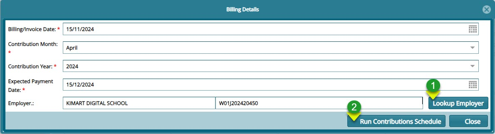

**Action**

-   Click **label 1** button to search for the employer name and populate the fields automatically.

-   Click **label 2** button to to run the contribution schedule. 

Clicking the **Lookup Employer** button will help you to fetch the employer by filtering through the records as shown below:

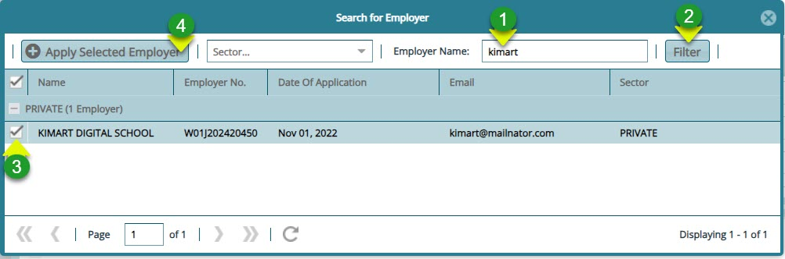

**Actions**

-   Click **label 1** text field and type the name of the employer you are generating the schedule for. 

-   Click **label 2** button to filter the records.

-   Click **label 3** check box to select the filtered record. 

-   Click **label 4** button to fetch the record and load it to the contribution schedule dialog box as shown in the preious screenshot.  

A successful running of contribution schedule will be confirmed by a window showing message with the employer name and their members with the total contribution expected as shown below:

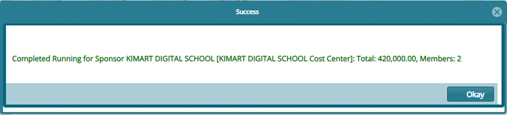

### Validating a schedule

### Download generated schedule

After generating a contribution schedule, a schedule is emailed ny NASSIT to the employer for confirmation or downloaded for internal view by clicking the **Download** link and from the drop-down menu click **Generated Schedule** to download the bill as shown below:

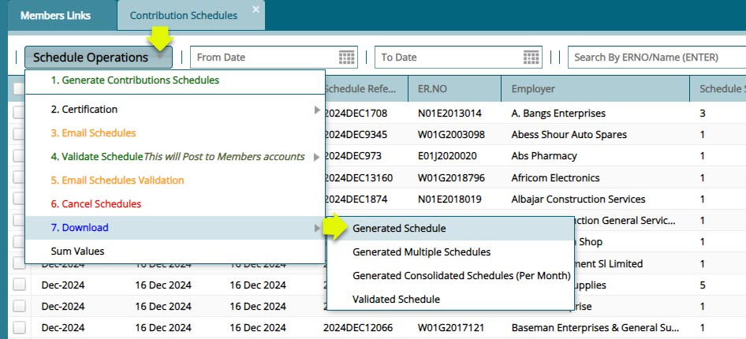

### Uploading Validated Schedule

After making the necessary updates to the contribution schedule, the employer will email it back to NASSIT for upload into the system for for validation. See the screenshot below on how to import the bill:

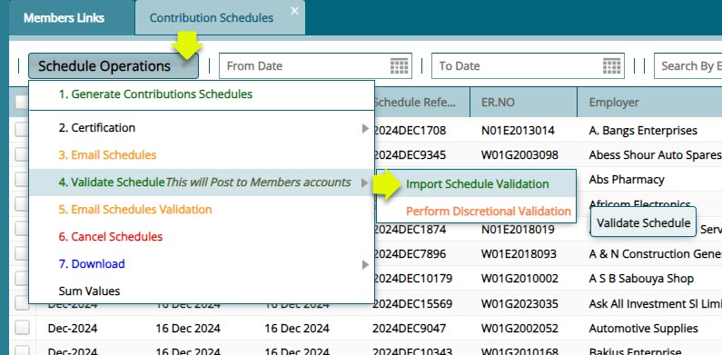

Clicking the **Import Schedule Validation** link will load the importation window. Click **Browse** to locate the bill file then click on the **'Upload'** button. This will populate the window with records as shown below:

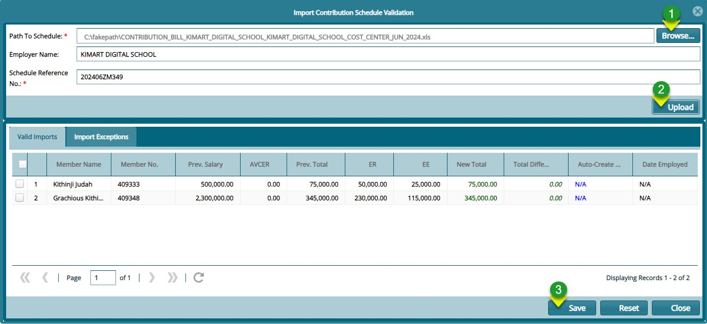

**Actions**

-   Click **label 1** button to locate the contribution schedule file from your device for upload.

-   Click **label 2** button to upload the schedule into the system.

-   Click **label 3** button to  save the contribution scheduel. 

### Contribution Schedule Operations

After a contribution schedule is validated, it will be listed on the contribution schedules window. From here the Contribution Schedule can be Certified, Cancelled among other actions from the **Schedule Operations** drop-down menu or **Unposted**,**Reversed**, **Tied to a Receipt** etc. from the **Posting** menu as shown in the screenshot below: 

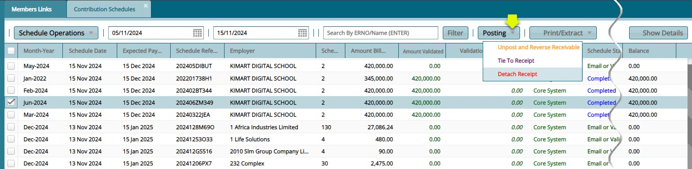

## Reversed Contribution Schedules

all the contribution scheduled that have been reversed for whatever reason such that they arre not posted to the members accounts are listed the in a **Reversed Contributions Schedule** as shown below:

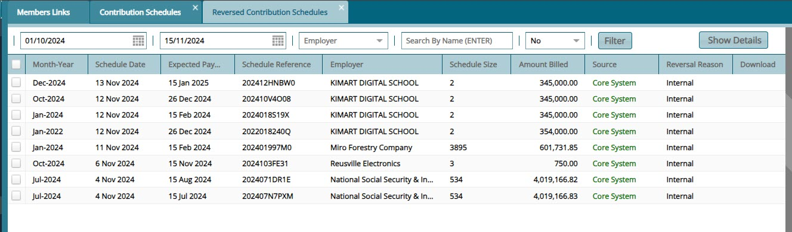

## Cashbook Register

The **'Cashbook Register'** lists all the cash books created and used in a scheme. From the **'Cashbook Operations'** menu a new cashbook can be created and the details of a selected cashbook from the list viewed. See screenshot below:

## Contributions Receipts Register

The Contributions Receipts window lists all the recipts created in the system ready to be tied to specific contribution schedules. From this window **'New Receipts'** can be **Created**, **Certified** and **Posted**. See screenshoot below:

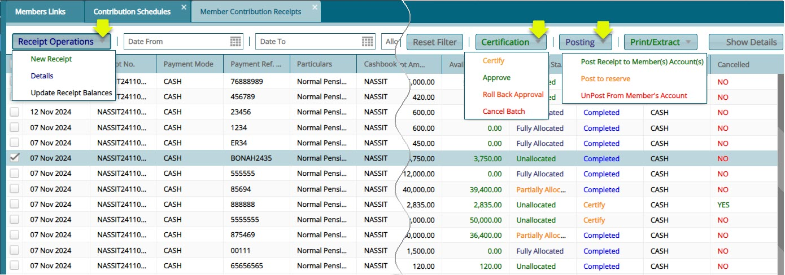

Click the **'New Receipt'** button open a dialogue box through which a **'New Contribution Receipt'** is created as shown below:

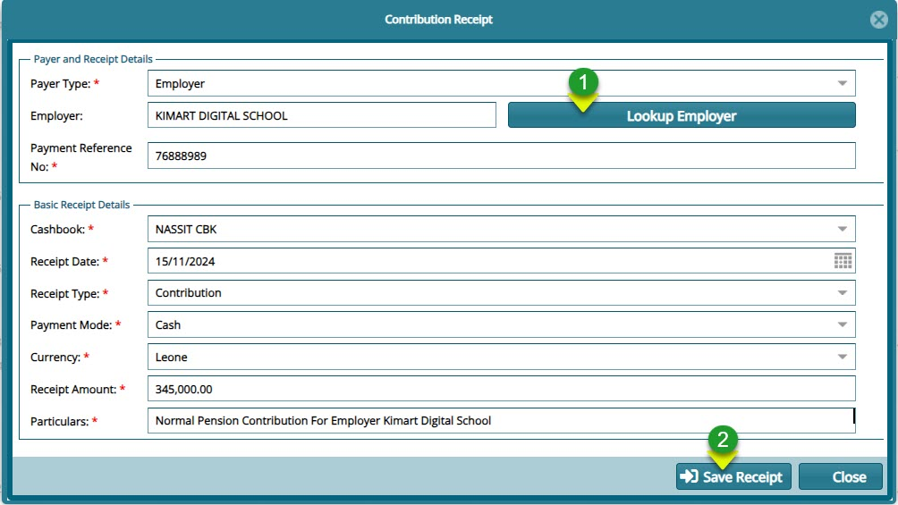

**Actions**

-   Click **label 1** button to filter the employer quickly from the employers register.

-   Click **label 2** button to save the new receipt ready fi tying  to a contribution schedule.

