## Contributions

After the process of adding Members and Sponsors to a Scheme, the next step is to upload members' contributions. Contributions can be uploaded to the system in two ways: as a single contribution for one member or multiple contributions for more than one member in a batch using a template.

## Contribution Journals

The 'Contribution Journal' form is used to capture contributions for members of the scheme. See screenshot below:

## Contribution Approval

The **'Contribution Approval'** window lists all the member contributions that have been received and need to be approved as a way of confirming their receipt. See screenshot below:

## New Batch Contribution

After downloading the contributions template and filling it with data. Click the **'New Batch Contribution'** link to open the window through which the template is uploaded back into the system. The following screenshot shows an example of a successful upload:

**Tip**

In the event of unagreeable data or tempered with template settings,  the system to reject the upload through an error alert message in the troubleshooting window.

## Contributions Debt Management

The configurations under this **'Contribution Debt Management'** menu are set to determine among other things the penalty formulae to use in case of rate contributions payments, the policy rates setting for processing penalties, and previous salaries are also configured. See screenshot below:

## Penalty Formulae

Click the **'Penalty Formulae'** link to open a penalty details dialog box through which a new penalty formula is set as shown in the screenshot below:

## Policy Rates

Click the **'Policy Rates'** link to open rates details dialog box through which a new rate is configured as shown in the screenshot below:

## Previous Salaries

The **'Previous Salaries'** window displays the records of all salaries that were paid previously. From this window the records can be imported into the system using a template. See screenshot below:

## Process Penalties 

The **'Process Penalties'** window displays the records of all contribution penalties given for late contributions and other reasons. From the **'Operations'** dropdown menu, a penalty record can be emailed to a member among other actions. See screenshot below:

### Batch Contributions Register

After batch contributions are successfully uploaded into the system, they are collectively saved in a register where all the member's batch contributions are tabulated based on the different sponsors in the scheme. To open this register, click the **'Batch Contributions Register'** link to batch records as shown below:

**Action**

-   Click **label 1** button to view a list of options that are appliable on a selected batch record or create a new batch.

-   Click **label 2** button to view a list of batch related reports that can be accessed for print.

-   Click **label 3** and pick a date range to filter batch records from the list.

-   Click **label 4** to select either to filter records based on those posted or not posted yet.

-   Click **label 5** to select the posting mode such as 'normal mode' to filter records by.

-   Click **label 6** and type a key word upon which records can be filtered.

-   Click **label 7** and from the dropdown menu check the **'Show Details'** button to load a new section showing more details of a     selected batch record from the list.

Clicking the **'Show Details'** checklist will open a new section on the lower part of the window showing extra information concerning the selected batch. The information is organized in tabs.

### Batch Details

To view the details of a selected batch record, click on the **'Batch Details'** tab as shown below:

### Batch Contribution

To view batch contributions distribution to member's accounts, click the **'Batch Contributions'** tab as shown below:

### Historical Contribution Register

The **'Historical Contributions Register'** shows all the historical data uploaded in the system in the form of batches. From this window, new batches of historical contributions can be uploaded and certified. See screenshot below:

### Load Historical Contribution Arrears

Clicking the **'Load Historical Contribution Arrears'** side menu will load a form through which the contribution arrears are loaded into the system. See screenshot below:

### Transferred in Claims

Click the **'Transferred in Claims'** link to open a grid table listing
all the claims transferred within a scheme. Besides searching for a
claim record using keywords or member number, a selected claim can be
**Certified,** **Posted,** or **Canceled** among other actions as shown
below:

### Contribution Receivables/Receipts

The links under this category give access to windows where the
Contributions Billing, Receivables Register, and Receipts Register
configurations are set. Click on the drop-down submenu links enclosed
below to load the respective windows and set configurations
appropriately:

### Contribution Billing

The **'Contribution Billing'** window lists all the bills generated in
the system to date. Through the window, a new contribution bill can be
generated and converted to contribution schedule among other operations.
See screenshot below:

### Generating a Bill

To generate a scheme contributions bill, click the **'Generate
Contributions Bills'** link to open a billing details window where a new
bill detail is captured. After Updating member salaries by clicking the
**'Update Member Salaries'** button, click the **'Run Contributions
Billing'** button to create a new bill. See screenshot below:

A successful running of contribution billing will be confirmed by a
window showing all employer and their members with the total
contribution expected as shown below:

### Validating Bill

### Download generated bill

After generating a bill, click the **'Download'** link and from the
dropdown menu click **'Generated Bill'** to download the bill as shown
below:

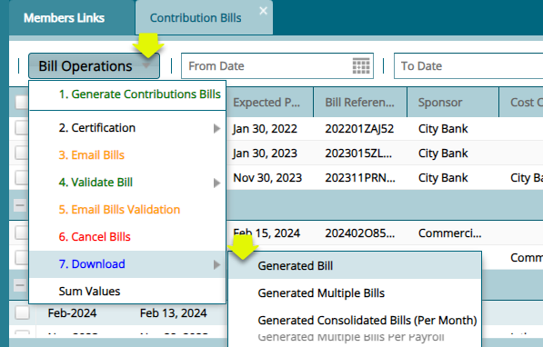

### Uploading Validating Bill

After making the necessary updates to the bill if any, the downloaded
bill is uploaded back into the system for validation. See the screenshot
below on how to import the bill:

Clicking the **'Import Bill Validation'** link will load the importation
window. Click **'Browse'** to locate the bill file then click on the
**'Upload'** button. This will populate the window with records as shown
below:

### Contribution Schedule 

After a bill is validated, it can then be converted into a contribution
schedule ready for sending to employer for payment. A converted bill
will be labelled as **'Completed'** under the Bill Status column. See
screenshot below:

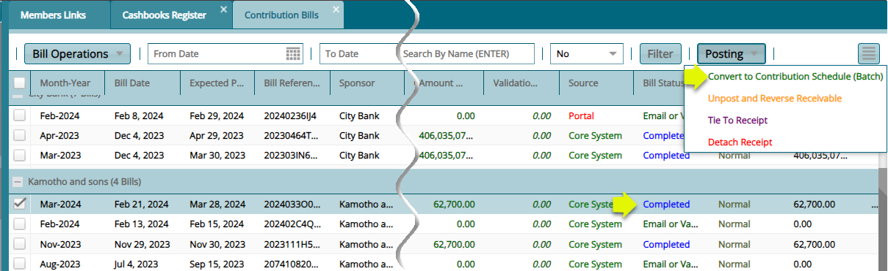

### Cashbook Register

The **'Cashbook Register'** lists all the cash books created and used in
a scheme. From the **'Cashbook Operations'** menu a new cashbook can be
created and the details of a selected cashbook from the list viewed. See
screenshot below:

### Receivables Register

Click the **'Receivables Register'** link to load a grid table listing
all the received contributions as shown below:

Click the **'New'** button open a dialogue box through which a new
contribution can be added as shown below:

### Receipts Register

The **'Receipts Register'** window displays a table listing all the
receipted contributions as shown below:

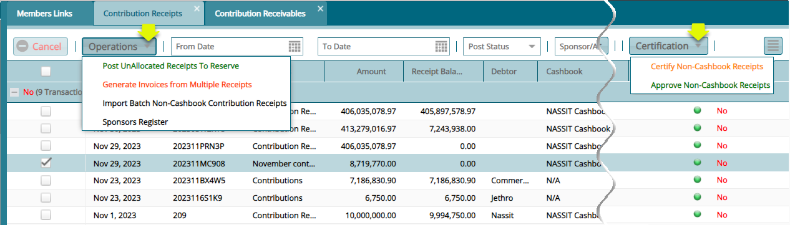

Click the **'Operations'** menu and from the dropdown menu, select to
generate an invoice for a selected receipt, post Non-Cash Book Receipts
among other operations as shown above.

### AVC Applications

The **'AVC Application'** window displays all the **Additional Voluntary
Contribution (AVC)** applications that have been made by scheme members
in addition to **Mandatory Contributions**. From this window the
requested can be approved or declined. See screenshot below:

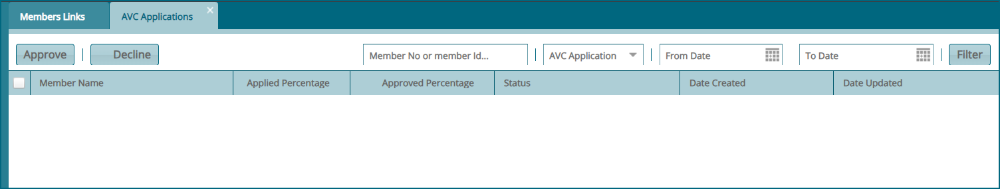

### Direct Debits

The **'Direct Debits'** window displays all direct debits authorized by
the sponsors in a scheme. The transactions can be approved, reversed, or
posted to a scheme's accounts:

## Claim Activities

The activities under this menu are related to claim processing. To start
an activity, click the appropriate link from the enclosed drop-down menu
to open the respective window as shown in the screenshot below:

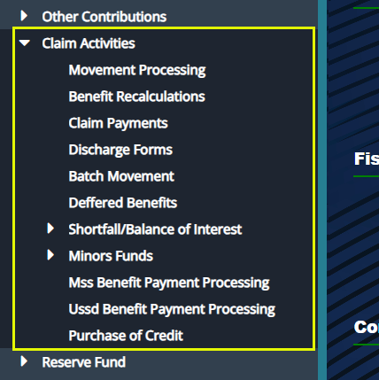

### Movement Processing

The **'Movement Processing'** window lists all the claims that have been
initiated from the members register. From this window, benefits for
claim record are calculated and transactions are certified. See
screenshot below:

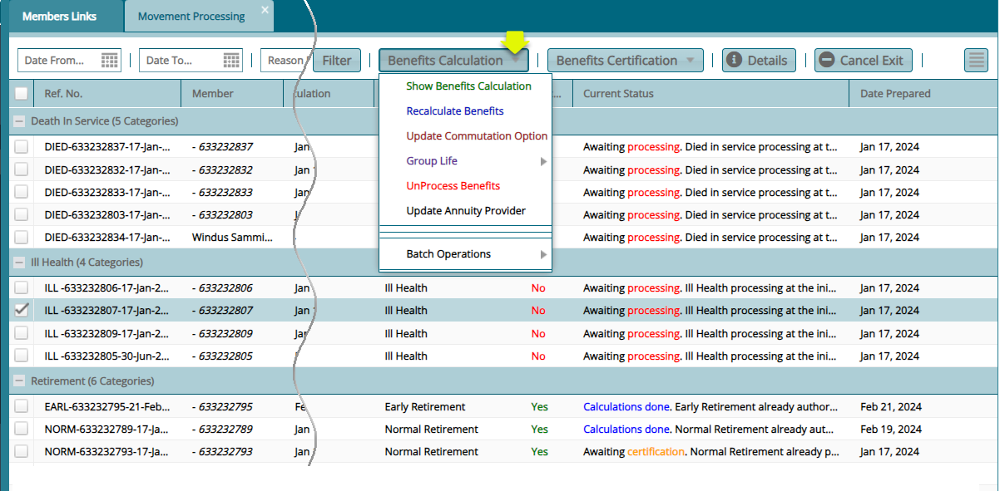

### Benefits Recalculation

The **'Benefits Recalculation'** window lists all the benefits
transactions that have undergone recalculation. The transactions listed
here are also subject to the certification process. See screenshot
below:

### Claim Payments

After benefits calculations and processing, all claim records for
different members under different exit categories are listed in the
**'Claim Payments'** window awaiting disbursement of money. See
screenshot below:

**Action**

-   Locate the **'Process Payments'** menu and from the drop-down menu
    select '**Send Claims (selected) for Payment'** or select
    '**Unprocessed Claim (selected) From Accounts'** among other
    actions in the list.

-   From the '**Certification'** drop-down menu**,** click **'Certify'**
    and **'Authorize'** the payment of record selected.

-   Click the '**Registers'** menu and from the drop-down, access
    windows where all effected payments are listed.

-   Click the **'Print'** menu and from the drop-down menu select the
    type of report to view.

-   click the **'More Options'** menu and from the drop-down menu,
    select an action to execute.

### Registers

The **'Registers'** menu provides access to finance registers and claim
payments postings as shown below:

### Payments

After claim processing and payment of benefits to members, all the
payment transactions are saved in a **'Finance Register'**. To check
records of payments, from the **'Registers'** drop-down menu, select
**'Payments'** from the Finance Registers submenu, as shown in the
previous screenshot, to open the Payments window.

Click the '**Payment Processing'** drop-down menu to allow a selected
payment from the list to be **'Certified'** and **'Posted to the
ledger**, **Unposted'** or '**Rejected'** among other actions as shown
in the following screenshot:

### Print

The **'Print'** menu provides access to different types of reports
related to benefits payments as shown below:

### More Options

The **'More Options'** menu provides access to edit and update actions
as shown below:

### Discharge Forms

**'Discharge Forms'** are configured to document members' exit details
from a scheme after claiming his/her benefits.

To access the list of claim forms in a scheme, click the **'Discharge
Forms'** link to open a window where all exited members' forms are
listed in a grid table. Click the **'Print'** button on the upper right
side to allow you to view various '**Exit Declaration Forms'** and
**'Payment Confirmation Letters'** for selected members form on the list
as shown below:

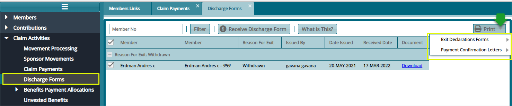

### Initiating Claim Movement

To initiate a claim for a member, navigate to the **'Members Register'**
and select the Member record from the list. Click the **Movements** tab
to access the **Initiate Movement/Claim** tab as shown in the following
sample screenshot:

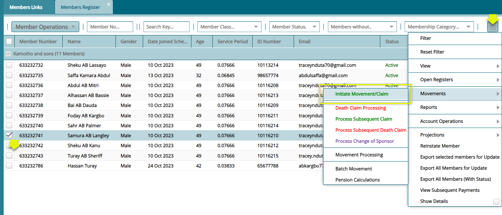

### Processing a Claim

To initiate a claim whose **'Reason for Exit'** is ill health, Click the
**'Initiate Movement/Claim'** link to load an exit form (see the
following screenshot) where configurations for processing the claims are
set.

Fill out the form with the required details and then click the
**'Confirm Exit Documents Checklist'** button (as shown in the next
screenshot but one) to receive and confirm receipt of relevant documents
from the member. After confirming receipt of documents, click the
**'Save'** button to proceed with the claim process as shown below:

Click the **'Confirm Exit Documents Checklist'** button, as shown in the
previously, to open the **'Benefits Log Checklist Confirmation'**
window**.** Select a document from the list and double-click to confirm
receipt of the document. Otherwise, click the **'Receive Document'**
button to upload the document as shown below:

A successful configuration of the exit form and confirmation of receipt
of relevant claim documents is noted on the status column where a
member's status is changed from **'Active'** to **'On Notice of Exit'**
as shown in the following screenshot:

After a successful initialization of a claim, the claim record is pushed
to the **'Movements processing'** window. Click the '**Movement Processing'** link to open the Movement Processing window. See
screenshot below:

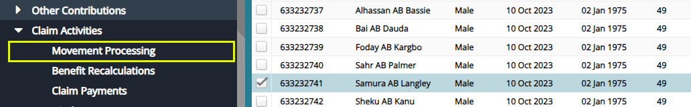

Clicking the **'Movement Processing'** menu will open the movement
processing window where all the initiated claims are listed awaiting
verification and benefits calculation as shown below:

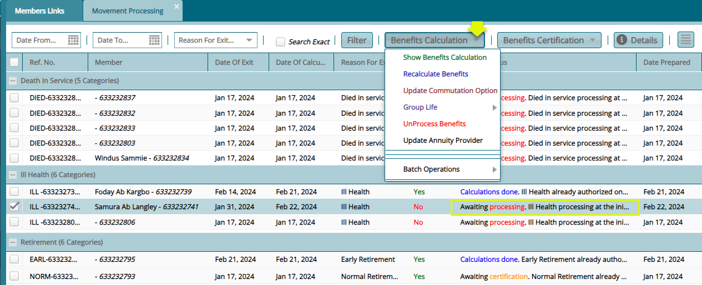

Click the **'Show Benefits Calculation'** tab from the **'Benefits
Calculation'** drop-down menu to load the **'Benefits Calculation'**
form. This shows the member's benefits tabulations as shown in the
screenshot below:

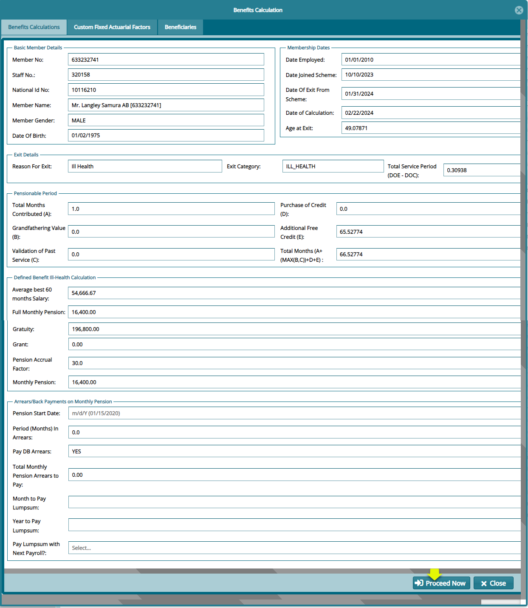

Next, click the **'Proceed Now'** button to process the payment and save
the records **'Awaiting Certification'** towards the disbursement of
money from the scheme accounts. See the screenshot below:

After the **'Certification'** is done, the record status in the movement
processing window will turn from **'Awaiting Certification'** to
**'Calculation done'** as shown in the screenshot below:

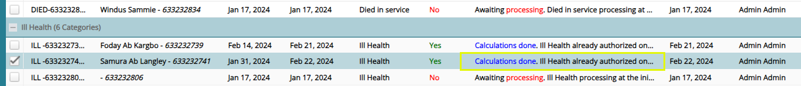

## Reserve Funds

FundMaster maintains records of balances (overpayments and
underpayments) in different transactions. See relevant Reserve Fund
links in the enclosed drop-down menu below:

### Transactions Register

Click the **'Transactions Register'** link to open the Transactions
Register where different transaction balances are listed. The
transactions are normally recorded as **Inflows**, which denotes
overpayments. These inflows can later be used to settle deficits, say
later underpayments from the same sponsor account.

The movement of money from the Fund accounts to bridge the deficit is
treated as an **Outflow**. The screenshot below shows a sample of a
Reserve Funds Transactions Register in FundMaster:

## Fund Accounts

From the **'Fund Accounts'** menu, the **'Financial Periods Register'**
is accessed enabling the creation of the different financial periods.
This allows different activities related to the fiscal financial
transactions.

### Financial Periods Register

Click the **'Financial Periods Register'** link to open the Financial
Periods Register window where all financial periods in a scheme are
listed. You can also create periods by Click the '**Create Periods'**
drop-down menu as shown below:

