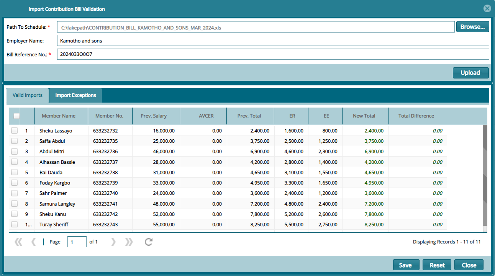

## Contribution Billing

The **'Contribution Billing'** window lists all the bills generated in the system to date. Through the window, a new contribution bill can be generated and converted to contribution schedule among other operations. See screenshot below:

## Generating a Bill

To generate a scheme contributions bill, click the **'Generate Contributions Bills'** link to open a billing details window where a new bill detail is captured. After Updating member salaries by clicking the **'Update Member Salaries'** button, click the **'Run Contributions Billing'** button to create a new bill. See screenshot below:

A successful running of contribution billing will be confirmed by a window showing all employer and their members with the total contribution expected as shown below:

#

## Validating Bill

### Download generated bill

After generating a bill, click the **'Download'** link and from the dropdown menu click **'Generated Bill'** to download the bill as shown below:

### Uploading Validating Bill

After making the necessary updates to the bill if any, the downloaded bill is uploaded back into the system for validation. See the screenshot below on how to import the bill:

Clicking the **'Import Bill Validation'** link will load the importation window. Click **'Browse'** to locate the bill file then click on the **'Upload'** button. This will populate the window with records as shown below:

### Contribution Schedule 

After a bill is validated, it can then be converted into a contribution schedule ready for sending to employer for payment. A converted bill will be labelled as **'Completed'** under the Bill Status column. See screenshot below:

### Cashbook Register

The **'Cashbook Register'** lists all the cash books created and used in a scheme. From the **'Cashbook Operations'** menu a new cashbook can be created and the details of a selected cashbook from the list viewed. See screenshot below:

### Receivables Register

Click the **'Receivables Register'** link to load a grid table listing all the received contributions as shown below:

Click the **'New'** button open a dialogue box through which a new contribution can be added as shown below:

### Receipts Register

The **'Receipts Register'** window displays a table listing all the receipted contributions as shown below:

Click the **'Operations'** menu and from the dropdown menu, select to generate an invoice for a selected receipt, post Non-Cash Book Receipts among other operations as shown above.

## AVC Applications

The **'AVC Application'** window displays all the **Additional Voluntary Contribution (AVC)** applications that have been made by scheme members in addition to **Mandatory Contributions**. From this window the requested can be approved or declined. See screenshot below:

## Direct Debits

The **'Direct Debits'** window displays all direct debits authorized by the sponsors in a scheme. The transactions can be approved, reversed, or posted to a scheme's accounts:

