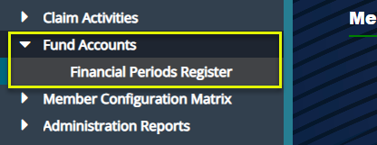

## Fund Accounts

From the **Fund Accounts** menu, the **Financial Periods Register** is accessed to enabling the creation of the different financial periods.
This allows different activities related to the fiscal financial transactions.

 

### Financial Periods Register

Click the **Financial Periods Register** link to open the Financial Periods Register window where all financial periods in a scheme are
listed. You can also create periods by Click the **Create Periods** drop-down menu as shown below:

 