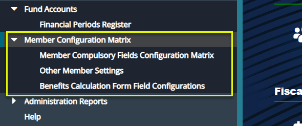
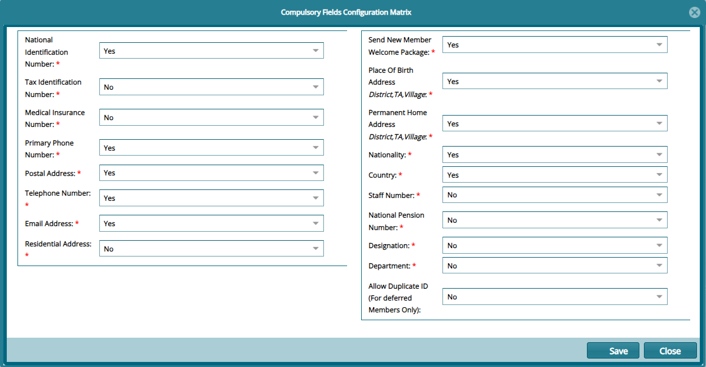
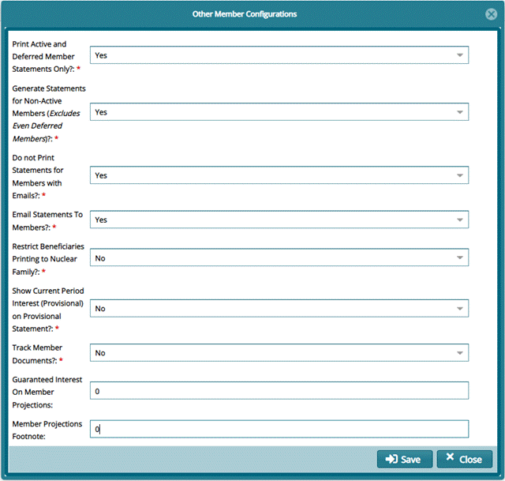
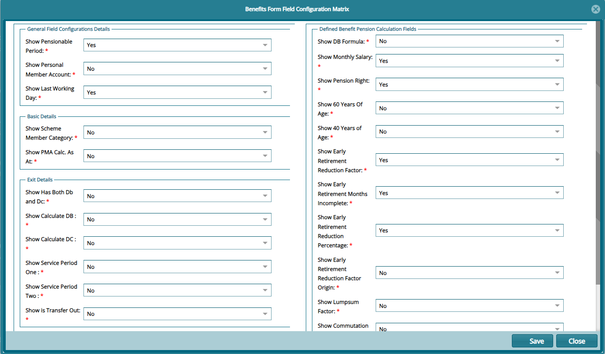

## Member Configurations Matrix

Before onboarding members, several configurations must be set based on the specific needs and expectations of a scheme and its participants.
These configurations ensure that all required member information is properly captured and validated:

 

### Member Compulsory Fields Configuration Matrix

Click the **Member Compulsory Fields Configuration Matrix** link to open a dialog box where the mandatory fields are set to **Yes** or **No**.
See screenshot below:

 

### Other Member Settings

Click the **Other Members Settings** link to open a dialog box and select **Yes** or **No** for the parameters listed as shown below:

 

***Benefits Calculation Form Field Configuration Form***

Click the **Benefits Calculation Form Field Configuration** Form link to open a dialog box and select **Yes** or **No** for the parameters listed
as shown below:

 

