## Members

All the link options under the **'Members'** menu open to different windows where the respective configuration related to member management are done. See screenshot below:

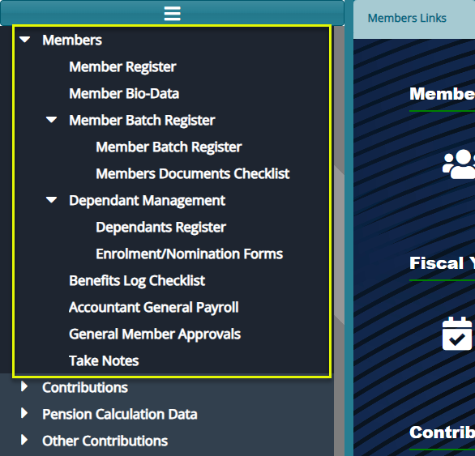

## Sponsor (Employer) Register

The **'Sponsor Register'** lists all the employers in a scheme. From this window specific actions can be carried out regarding a selected employer from the list. See screenshot below:

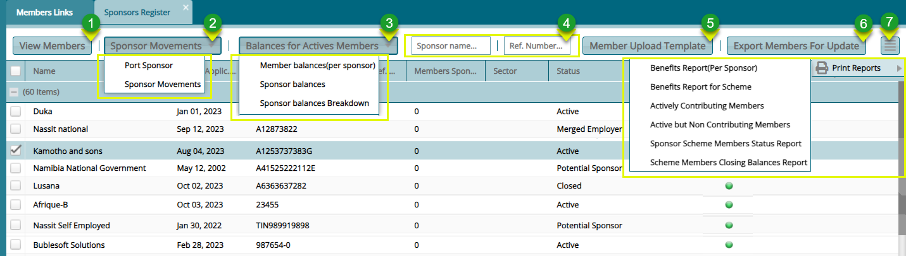

**Action**

-   Click **label 1** button to open a window where all members in a selected sponsor are listed.

-   Click **label 2** menu to open a drop-down list to either port a sponsor or initiate a sponsor movement.

-   Click **label 3** menu to open a drop-down list to either view sponsors balances among other actions.

-   Click **label 4** textboxes and type a sponsor name or reference number to filter sponsor records.

-   Click **label 5** button to download the MS Excel template to user for updating members details.

-   Click **label 6** button to initiate the process of exporting members for updates

-   Click **label 7** button to access extra links such as a link to view members' contribution balance history and various reports.

**Tip**

More columns can be shown on the grid table by Click the header cell of any column and adding new data fields.

## Members Register

The **'Members Register'** lists all the members under an employer in a scheme. From this window specific actions can be carried out regarding a selected member from the list.

Clicking the **'View Member'** button (see previous screenshot) will open a members register window displaying the members under a selected sponsor as shown below:

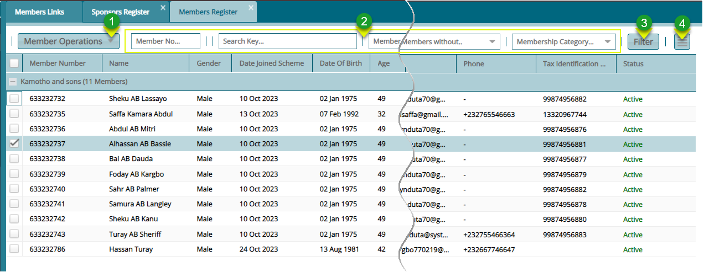

**Action**

-   Click **label 1** menu to open a drop-down list of options related to members operations such as adding a new member.

-   Click **label 2** and type member number or key words to search for records quickly.

-   Click **label 3** button to filter records as set.

-   Click **label 4** menu to open a drop-down list of other options related to selected member.

## Member Operations

The **'Member Operations'** menu provides links to open windows for various actions related to members. These actions include tasks like adding a new member, importing members using templates among others. See the screenshot below:

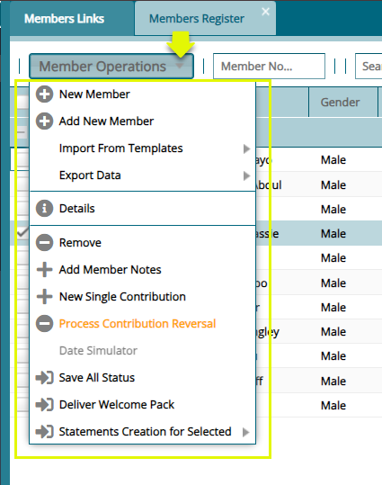

## Member Onboarding Processes

### *Single Member Onboarding Method*

To register a single member in a scheme, a member details form is used to capture member's data for the registration process. To begin the process, click the '**New Member'** link to open a dialog box through which a member's basic details are captured as shown below:

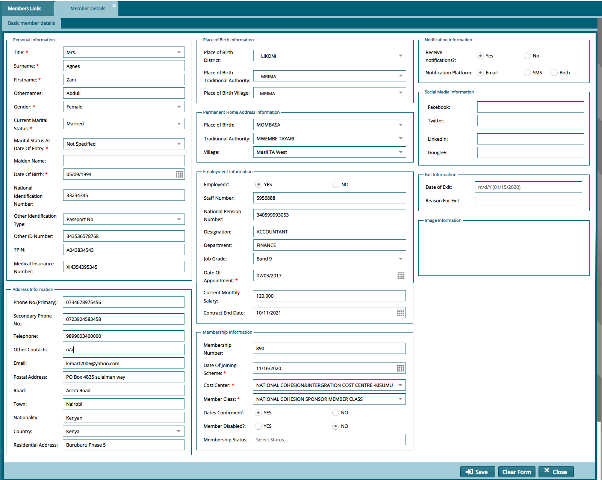

**Tip**

-   Remember to go to the member approval window to approve a newly created member. This is demonstrated in a later section.

### *Batch Member Onboarding Method* 

This method enables massive registration of members at a go. Members are compiled in a template file and then uploaded to the system. To begin, download the members template. There are two ways of accessing the download links as shown below:

1.  Download the template from the **'Sponsors Registers'** window as shown below:

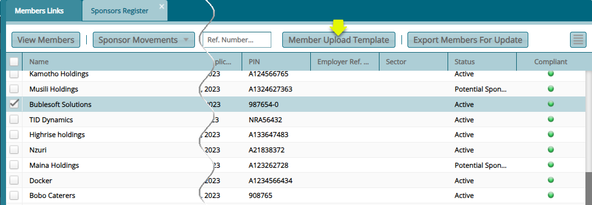

2.  Download the template from the **'Members Register'** window as shown below:

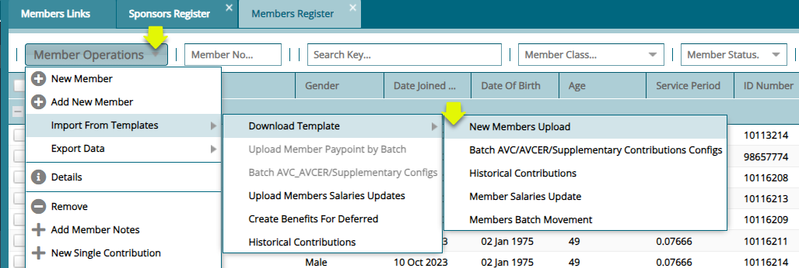

Below is a sample template used to import and upload members:

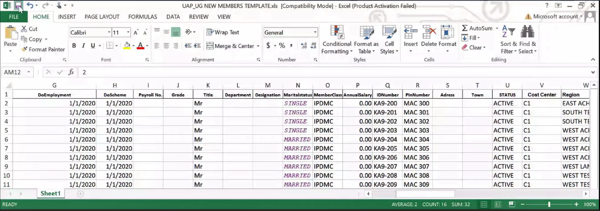

**Tip**

To upload members efficiently, restrict the number of members on the file to a figure below 65, 500.

## Members Import Process

To import members in batch, after preparing the template, click the **Members** link to open the **Members Import** window through which the template is loaded from a user's storage device to the system as shown below:

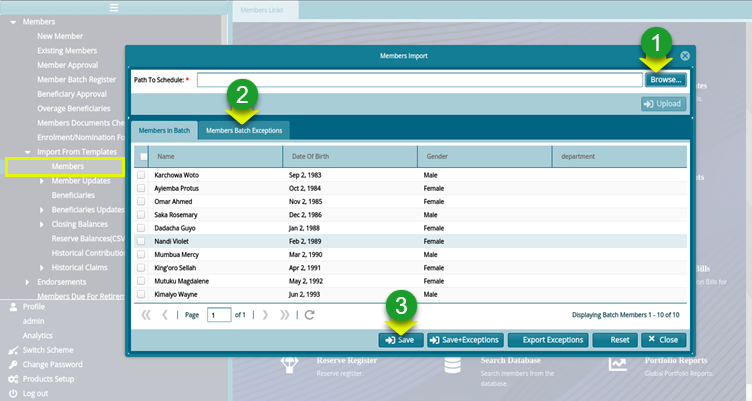

**Action**

-   Click **label 1** button to provide a link for fetching the template file from another device.

-   Click **label 2** button to check for exceptions (possible errors) before proceeding.

-   Click **label 3** button to save the uploaded list of members from the batch file.

### Members Right Side Menu

Clicking the **'Hamburger'** icon on the right side of the members register window will open a dropdown menu with more options of the actions that relate to members. These actions include claim movements, reports among others. See the screenshot below:

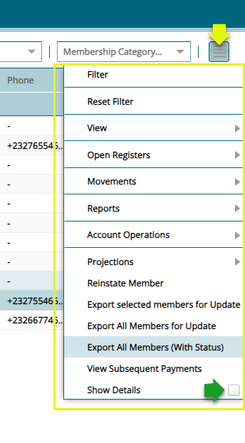

### Members Extra Details

Clicking the **'Show Details'** checkbox, as shown in the previous screenshot, will open a section on the lower side of the members register window, displaying details of a selected member from the register. The section is arranged in tabs, such as the Contributions tab, Closing Balances tab, etc., as shown below:

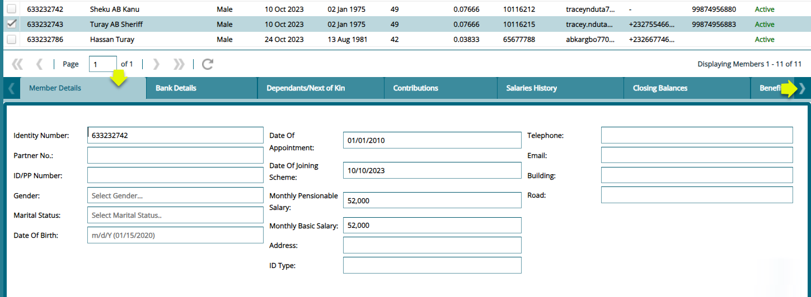

## Member Biodata

The **'Members Bio Data'** window displays the records of members personal information. Records can be filtered by members name and an extract of the members report generated a shown below:

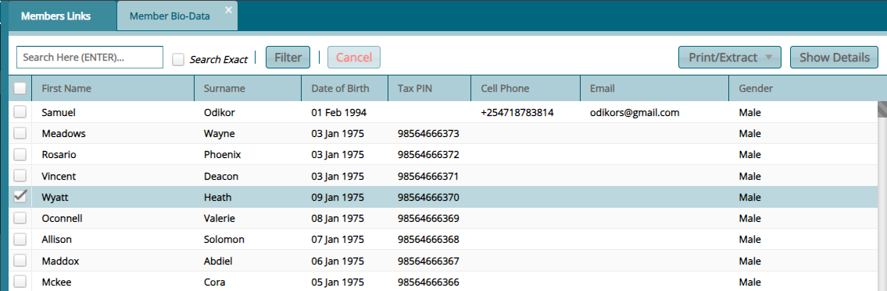

## Member Batch Register

The **'Members Batch Register'** holds the details of the members who have been uploaded via a template. See the members batch register screenshot below:

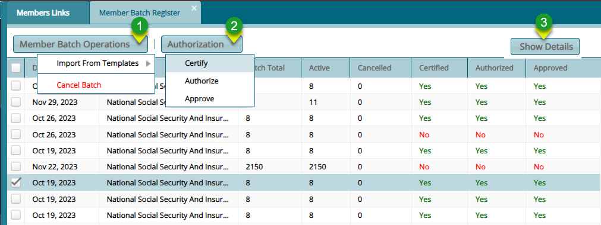

**Action**

-   Click **label 1** menu to select the option of importing member in batch or canceling a batch.

-   Click **label 2** button and from the drop-down menu click to certify, authorize, and approve a selected batch from the list.

-   Click **label 3** button to view all the details of a selected individual member in the batch.

Clicking the **'Show Details'** button will open a section of extra details of a selected member as shown below:

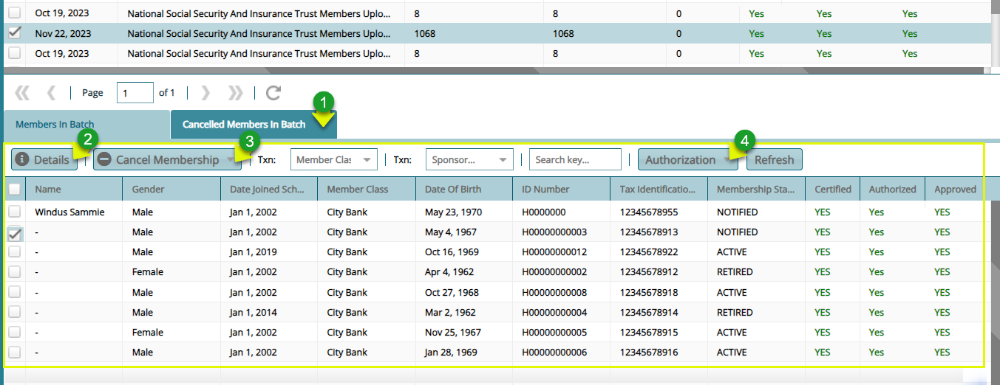

**Action**

-   Click **label 1** to see a list of all the members whose membership has been revoked from the batch being proceeded.

-   Click **label 2** button to view all the details of a selected individual member in the batch.

-   Click **label 3** button to revoke the membership of a selected member in the batch.

-   Click **label 4** button and from the drop-down menu then click to certify, authorize, and approve selected members from the batch.

Clicking the **'Cancelled Members in Batch'** button will show a section listing all members whose membership has been revoked. To retore membership, select individuals from the grid table and click the **'Restore Membership'** button as shown below:

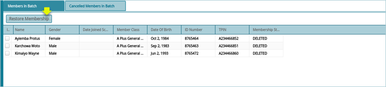

### Member Documents Checklist

The '**Member Document Checklist'** is a list of all the documents that are needed for the successful registration of a member into a scheme. These documents are enlisted in the system as shown below:

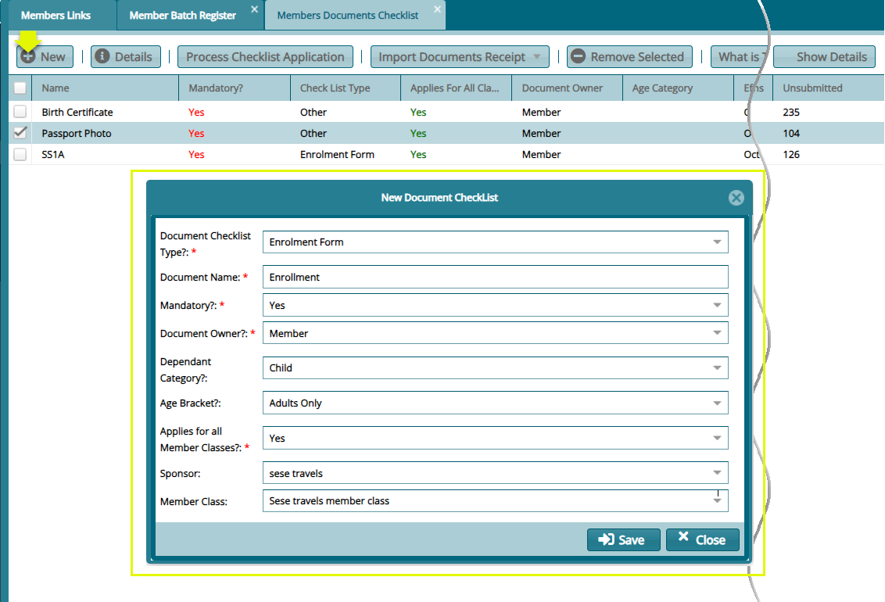

## Dependant Management

From the **Dependant Managemet** menu, key beneficiaries operations are initiated and accomplished, such as registration of dependants and access to nomination and enrollment forms. See screenshot below:

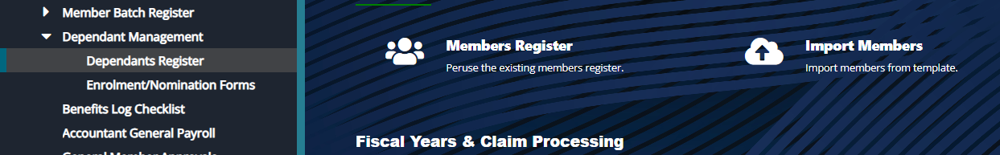

The **'Dependant Management'** menu, shown in the screenshot above, is not applicable to NASSIT dependants operations. To add dependants, select a particular member from the register, launch the **'Show Details'** section to add beneficiaries from the 'Dependents/Next of kin tab as shown below:

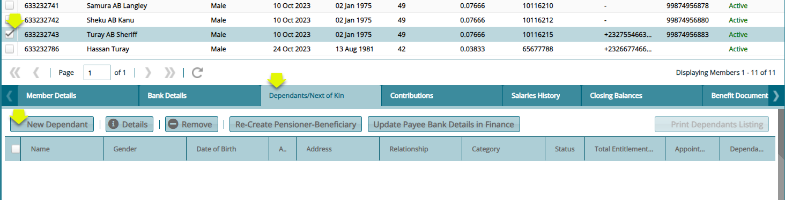

## Benefits Log Checklist

The '**Benefits Log Checklist'** window lists all the documents already defined for a claim of benefits. See screenshot below:

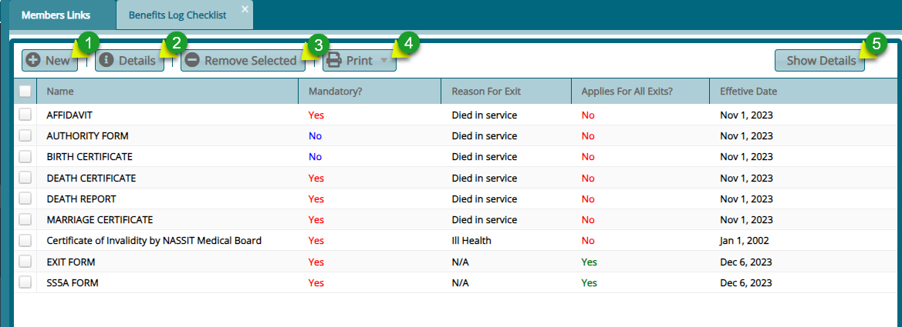

**Action**

-   Click **label 1** button to add a new benefits log.

-   Click **label 2** button to view the details of a selected record.

-   Click **label 3** button to delete a selected log from the list.

-   Click **label 4** button to view a printable copy of the checklist.

-   Click **label 5** button to view the details of a selected record from the list.

## Accountant General Payroll

The **'Accounts General Payroll'** window contains the list of the members who worked before the year 2000. There service behold 2000 is factored in claim processing. See screenshot below:

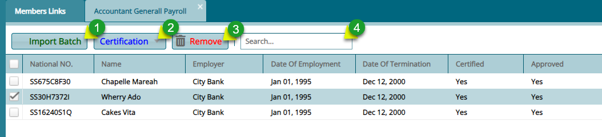

**Action**

-   Click **label 1** button to initiate the process of uploading payrolls in batch.

-   Click **label 2** menu and from the dropdown list click the appropriate option for certification of the selected payroll
    records. There are also options for certification of all the payrolls listed.

-   Click **label 3** button to delete a selected payroll record from the list.

-   Click **label 4** text box and type key words to filter payroll records quickly.

## General Member Approvals

The '**General member Approval'** window displays the members whose details have been updated and need to be certified and approved before they can be moved to the member register. See screenshot below:

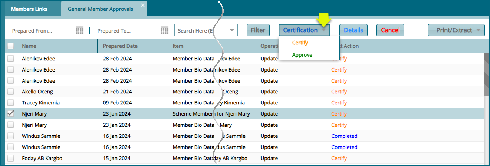

## Take Notes

This tool aids the system users to take some notes and save them. To see the notes already written and capture new notes.

Click the **'Take Notes'** link to open the Notes window. From this window locate and then click the **'New'** button to load a new dialog box and type new notes as shown below:

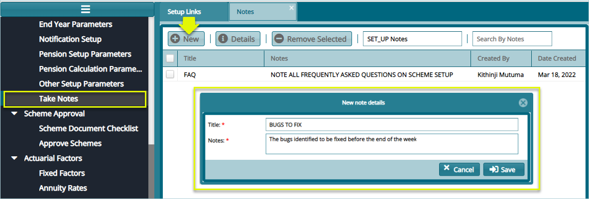