### Membership Registration

All the links under the **'Members'** menu open to different windows where the respective configuration related to the Management
of the scheme employers, members and their dependants are done. See screenshot below:

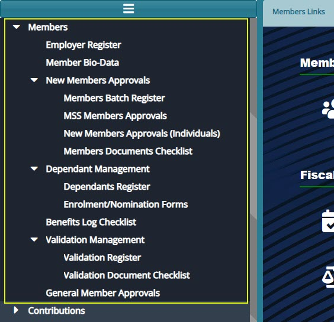

## Employer Register

The **'Employer Register'** lists all the establishments in the NASSIT scheme and categorizes them according to the sector of the economy they fall under. From this window specific actions can be taken regarding a selected establishment from the list. See screenshot below: 

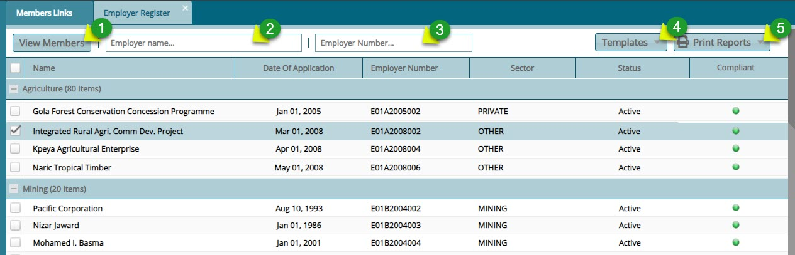

**Actions**

- Click **label 1** button to open a window where all members of a selected employer are listed.

- Click **label 2** textbox and type an employer name or reference number to filter employer records.

- Click **label 3** textbox and type an employer reference number to filter employer records.

- Click **label 4** button and from the drop-down menu select a template to download.

- Click **label 5** button and from the drop-down menu select links to download member related reports.
   

**Tip:** More columns can be shown on the grid table by clicking the header cell of any column and adding new data fields as shown in the screenshot below:

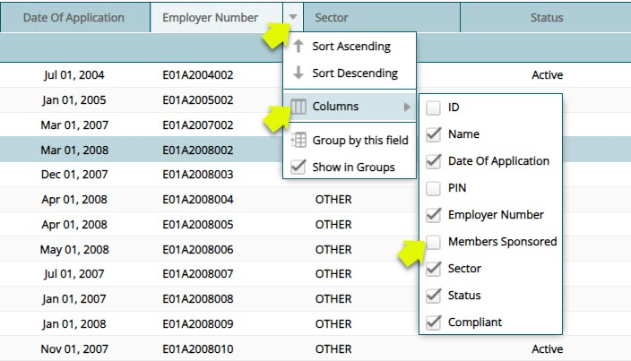

## Members Register

The **Members Registe** contains the records for all the members under an establishment within the scheme. From this window, specific actions can be performed on a selected member from the list.

Clicking the **View Members** button (see the member register screenshot) will open the Members Register window, displaying the members under the selected establishment, as shown below:

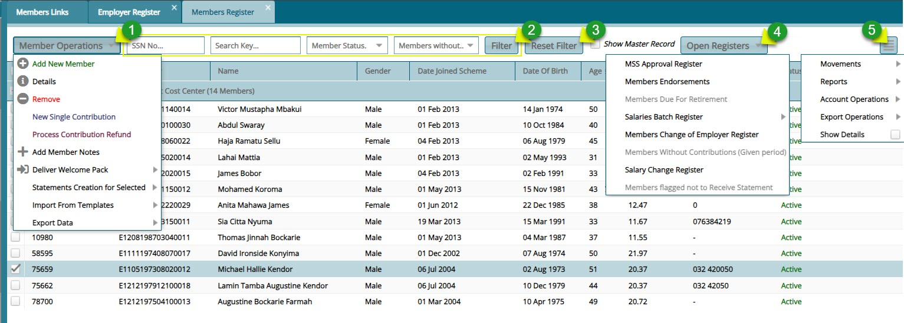

**Actions**

-   Click **label 1** menu to open a drop-down list of options related to members operations such as adding a new member.

-   Click **label 2** button to filter member records based on the typed parameters.

-   Click **label 3** button to reset the member records to default.

-   Click **label 4** drop-down menu button to access open registers for related entities. 

-   Click **label 5** menu button to open a drop-down list of other options related to a selected member.

### Member Operations

The **Member Operations** drop-down menu provides links to open windows for various actions related to members. These actions include tasks like adding a new member, viewing the details of a selected member, among others. See the screenshot below:

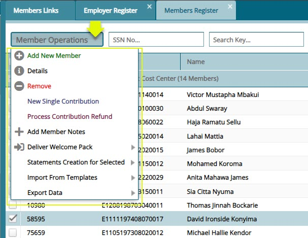

### Members Details

Clicking the **'Show Details'** checkbox, as shown in a previous screenshot, will open a section on the lower side of 
the members register window, displaying details of a selected member from the register. The section is arranged in tabs,
such as the Dependants/Next of kin tab, Contributions tab, Salary History tab etc., as shown below:

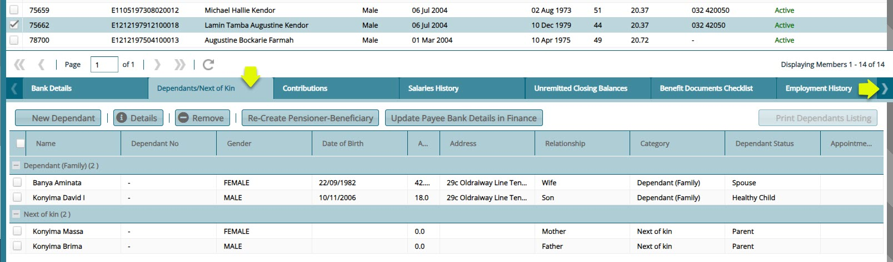

### Member Onboarding Process

### *Adding a New Member*

To register add a member in an establishment, a member details form is used to capture member's data for the registration process. To begin the process, click the '**'New Member'** link from the **'Member Operations'** drop-down menu to open a dialog box through which a member's basic details are captured. see all the steps as follows:

***Section 1 of Membership Form***

Fill in the details in the first section of the membership form and click the **'Next'** button to move to the next section as
shown below:

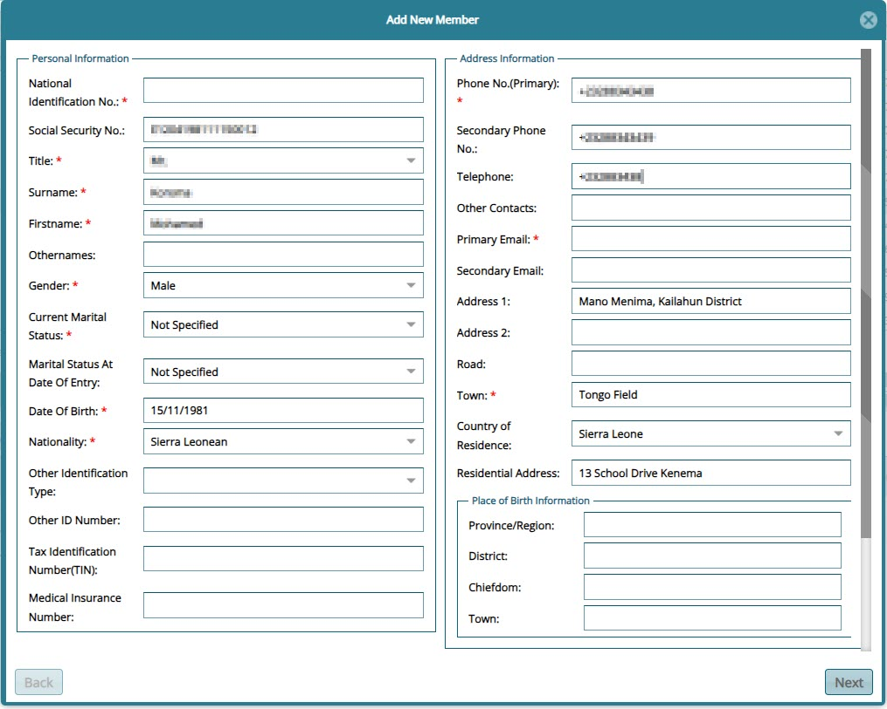

***Section 2 of Membership Form***

Fiil in the details in the second section of the membership form, select the employer and click the **'Next'** button to move to
the next section as shown below:

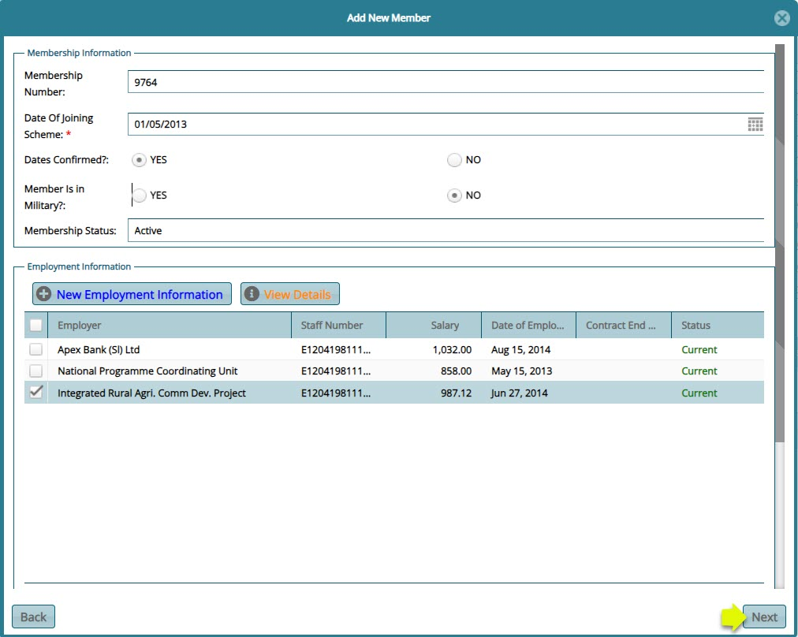

***Section 3 of Membership Form***

Capture the details of the member's **Dependants** and **Parents** by filling in their details and then click the 
**'Complete Saving Member'** button to save the new meber and his/her beneficiaries as shown in the screenshot below: 

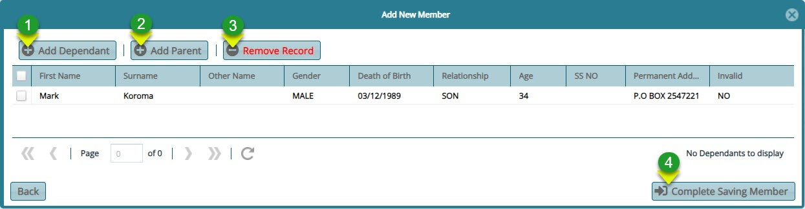

**Action**

-   Click **label 1** to open a dialog box for capturing the dependants details.

-   Click **label 2** to open a dialog box for capturing the a parent's details.

-   Click **label 3** to delete a selected record from the list. 

-   Click **label 4** to complete the process of registring a member. 

Clicking the **'Add Dependant'** button will load the dialog box for capturing the details of the dependant as shown below:

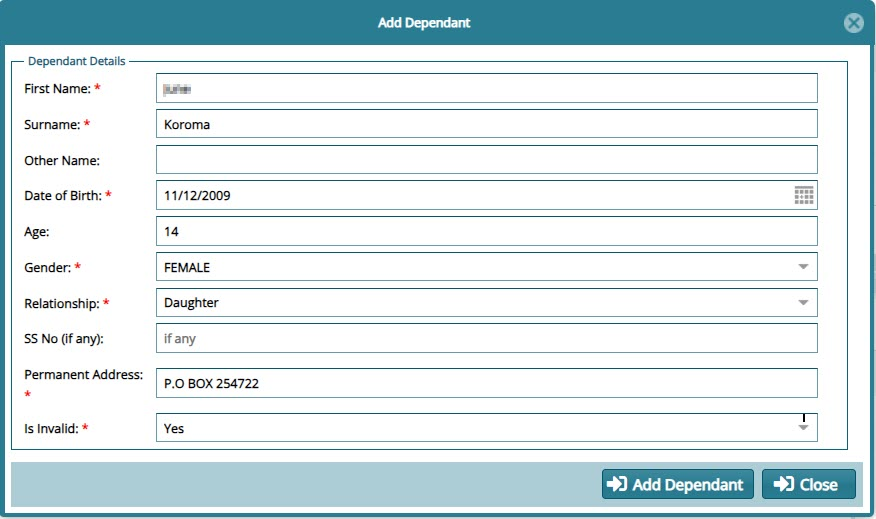

Clicking the **'Add Parent'** button will load the dialog box for capturing the details of the parent as shown below:

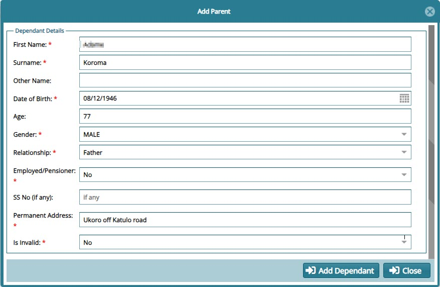

Clicking the **'Complete Saving Member'** button will save push the members details into the member register.

**Tip:** Remember to go to the **General Member Approval** window to approve a newly created member. This is demonstrated in a later section.

<!--
### *Batch Member Onboarding Method* 

This method enables massive registration of members at a go. Members are compiled in a template file and then uploaded 
to the system. To begin, download the members template. There are two ways of accessing the download links as shown below:

1.  Download the template from the **'Sponsors Registers'** window as shown below:

2.  Download the template from the **'Members Register'** window as shown below:

Below is a sample template used to import and upload members:

**Tip**

To upload members efficiently, restrict the number of members on the file to a figure below 65,500.

### Members batch upload Process

To import members in batch, after preparing the template, click the **Members** link to open the **Members Import** 
window through which the template is loaded from a user's storage device to the system as shown below:

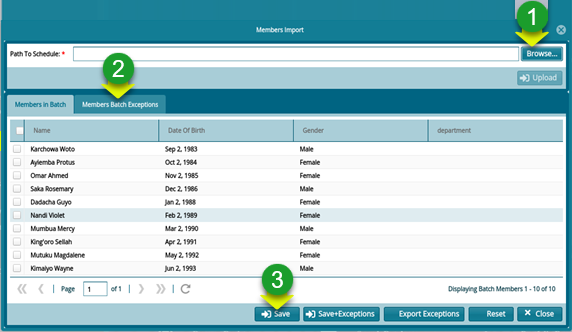

**Action**

-   Click **label 1** button to provide a link for fetching the template file from another device.

-   Click **label 2** button to check for exceptions (possible errors) before proceeding.

-   Click **label 3** button to save the uploaded list of members from the batch file.

### Members Right Side Menu

Clicking the **'Hamburger'** icon on the right side of the members register window will open a dropdown menu with more 
options of the actions that relate to members. These actions include claim movements, reports among others. See the screenshot below:

-->

## Member Biodata

The **'Members Bio Data'** window displays the records of members personal information. Records can be filtered by members 
name and an extract of the members report generated a shown below:

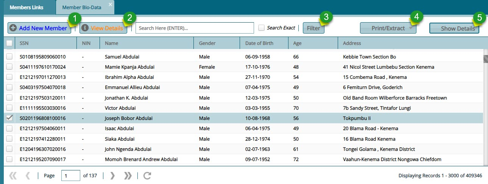

**Action**

-   Click **label 1** button to initiate the process of adding a new member. 

-   Click **label 2** button to open a window showing the details of a selected member.

-   Click **label 3** button to filter a member record based on the key words typed on the search box. 

-   Click **label 4** button to extract a report for the selected member.  

-   Click **label 5** button to show extra details of a selected member.  

Clicking the **Show Details** will show a lower section below the grid table showing more details of a selected member bio record. The screenshot below shows the **Employment History** tab. Under this tab are the details pertaining to different **Establishments** the member has worked for: 

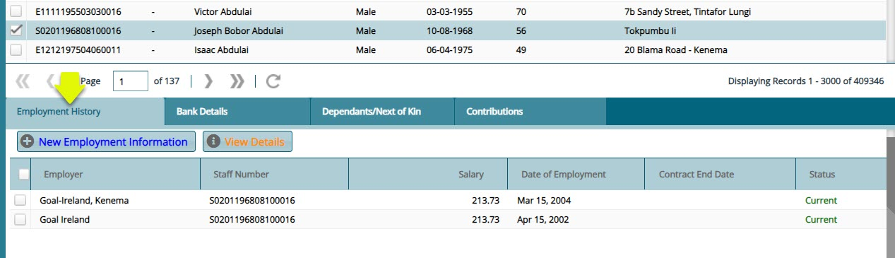

Clicking the **New Employment Information** button will load a dialog box for capturing another record of the selected member employment history. See screenshot below:

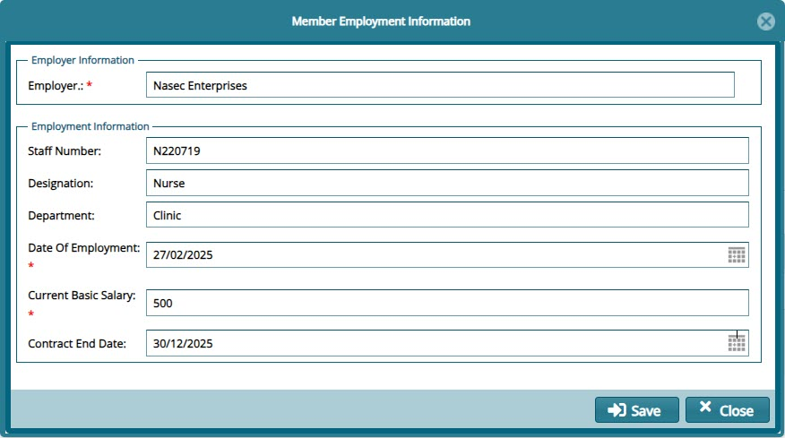

## New Members Approvals

The **New Members Approvals** menu provides links to access windows through which apploval of membership from batch registration,single registration and registrations done through the portal are granted so that the members can be moved to **Member Register**.See screenshot below:

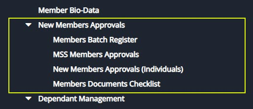

### Members Batch Register

The **'Members Batch Register'** holds the details of the members who have been uploaded via a template. See the members
 batch register screenshot below:

**Action**

-   Click **label 1** menu to select the option of importing member in batch or canceling a batch.

-   Click **label 2** button and from the drop-down menu click to certify, authorize, and approve a selected batch from the list.

-   Click **label 3** button to view all the details of a selected individual member in the batch.

Clicking the **'Show Details'** button will open a section showing more details of a selected member as shown below:

**Action**

-   Click **label 1** to see a list of all the members whose membership has been revoked from the batch being proceeded.

-   Click **label 2** button to view all the details of a selected individual member in the batch.

-   Click **label 3** button to revoke the membership of a selected member in the batch.

-   Click **label 4** button and from the drop-down menu then click to certify, authorize, and approve selected members from the batch.

Clicking the **'Cancelled Members in Batch'** button will show a section listing all members whose membership has been 
revoked. To retore membership, select individuals from the grid table and click the **'Restore Membership'** button as shown below:

### MSS Members Approvals

All members registered through the MSS Portal will be listed on this **MSS Member Approvals** window waiting for certification process before they can be moved to the Members Register. From this window the details of a selected member can be viewed, or the registration cancelled all together. See screenshot below:

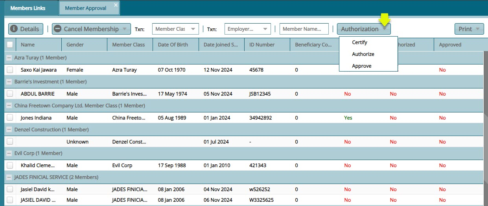

### New Members Approvals (Individual)

All members registered through the single member onboarding process (Using the membership form in FundMaster) will be listed on this window waiting for the certification process before they can be moved to the Members Register. From this window the details of a selected member can be viewed, or the registration cancelled all together. See screenshot below:

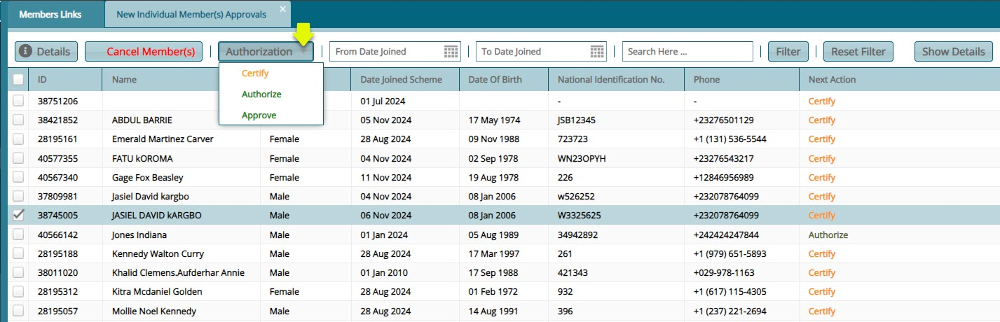

### Members Documents Checklist

The **'Members Documents Checklist'** window list of all the documents that are needed for the successful registration of a member into a scheme. From this window new documents can be added to the checklist by clicking the **New** button to load a 
**New Document checklist** dialog box through which the details of a new document are captured. See screenshot below: 

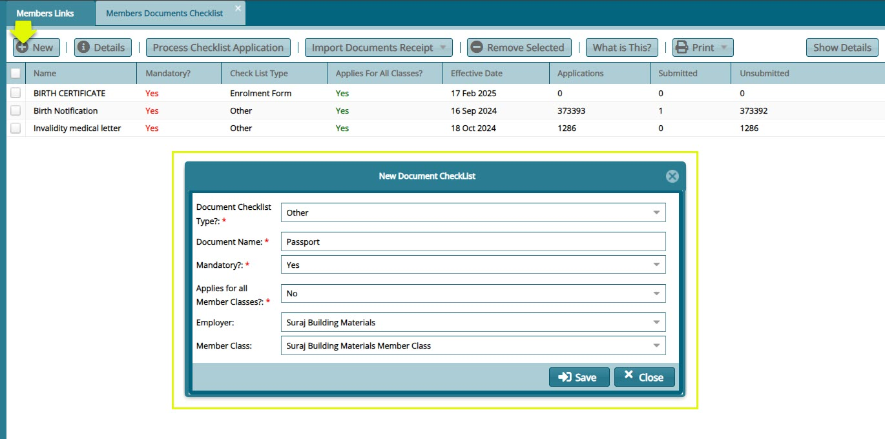

## Dependant Management

The **'Dependant Management'** menu provides access link to the dependants register. Click the respective link to
open a window for interacting with the mentioned objects. See screenshot below:

### **Dependants Register**

The **'Dependants Register'** contains the details of all the beneficiaries nominated by scheme members. From the register's menu
bar all necessary dependant document checklist can be accessed from the **'Open Register'** drop-down button among others as shown in the screenshot below:

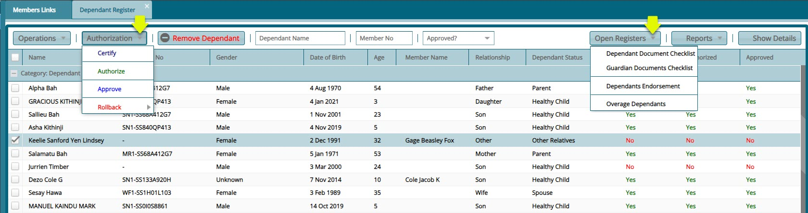

### **Dependants Documents Checklist**

To view and add the documents that dependants need to submit for registration, locate the **'Open Register'** menu from the 
**'Dependants Registers'** and from the drop-down, select the **'Dependants Document Checklist'** to open the window through which
 the configurations are done as shown in the screenshot below:

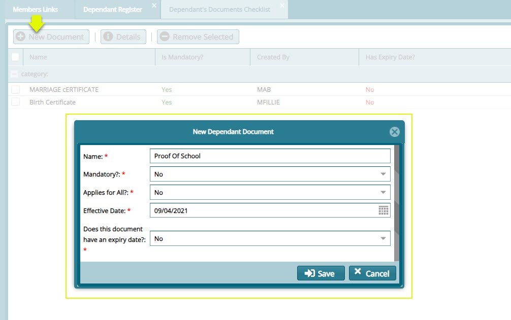

### **Dependants Endorsement**

In case a dependant’s details are updated from the **'Dependants Register'**, such changes need to be endorsed before the updates can take effect. All the beneficiaries whose details have been changed will be moved to the **'Dependants Endorsement'** window for approval. From this window, certification is done. See screenshot below:

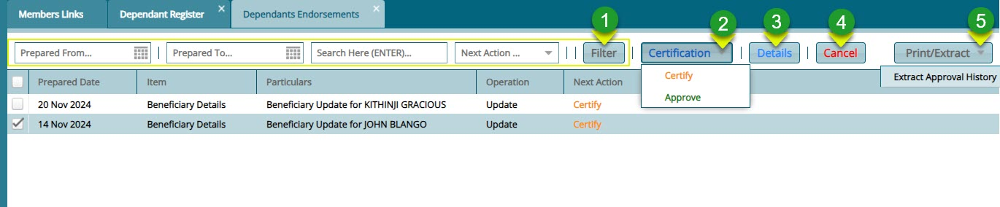

**Action**

-   Click **label 1** button to search for records based on set parameters. 

-   Click **label 2** button to certify and approve endosement of a selected dependant from the list.

-   Click **label 3** button to view the details of a selected dependant in a separate window.

-   Click **label 4** button cancel a dependant's proposed updates.

-   Click **label 5** button to extra dependants related reports.

## Benefits Log Checklist

The **Benefits Log Checklist** window displays a list of all required documents that must be uploaded into the system before a claim process can be initiated. Refer to the screenshot below for a visual representation of this checklist.

**Action**

-   Click **label 1** button to add a new benefits log.

-   Click **label 2** button to view the details of a selected record.

-   Click **label 3** button to delete a selected log from the list.

-   Click **label 4** button to view a printable copy of the checklist.

-   Click **label 5** button to view the details of a selected record from the list.

<!--
## Accountant General Payroll

The **'Accounts General Payroll'** window contains the list of the members who worked before the year 2000. There service behold 
2000 is factored in claim processing. See screenshot below:

**Action**

-   Click **label 1** button to initiate the process of uploading payrolls in batch.

-   Click **label 2** menu and from the dropdown list click the appropriate option for certification of the selected payroll
    records. There are also options for certification of all the payrolls listed.

-   Click **label 3** button to delete a selected payroll record from the list.

-   Click **label 4** text box and type key words to filter payroll records quickly.

-->

## General Member Approvals

The **'General Member Approvals'** window displays the members whose details have been updated and need to be **'Certified'** and **'Approved'** before the changes can be reflected in the Members Register. See screenshot below:

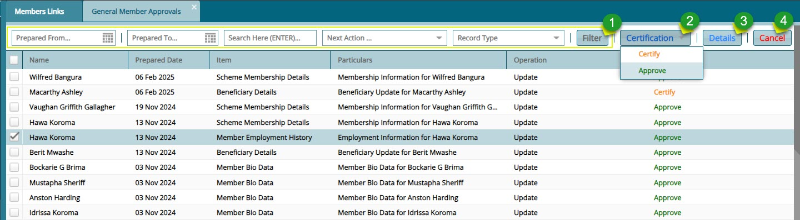

 **Action**

•	Click label 1 button to filter the records by the parameters you have set.

•	Click label 2 button and from the drop-down menu then click to Certify or Approve the updates of a selected member.

•	Click label 3 button to view the details of a selected record from the list.

•	Click label 4 button to cancel the certification of a selected member record.

Clicking the **Details** button will open an **'Item Approval Details'** window showing the changes made to the member details. See the screenshot below:

<!--
## Take Notes

This tool aids the system users to take some notes and save them. To see the notes already written and capture new notes.

Click the **'Take Notes'** link to open the Notes window. From this window locate and then click the **'New'** button to load
 a new dialog box and type new notes as shown below:

-->