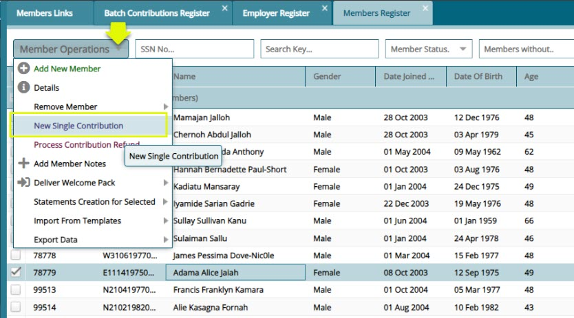
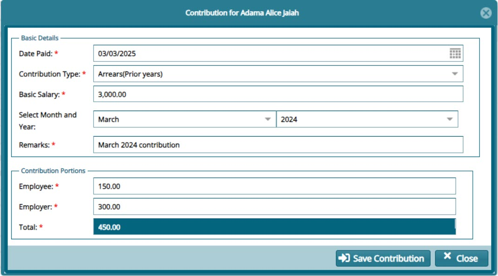
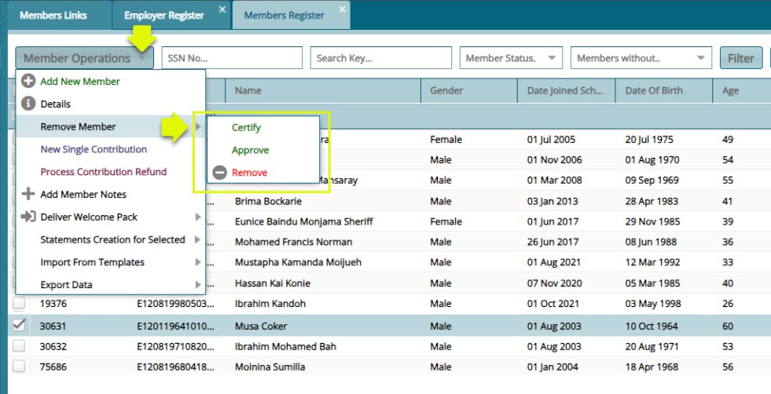
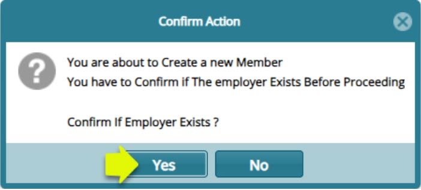
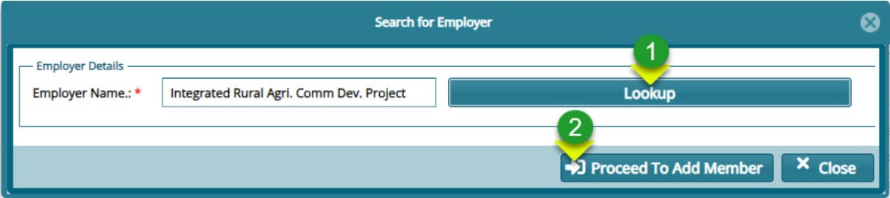
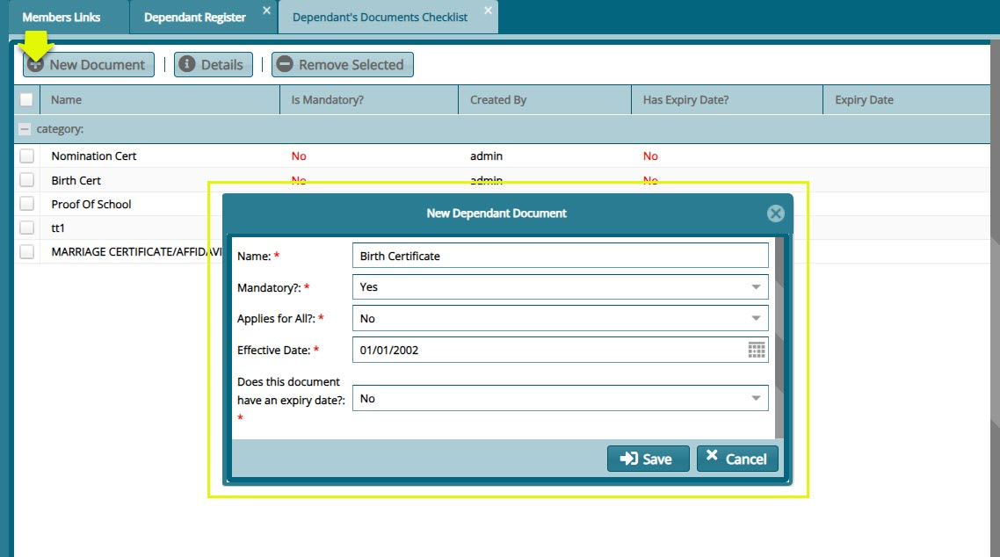
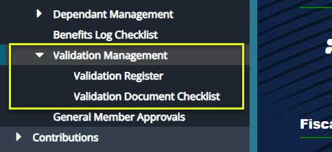
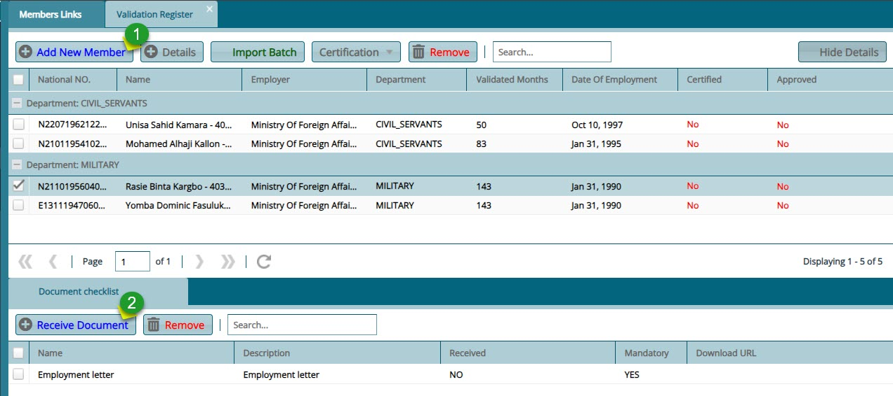
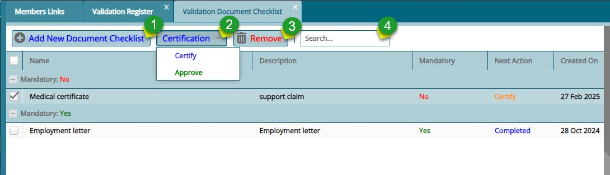
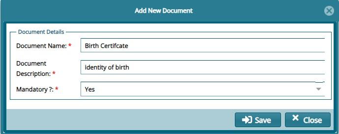

### Membership Registration

All the links under the **'Members'** menu open to different windows where the respective configuration related to the Management
of the scheme employers, members and their dependants are done. See screenshot below:

## Employer Register

The **'Employer Register'** lists all the establishments in the NASSIT scheme and categorizes them according to the sector of the economy they fall under. From this window specific actions can be taken regarding a selected establishment from the list. See screenshot below: 

**Actions**

- Click **label 1** button to open a window where all members of a selected employer are listed.

- Click **label 2** textbox and type an employer name or reference number to filter employer records.

- Click **label 3** textbox and type an employer reference number to filter employer records.

- Click **label 4** button and from the drop-down menu select a template to download.

- Click **label 5** button and from the drop-down menu select links to download member related reports.
   

**Tip:** More columns can be shown on the grid table by clicking the header cell of any column and adding new data fields as shown in the screenshot below:

## Members Register

The **Members Registe** contains the records for all the members under an establishment within the scheme. From this window, specific actions can be performed on a selected member from the list.

Clicking the **View Members** button (see the member register screenshot) will open the Members Register window, displaying the members under the selected establishment, as shown below:

**Actions**

-   Click **label 1** menu to open a drop-down list of options related to members operations such as adding a new member.

-   Click **label 2** button to filter member records based on the typed parameters.

-   Click **label 3** button to reset the member records to default.

-   Click **label 4** drop-down menu button to access open registers for related entities. 

-   Click **label 5** menu button to open a drop-down list of other options related to a selected member.

### Member Operations

The **Member Operations** drop-down menu provides links to open windows for various actions related to members. These actions include tasks like adding a new member, viewing the details of a selected member, among others. See the screenshot below:

### Members Details

Clicking the **'Show Details'** checkbox, as shown in a previous screenshot, will open a section on the lower side of 
the members register window, displaying details of a selected member from the register. The section is arranged in tabs,
such as the Dependants/Next of kin tab, Contributions tab, Salary History tab etc., as shown below:

### Member Onboarding Process

### *Adding a New Member*

To register add a member in an establishment, a member details form is used to capture member's data for the registration process. To begin the process, click the '**'New Member'** link from the **'Member Operations'** drop-down menu to open a dialog box through which a member's basic details are captured. see all the steps as follows:

***Section 1 of Membership Form***

Fill in the details in the first section of the membership form and click the **'Next'** button to move to the next section as
shown below:

***Section 2 of Membership Form***

Fiil in the details in the second section of the membership form, select the employer and click the **'Next'** button to move to
the next section as shown below:

***Section 3 of Membership Form***

Capture the details of the member's **Dependants** and **Parents** by filling in their details and then click the 
**'Complete Saving Member'** button to save the new meber and his/her beneficiaries as shown in the screenshot below: 

**Actions**

-   Click **label 1** to open a dialog box for capturing the dependants details.

-   Click **label 2** to open a dialog box for capturing the a parent's details.

-   Click **label 3** to delete a selected record from the list. 

-   Click **label 4** to complete the process of registring a member. 

Clicking the **'Add Dependant'** button will load the dialog box for capturing the details of the dependant as shown below:

Clicking the **'Add Parent'** button will load the dialog box for capturing the details of the parent as shown below:

Clicking the **'Complete Saving Member'** button will save push the members details into the member register.

**Tip:** Remember to go to the **General Member Approval** window to approve a newly created member. This is demonstrated in a later section.

## Adding a Single Contribution

To capture a single contribution into a members account, navigate to the Members Register and select the member from the grid table. Locate the **Member Operations** menu on the top menu bar and from the dropdown menu click New Single Contribution as shown below:

Clicking the **New Single Contribution** link will load a dialogue window where the details of the contribution made are captured into the system. See screenshot below:

**Tip:** for the contribution to reflect in the members contributions account, navigate to the **Single contribution Approval** window where the record is to be certified, approved and posted to the members account.

### Removing a Member 

To remove a member from the register, navigate to the Members Register and select the member from the grid table. Locate the **Member Operations** menu on the top menu bar and from the dropdown menu click **Remove Member**, then click **Certify**, **Approve**, and **Remove** respectively as shown below: 

**Tip:** the reasons for removing a member from the register should be typed on the comments window that pops up when you click on the action links.

### Members Documents Checklist

The **Members Documents Checklist** window list of all the documents that are needed for the successful registration of a member into a scheme. From this window new documents can be added to the checklist by clicking the **New** button to load a new document checklist dialog box through which the details of a new document are captured. See screenshot below: 

## Members BioData

The **Members BioData** window displays records of members personal information. Records in this register can be filtered by a member’s name and an extract of the members report generated. See screenshot below:

**Actions**

-   Click **label 1** button to initiate the process of adding a new member. 

-   Click **label 2** button to open a window showing the details of a selected member.

-   Click **label 3** button to filter a member record based on the key words typed on the search box. 

-   Click **label 4** button to extract a report for the selected member.  

-   Click **label 5** button to show extra details of a selected member.  

### Adding a New Member

To add a new member from Members BioData window, click the **Add New Member** to as shown previously. This action will load a dialog box asking for confirmation of the existence a the establishment for which the member is to be attached as shown below:

Clicking the **Yes** button will load the **Employer Search** dialog window  as shown below:

**Action**

- Click **label 1** button to load another window and select the right employer. 

- Click **label 2** button to open the membership details form.

**Tip:** Refer to **Member Onboarding Process** as shown previously.

### Member Details

Clicking the **Show Details** will show a lower section below the grid table showing more details of a selected member bio record. The screenshot below shows the **Employment History** tab. Under this tab are the details pertaining to different **Establishments** the member has worked for: 

Clicking the **New Employment Information** button will load a dialog box for capturing another record of the selected member employment history. See screenshot below:

**Tip:** Click the tabs named **Bank Details**,**Dependants/Next of Kin**,**Contributions** to view the respective details for the selected member.

## New Members Approvals

The **New Members Approvals** menu provides links to access windows through which apploval of membership from batch registration,single registration and registrations done through the portal are granted so that the members can be moved to **Member Register**.See screenshot below:

### Members Batch Register

The **'Members Batch Register'** holds the details of the members who have been uploaded via a template. See the members
 batch register screenshot below:

**Actions**

-   Click **label 1** menu to select the option of importing member in batch or canceling a batch.

-   Click **label 2** button and from the drop-down menu click to certify, authorize, and approve a selected batch from the list.

-   Click **label 3** button to view all the details of a selected individual member in the batch.

Clicking the **Show Details** button will open a section showing more details of a selected member as shown below:

**Actions**

-   Click **label 1** to see a list of all the members whose membership has been revoked from the batch being proceeded.

-   Click **label 2** button to view all the details of a selected individual member in the batch.

-   Click **label 3** button to revoke the membership of a selected member in the batch.

-   Click **label 4** button and from the drop-down menu then click to certify, authorize, and approve selected members from the batch.

Clicking the **Cancelled Members in Batch** button will show a section listing all members whose membership has been 
revoked. To retore membership, select individuals from the grid table and click the **Restore Membership** button as shown below:

### MSS Members Approvals

All members registered through the MSS Portal will be listed on this **MSS Member Approvals** window waiting for certification process before they can be moved to the Members Register. From this window the details of a selected member can be viewed, or the registration cancelled all together. See screenshot below:

### New Members Approvals (Individual)

All members registered by filling the membership form in FundMaster will be listed on this window waiting for the certification process before they can be moved to the Members Register. From this window the details of a selected member can be viewed, or the registration cancelled all together. See screenshot below:

## Dependant Management

The **Dependant Management** menu provides access link to the dependants register. Click the respective link to
open a window for interacting with the mentioned objects. See screenshot below:

### **Dependants Register**

The **Dependants Register** contains the details of all the beneficiaries nominated by scheme members. From the register's menu
bar all necessary dependant document checklist can be accessed from the **Open Register** drop-down button among others as shown in the screenshot below:

### **Dependants Documents Checklist**

To view and add the documents that dependants need to submit for registration, locate the **Open Register** menu from the 
**Dependants Registers** and from the drop-down, select the **Dependants Document Checklist** to open the window through which
 the configurations are done as shown in the screenshot below:

### **Dependants Endorsement**

In case a dependant’s details are updated from the **Dependants Register**, such changes need to be endorsed before the updates can take effect. All the beneficiaries whose details have been changed will be moved to the **Dependants Endorsement** window for approval. From this window, certification is done. See screenshot below:

**Actions**

-   Click **label 1** button to search for records based on set parameters. 

-   Click **label 2** button to certify and approve endosement of a selected dependant from the list.

-   Click **label 3** button to view the details of a selected dependant in a separate window.

-   Click **label 4** button cancel a dependant's proposed updates.

-   Click **label 5** button to extra dependants related reports.

## Benefits Log Checklist

The **Benefits Log Checklist** window displays a list of all required documents that must be uploaded into the system before a claim process can be initiated. Refer to the screenshot below for a visual representation of this checklist.

**Actions**

-   Click **label 1** button to add a new benefits log.

-   Click **label 2** button to view the details of a selected record.

-   Click **label 3** button to delete a selected log from the list.

-   Click **label 4** button to view a printable copy of the checklist.

-   Click **label 5** button to view the details of a selected record from the list.

## Validation Management

The **Validation Management** menu provides access to member validation tools. It includes the **Validation Register** for tracking invalidity members and the **Validation Document Checklist** for managing required documents. See screenshot below:

### Validation Register

The **Validation Register** contains details of scheme members classified as having a disability (invalidity members). It helps track and manage their eligibility, benefits, and special considerations within the scheme. See the register screenshot Below:

 **Actions**

- Click **label** 1 button to add a new member.

- Click **label 2** button to upload the employment letter necessary for registering a new member into the scheme.

### Validation Document Checklist

The **Validation Document Checklist** window allows the listing of all the documents required for invalidity benefits claims at the point of retirement. See screenshot below:

**Actions**

- Click **label 1** button to add a new document to the checklist.

- Click **label 2** button and from the dropdown menu click to Certify and Approve the new document. view the details of a selected record.

- Click **label 3** button to delete a selected document from the list. 

- Click **label 4** text box and type the name of a checklist document to filter records. 

Clicking the **Add New Document Checklist** will open a dialog box through which the detail of a new document is created as shown below:
 

