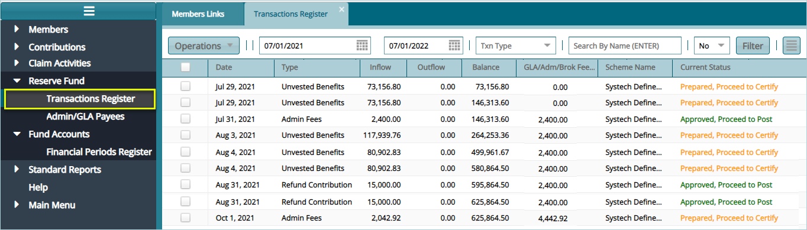

## Reserve Funds

FundMaster maintains records of balances (overpayments and underpayments) in different transactions. See relevant Reserve Fund
links in the enclosed drop-down menu below:

## Transactions Register

Click the **'Transactions Register'** link to open the Transactions Register where different transaction balances are listed. The transactions are normally recorded as **Inflows**, which denotes overpayments. These inflows can later be used to settle deficits, say later underpayments from the same sponsor account.

The movement of money from the Fund accounts to bridge the deficit is treated as an **Outflow**. The screenshot below shows a sample of a Reserve Funds Transactions Register in FundMaster:

