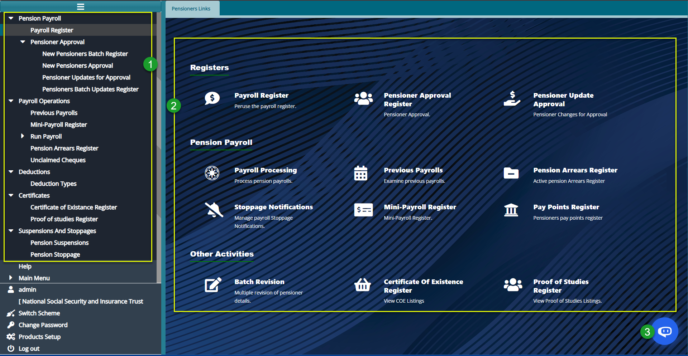
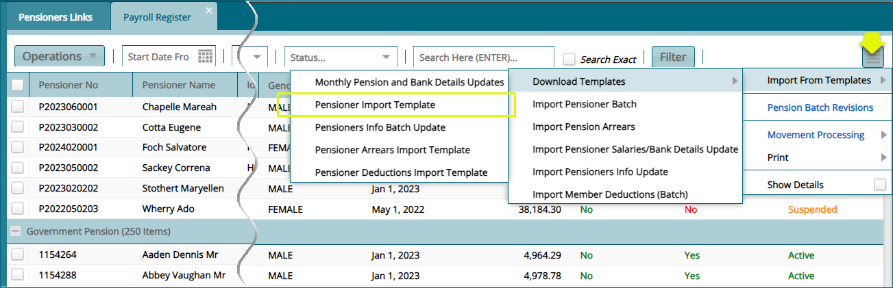
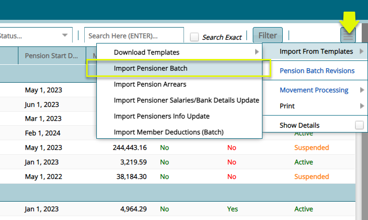
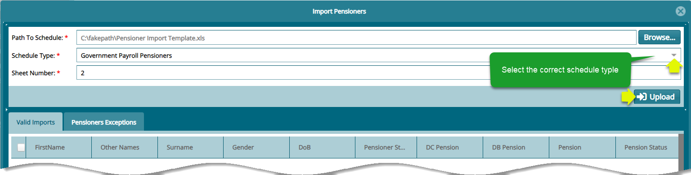
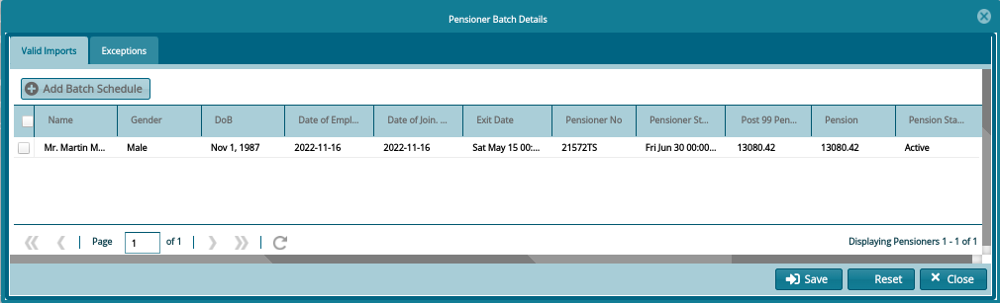

### Pensioners Module

The pensioners module contains information on scheme members that have
become eligible to receive their annuities/pension upon retirement. The
module allows for direct deductions from the annuity/pension to go into
other schemes like medical covers. Pensioners can add beneficiaries to
assume their annuities once they die. Depending on the status of the
pensioner, the annuity/pension can be suspended or reenabled from this
module. The panel also provides access to pension payroll processing
(for pensioners and beneficiaries), pension payroll reconciliation,
certificate of existence updating, pension liabilities processing, pay
points register administration, pension revisions, pension purchase and
commutations.

To access the Pensioners Module dashboard, click the **Pensioners Module**
link on the FundMaster landing page to open the **Pensioners Links** window
shown below:

**Action**

-   Click the menu item links listed on the left side pane in the
    section labelled 2 to access pensioners forms, registers and
    configure all pensioners-related settings.

-   Click the hot links under the section labelled 1 to access shortcut
    routes to commonly visited links in the pensioners module.

-   Click on the button labeled 3 to access the system\'s Intelligent
    Assistant (IA) help chatbot.

## Pensioner Upload Process

To onboard pensioners, a user must upload the pensioners in template
format with verified pension details including:

-   Member No: Member number acts as a connection between the pensioners
    register and the member register.

-   Pension status: The status of pension, which could be either active,
    deferred, suspended e.tc

-   Pensioner Number: This is the unique identity number for a
    pensioner.

## Batch Upload Method

To upload the pensioners in batch using a template, navigate to the
'Pensioners Register' and from the hamburger icon on the right, click
**'Import From Template'** and from the dropdown menu click 
**'Pensioner Import template'** to download a template as shown below:

Follow the steps as shown in the above screenshot to download the template to your
local machine. Fill in the template with the required data and navigate back to the 
**‘Import From Templates’** menu and click **‘Import Pensioners Batch’** 
to upload the pensioners as shown below:

Clicking the **‘Import Pensioner Batch’** to open the import pensioners 
window. From the window, click the ‘Browse’ button and navigate to 
where the template file is in your device. After establishing the
access path, select the ‘Schedule Type’ from the dropdown list,
key in the MS Excel sheet number and then click the **‘Upload’** button as shown below:

Clicking the **‘Upload’** button will populate the grid table within 
the import pensioners window with ‘Valid Import’ window showing the 
names of the pensioners. Clicking the ‘Exception’ tab will open the
exceptions window showing the errors that need to be corrected regarding
data in the template for a successful process. See screenshot below:

A successful batch upload process will be listed on the **'New pensioner Batch Register'** where the certification process is conducted as shown
on the above-mentioned register.

## Single Upload Method

The single pensioner upload method commences from the members register
when scheme member retires. At exit, if the member's benefits are
successfully calculated and approved, the member will be moved directly
to the **'New Pensioner Approval'** window.

