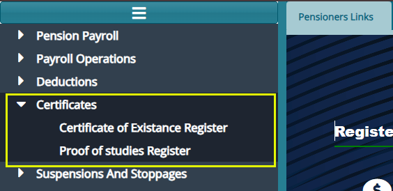
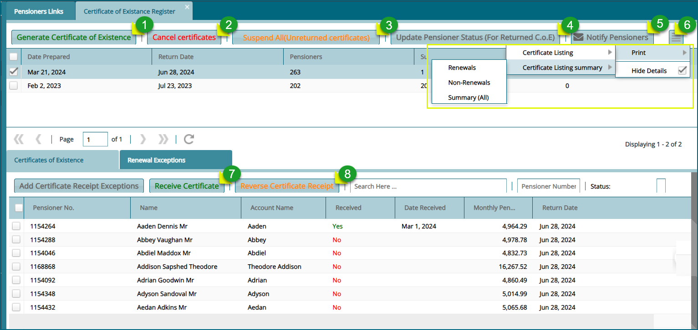
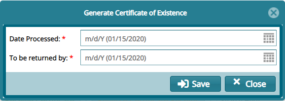

## Certificates

The **'Certificates'** menu gives access to the certificate of exitance
register and the proof studies register. See screenshot below:

### Certificate of Existence Register 

First, a Certificate of Existence (C.O.E) is proof that a particular
pensioner is still alive. FundMaster has a provision for generating
C.O.E for different cycles with each cycle having the deadline at which
a pensioner must return the COE before the period elapsed. All COE
cycles are listed on the **'Certificate of Existence Register'** as
shown below:

**Action**

-   Click **Label 1** button to open a dialog box through which a new
    COE cycle is generated by selecting cycle dates

-   Click **Label 2** button to cancel a selected cycle record from the
    grid table.

-   Click **Label 3** button to suspend all unreturned pensioners whose
    certificates are not returned by the set date.

-   Click **Label 4** button to update pensioners status for returned
    cycles.

-   Click **Label 5** button to send a notification to a pensioner upon
    receipt of a certificate.

-   Click **Label 6** button and from the dropdown menu click a link to
    view respective reports or click to open a grid table on the lower
    section showing pensioners' details.

-   Click **Label 7** button to receive a certificate from a selected
    pensioner.

-   Click **Label 8** button to reverse a received certificate.

#### Generation of C.O.E. Cycles

Clicking the **'Generate a Certificates of Existence'** button will
open a dialog box for inputting cycle dates as shown below:

