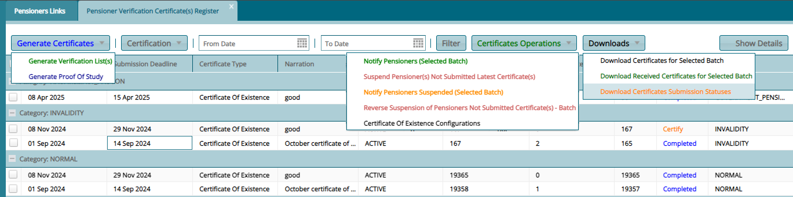
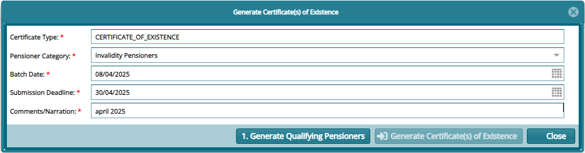
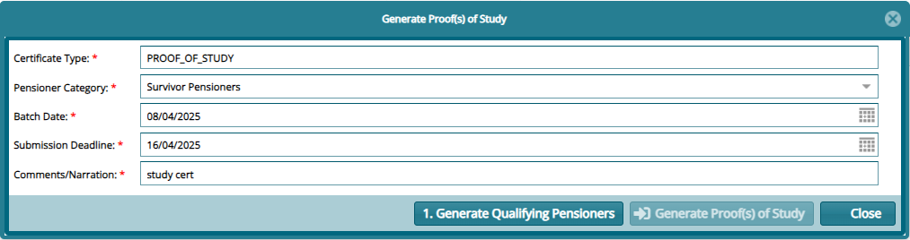

## Certificates

### Pensioners Certificates

A **Pensioners Certificate** is proof that a particular pensioner is
still alive. FundMaster has a provision for the generation of C.O.E for
different cycles with each cycle having the deadline in which a
pensioner must return the COE before the period elapsed. See
**Certificates of Existence Register** below:

To generate a list of pensioners for verification, click **Generate
Verification Lists(s)** button to open a dialog window to define the
type of certificate you what to generate as shown below:

A certificate of study can also be generated by clicking the **Generate
Proof of Study** button to load a dialog window as shown below:

