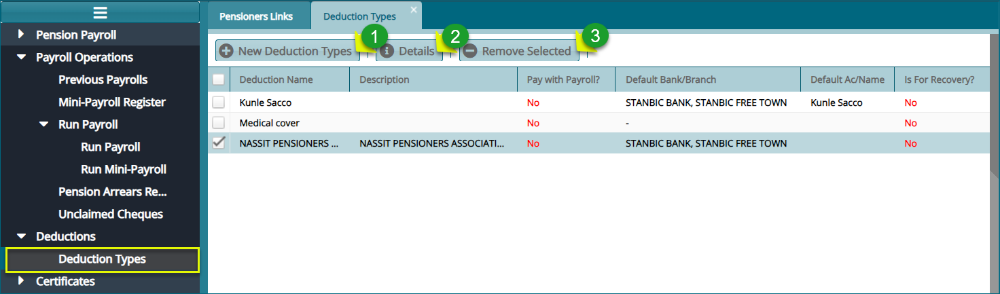
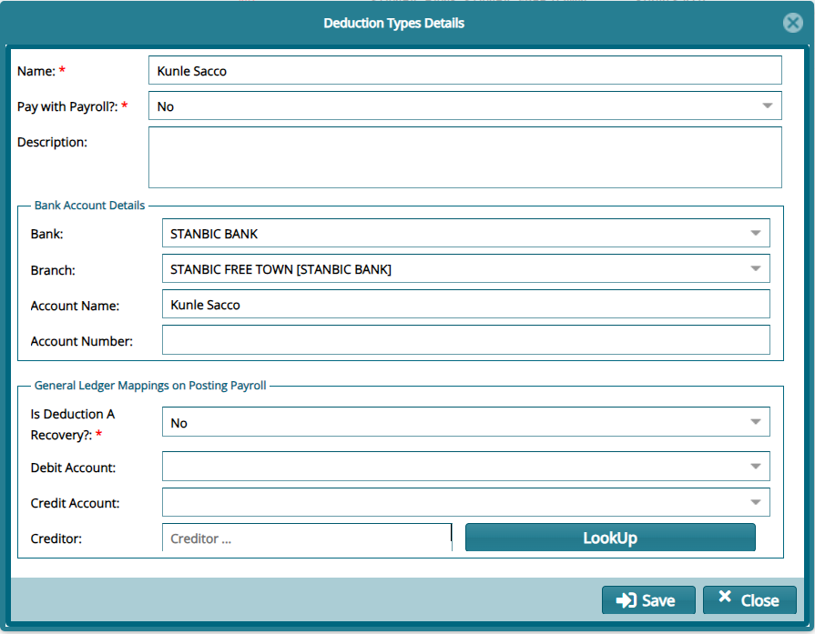
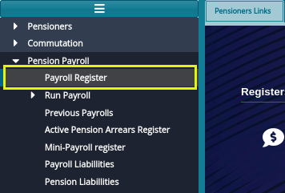
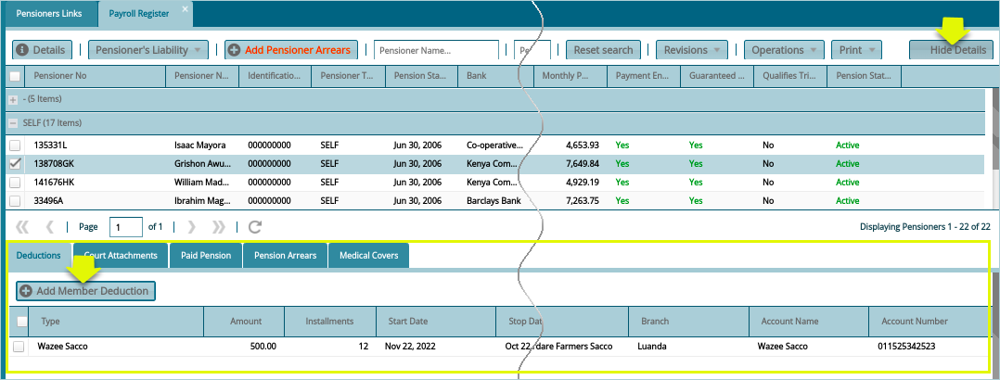
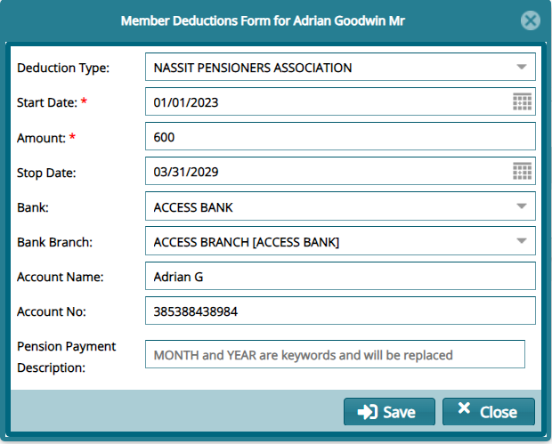
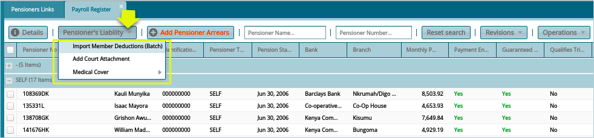
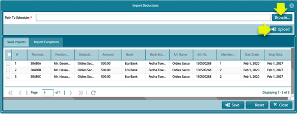
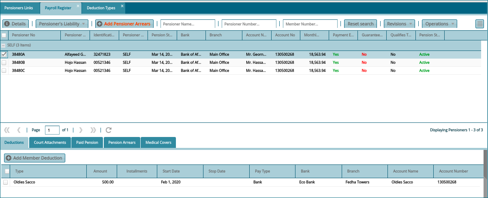

## Deductions

Deductions are different forms of substructions that are made from
pensioners' retirement pension and to remitted to other funds such as
medical covers or saccos, among others.

### Prerequisites

-   Deduction types must be added to the system

-   Deduction type bank details must be up to date

## Deduction Types

To add deduction types to the system, navigate to deduction menu and
click **'Deduction Types'** link to open the deduction types window as
shown below:

**Action**

-   Click **Label 1** button to add a new deduction.

-   Click **Label 2** button to view the details of a selected deduction
    type.

-   Click **Label 3** button to remove a selected deduction type from
    the list.

Clicking the **'New Deduction Type'** button will open a deduction types
dialog box through which the details of a new deduction type can be
added in the system as shown in the screenshot below:

## Adding Deduction to Pensioner

Once the details have been saved successfully the next action is to add
Pensioners deduction. There are two methods for adding deductions to
pensioners:

a.  Adding deduction for a single pensioner.

b.  Adding deductions via template for more than one pensioner.

### Adding Deduction for a Single Pensioner

To add single pensioner deduction, proceed to the left side pane and
click payroll register link as shown below:

Clicking the **'Payroll Register'** link will open the Payroll Register
window with a grid table showing all pensioners who are eligible for any
pay once the payroll has been validated and processed. To add deduction
for a single pensioner, select a pensioner from the list and click show
details button (it turns to hide details when clicked) on the right
upper corner. This will open a section on the lower part of the window.
Locate the Add Member deduction on the left side and click to launch a
dialog box for filling in details. See the screenshot below:

Clicking the **'Add Member Deduction'** button will pop up a pensioner
deduction form through which details of the deduction transaction are
captured as shown below:

### Adding Deductions Via Template

This applies when the user wants to add pensioner deductions for more
than one pensioner which will save user's time as opposed to adding
deductions for a single pensioner at a time.

### Prerequisites

-   Load the deduction template provided.

-   The deduction type code specified in the template must exist within
    the system if not it must be added.

To upload a deduction, navigate to the pensioners register as
demonstrated previously with a single pensioner. From the menu bar click
the Pensioner Liability and from the drop-down menu, select 
**'Import Member Deductions'** as shown in the screenshot below:

Clicking the **'Import Member Deductions'** button will load an import
deductions window. From this window click the **'Browse'** button and
navigate to the location of already loaded deduction template from your
files and click upload button which will populate the grid with both
valid and invalid deduction details as shown in the screenshot below:

To view the Pensioner's Deductions list, navigate to the Payroll
Register menu and select a Pensioner from the list. Click the 
**'Show Details'** checkbox at the right top corner as shown in the screenshot
below:

