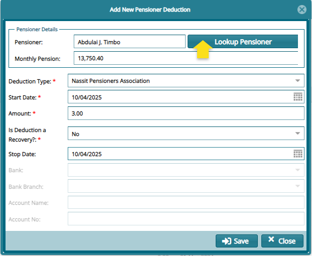

## Deduction

Pensioner Deductions are the different forms of money deductions made
from pensioners monthly pension to remit to other funds such as medical
covers or saccos. Below is a **Pensioners Deduction** window:

### Add New Pensioner Deduction

Click the **Add New Pensioner Deduction** from the Pension Deductions
window to open a dialog window for capturing the details of a new
deduction as show below:

Clicking the **Lookup Pensioner** button within the dialog window will
aid in selecting the name of the pensioner whose pension needs to be
subjected to a deduction. See the window below:

Click the **Apply Selected Pensioner** to load the name of the pensioner
into the previous dialog window.

#### *Deduction Certification*

After saving the new deduction, navigate to the **Pensioner Updates for
Approval** window to select and **Certify** and **Approve** the
deduction as shown in the screenshot below:

**NB:** After certification, the deduction record will disappear from
the Pensioner Updates for Approval window.

#### *Deduction Confirmation*

To see the deduction record, navigate back to the **Pensioner
Deduction** window and locate the pensioners name under the category of
the type of deduction made as shown in the screenshot below:

### Deduction Types

Clicking the **Deductions Type** button on the Pensioners Deduction
window will load a window displaying all types of deductions available.
You can click the **New Deduction Type** button to open a dialog box for
adding a new type of deduction. See screenshot below:

### New Deduction Type

Clicking the **New Deduction Type** button will open a Deduction Types
dialog box through which the details of a new deduction type can be
added in the system as shown in the screenshot below:

