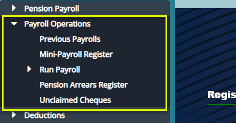
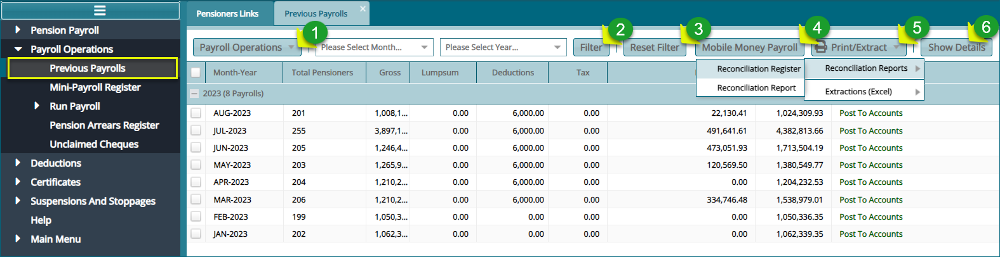
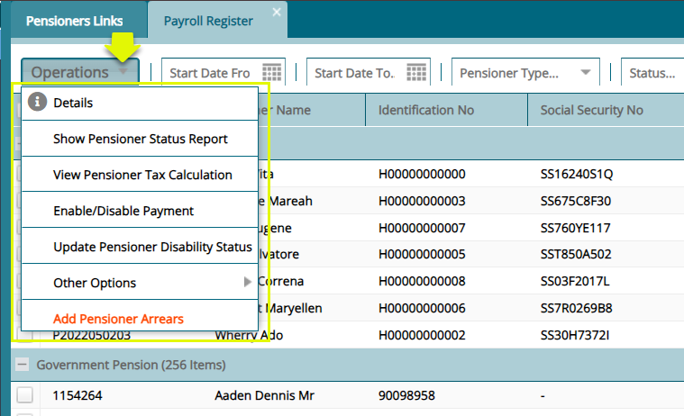
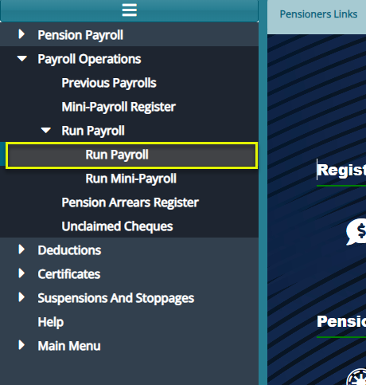
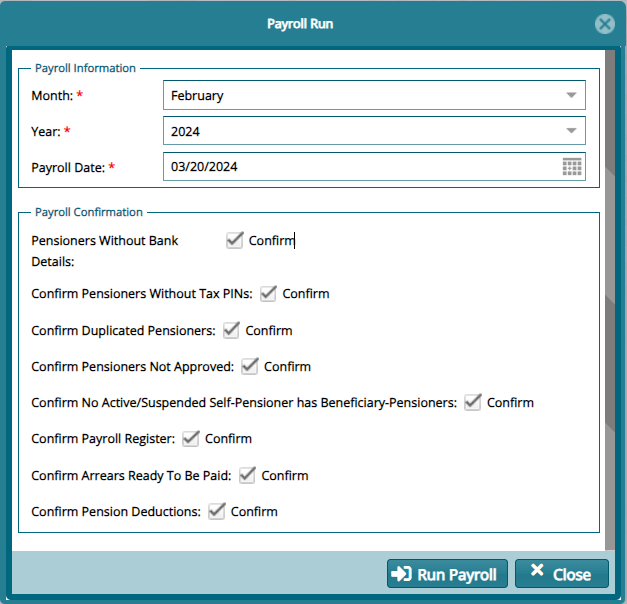
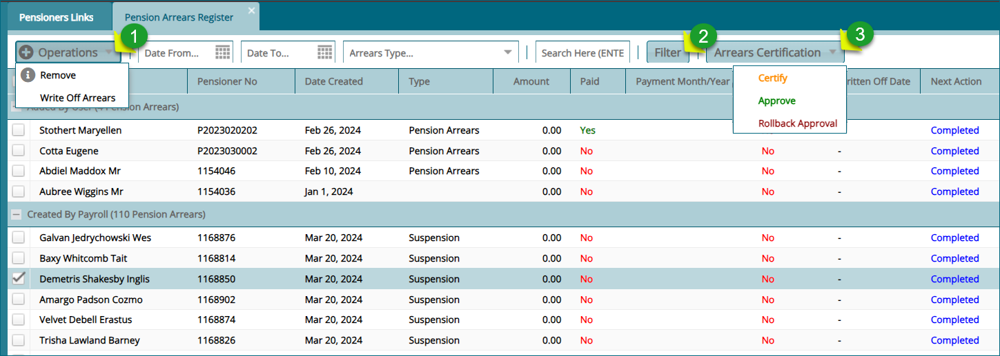
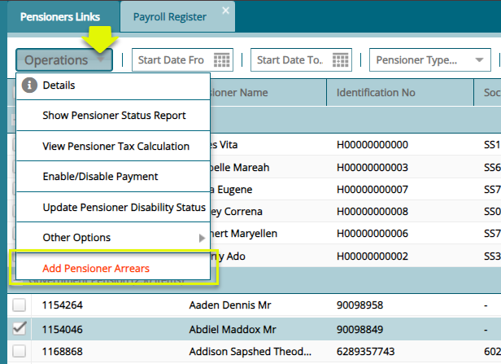
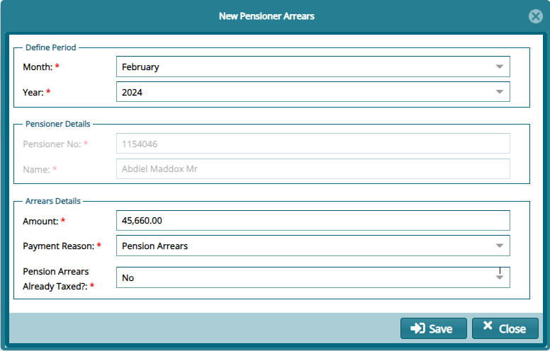
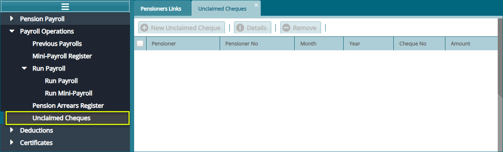

## Payroll Operations

The **'Payroll Operations'** window gives links to access to key payroll
related actions such as running a payroll window. See screenshot below:

### Previous Payrolls

The **'Previous Payrolls'** window lists all previous payrolls as shown
below:

**Action**

-   Click **Label 1** dropdown button to access links to various payroll
    related activities such as confirming payroll against staged
    payroll.

-   Click **Label 2** text boxes to configure how to filter records from
    the list.

-   Click **Label 2** button to filter records as per the settings done
    in the text boxes.

-   Click **Label 3** button to repopulate records as per default
    settings.

-   Click **Label 4** button to view a window with mobile payment
    transactions.

-   Click **Label 5** button to view reports in print format.

-   Click **Label 6** button to open a grid table on the lower section
    showing more details of a selected payroll.

**NB:** Select payroll month and year to view pensioner's payroll
details, else the grid will be empty.

#### Payroll Activities

From the payroll register, several actions can be taken upon a selected
pension on the payroll such as viewing a pensioner's tax calculation.
Click on a menu item to open respective windows where such actions can
be performed. See screenshot below:

### Run Payroll

To run the payroll, navigate to Pension Payroll menu, from the 
**'Run Payroll'** menu, click on Run Payroll sub-menu to pop up a payroll
checklist as shown in the screenshot below:

Clicking the **'Run Payroll'** link will open the payroll roll checklist
window. Confirm various payroll parameters and click 'Run Payroll'
button as shown in the screenshot below:

**Note:** If a payroll runs successfully, it will move to the previous
payroll window, where it can be confirmed against a staged payroll and
then certified.

### Pension Arrears Register

The **'Pension Arrears Register'** records all arears details and allows
selected arrears to be written off. See screenshot below:

**Action**

-   Click **Label 1** and from the drop-down menu, select to process an
    arrear write off or remove a selected arrears.

-   Click **Label 2** button to filter records in the register based on
    set parameters on the text fields.

-   Click **Label 3** button and from the dropdown list, certify,
    approve or rollback the approval process.

#### Adding Arrears

To add Arrears, select a pensioner from the payroll window to add an
arrears for that pensioner. From the **'Operations'** dropdown window,
click **'Add pensioner Arrears'** as shown below:

Clicking the '**Add Pensioners Arrears'** link will open a new
pensioners arrears form through which an arrear is added to a pensioners
payroll detail. Key in the arrears details and click the '**Save'**
button as shown in the screenshot below:

### Unclaimed Cheques

The **'Unclaimed Cheques'** window lists all the cheques written in a
scheme. See screenshot below:

