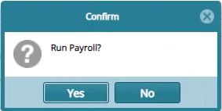

## Payroll Operations

The Payroll Operations menu gives access to payroll related access links
such as a link to access the pension arrears register. See screenshot
below:

### Previous Payroll

To view all the payrolls that have already been ran for different
months, click the **Previous Payrolls** link as to open the following
window:

### Run Payroll

To run the payroll, click on **Run Payroll** link to pop up a payroll
checklist window as shown in the screenshot below:

Clicking the **Confirm Payroll Register** checkbox will load a success
message box with a link to download an excel file with the details of
the payroll. Otherwise click **OK** to continue.

Click the **Run Payroll** button to open a confirmation dialog box and
click the **Yes** button as shown below:

Clicking the **Yes** button will trigger the execution of the payroll.
If the payroll rans successfully, the record will be displayed in the
**Previous Payroll** window from which the payroll can be confirmed,
certified and posted to accounts for payment. See screenshot below:

Confirm the payroll execution as shown in the screenshot below:

Certify and approve the process as shown in the screenshot below:

Post to accounts for payment as shown in the screenshot below:

### Pension Arrears Register

The **Pension Arrears Register** displays all types of pensioners
arrears detail and allows selected arrears to be written off. See
screenshot below:

#### Add New Arrear

To add an arrear for a pensioner, navigate to the **Payroll Register**
select the pensioner you need to process an arrear for. Locate and click
the **Add Pensioner Arrears** button from the **Operations** menu as
shown below:

Clicking the **Add Pensioner Arrears** menu item as shown above will
open a dialog window for capturing the details of the arrear. See
screenshot below:

#### Arrear Confirmation

To see the Arrear record, navigate back to the **Payroll Register**
window and select the pensioner whose arrear we just processes. Click
the **Show Details** icon to expand the window. From the **Pension
Arrears** tab, you can see the new arrear record has been added as shown
in the screenshot below:

### Pension Arrears Payment Register

The **Pension Arrears Payment Register** displays the pensioners arrears
processed for payment. See screenshot below:

