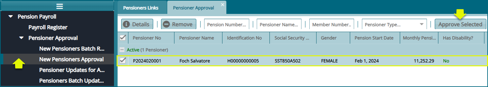
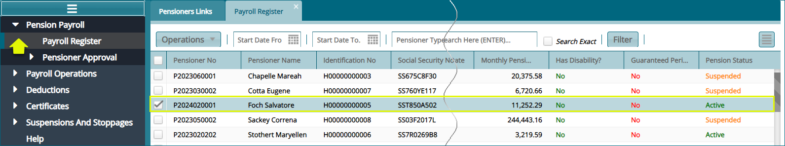
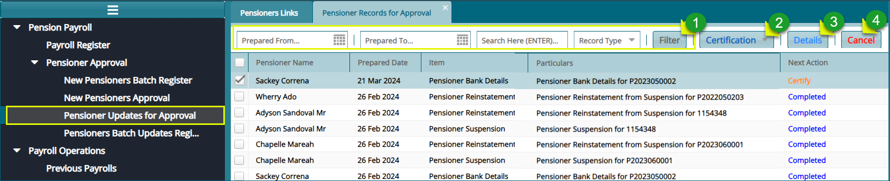
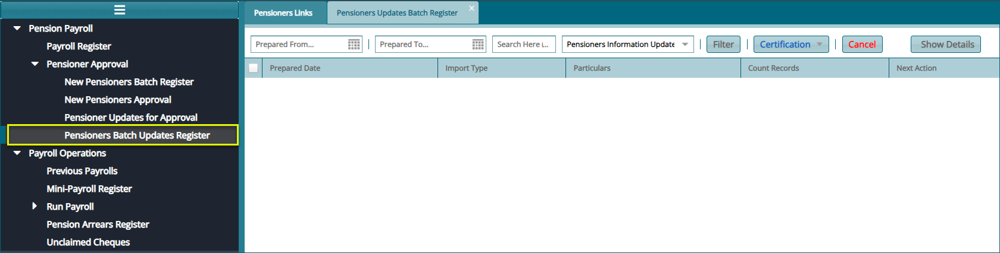

## Payroll Register

The **‘Payroll Register’** holds the details of pensioners who are qualified to receive their pension moneys. See screenshot below:

 
 **Action**

-   Click Label 1 dropdown button to access links to various payroll related activities such as adding pensioner arrears to a selected pensioner. 
-   Click Label 2 button to filter records as per the settings done in the text boxes.
-   Click Label 3 dropdown button to access extra links such as print menu to view a list of related reports. 

#### Payroll Activities

From the payroll register, several actions can be taken upon a selected pension on the payroll such as viewing a pensioner’s tax calculation. Click on a menu item to open respective windows where such actions can be performed. See screenshot below:

 

## New Pensioners Approval

All pensioners who come directly from the members module after exiting a
scheme through retirement are directly moved to the **'New Pensioners Approval'** 
window where they are approved and then moved to the payroll
register. See screenshot below:

**Note:** when a selected pensioner is approved by clicking the
**'Approve Selected'** button, as shown above, the pensioner will be
moved to the **'Approve Selected'** as shown below:

## Pensioners Updates for Approval

All pensioners whose details have been updated individually, are listed
on the '**Pensioners Updates for Approval'** window. Here the updates
are certified and approved and moved to the payroll register. See
screenshot below:

**Action**

-   Click **Label 1** button to filter records based on set parameters.

-   Click **Label 2** button and from the dropdown list, certify and
    approve the updates of a selected pensioner from the list.

-   Click **Label 3** button to open a dialog box showing the modified
    data for a selected pensioner.

-   Click **Label 4** button to cancel a selected record from the list.

## Pensioners Batch Updates Register

All pensioners whose details have been updated in batch using a
**template** are listed on the **'Pensioners Batch Updates Register'**
window. Here the pensioners whose details have been changed are
subjected to the certification process before moving to the payroll
register. See screenshot below:

