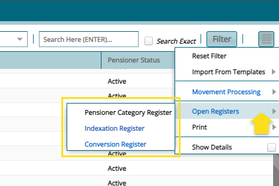
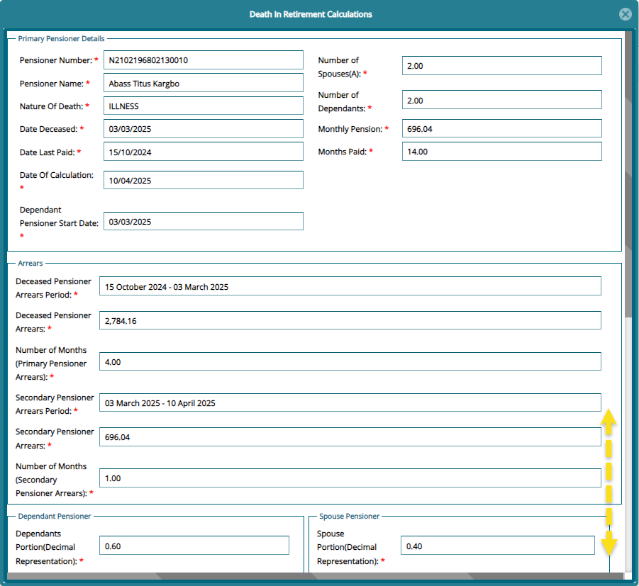

### Pension Register

## Payroll Register

The **Payroll Register** displays all the pensioners under different
categories. From this payroll window, several processes such as
**Movement Processing** can be initiated, accessing the **Open
Registers** and other operations such as adding pensioner arrears to a
selected pensioner from the grid table. See screenshot below:

### Movement Processing

The **Movement Processing** menu gives access to some special group of
processes that can be executed from the **Payroll Register** as shown in
the screenshot below:

### *Initiate Conversion*

To initiate the movement for processing a death in retirement, select
the name of the pensioner from the **Payroll Register**. From the
**Movements Processing** window, click **Initiate Conversion** to open a
dialog window where the details of the conversion are captured as shown
below:

**Actions**

-   Make sure you select each dependant from the list and click the
    **Dependants Documents** tab to upload all mandatory documents.
    Otherwise, the process can't be carried out without the documents
    received onto the system.

-   Click **Confirm Documents Checklist** to receive the documents
    relating to the death of the pensioner and finally click **Save
    Death in Retirement** button to process the conversion.

-   A successful conversion of the record upon clicking the save death
    in retirement, the name of the pensioner will disappear from the
    **Payroll Register** and appear in the **Conversions Register**.
    From this register the **Certification** of the conversion can be
    done and the **Benefit Calculation** for the deceased pensioner
    reviewed as shown below:

### *Pensioner Suspensions*

To suspend a pensioner, select his/her name from the **Payroll
Register** and click **Pension Suspensions** from the **Movements
Processing** menu as shown below:

Clicking **Pension Suspensions** will open a dialog box for capturing
the suspensions details as shown below:

Clicking **OK** will send the record to the **Pensioner Updates
Approval** window for certification as shown below:

A successful **Certification** of the suspension process will send the
pensioner to the **Suspended Pensions** register. See screenshot below:

### *Pension Stoppage*

To stop a pensioner, select his/her name from the **Payroll Register**
and click **Pension Stoppage** from the **Movements Processing** menu as
shown below:

Clicking **Pension Stoppage** will open a dialog box for capturing the
suspensions details as shown below:

Clicking **OK** will send the record to the **Pensioner Updates
Approval** window for certification as shown below:

A successful certification of the suspension process will send the
pensioner to the **Suspended Pensions** register. See screenshot below:

### *Invalidity to Reinstatement Transition*

To transit a pensioner from invalidity status to stop a pensioner
normal, select his/her name from the **Payroll Register** under the
Invalidity Category and click **Invalidity to Reinstatement Transition**
from the **Movements Processing** menu as shown below:

Clicking **Invalidity to Reinstatement Transition** will move the
pensioner from invalidity category back to the original pensioner
category. See screenshot below:

## Open Registers

The **Open Registers** menu host registers such as the Indexation and
Conversions registers from which key processes such as pension
indexation are initiated. See screenshot below:

### *Pension Category Register*

The **Pensioner Category Register** displays all the categories of
pensioners. From this window a new category can be created and others
removed as shown below:

### *Indexation Register*

The **Indexation Register** displays for the pension payrolls that have
previously been indexed. From this window a new indexation can be done
and certified among other activities. See screenshot below:

Clicking the **Index Pension** button will open a window where a new
indexation can be parameterized and processed. See screenshot below:

A successful indexation upon clicking the **Process Indexation** button
will display the new indexation record in the indexation window for
certification processing as shown below:

### *Conversion Register*

Clicking **Conversion Register** from the Open Register will open a
register where all the initiated death in retirement claims are
displayed a shown below:

#### *Death in Retirement Benefits Calculation*

Clicking **Show Calculation** from the **Operation** dropdown menu will open
a window where the pensioners death in retirement benefits calculation
is tabulated as shown below:

#### *Death in Retirement Documents Check List*

Clicking **Document Checklist** from the conversion register will open a
window where all needed documents for processing a death claim are
listed. From this window new documents can be added to the checklist as
shown below:

## Pensioners Approval

The pensioners approval menu gives access to approval related register
such as the new pensioner approval register. See screenshot below:

Clicking the **New Pensioners Batch Approval Register** will open a
register where new pensioners uploaded in batch are displayed ready for
**Certification** among other actions such as cancelling the batch
approval request. See screenshot below:

### *New Pensioners Approval Register*

Clicking the **New Pensioners Approval Register** will open a register
where new pensioners uploaded individually are displayed ready for
**Certification** among other actions such as viewing the details of a
record. See screenshot below:

### *Pensioners Updates for Approval*

Clicking the **Pensioners Update Approval** will open a register where
updated made to pensioners records are displayed ready for
**Certification**. See screenshot below:

### *Pensioners Updates Batch Register*

Clicking the **Pensioners Update Batch Register** will open a register
where updated made to pensioners records in batches are displayed ready
for **Certification**. See screenshot below:

