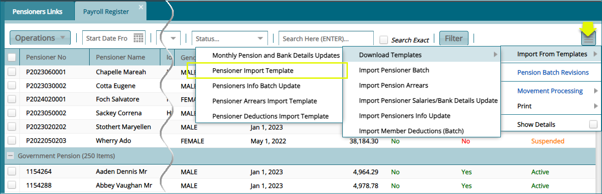
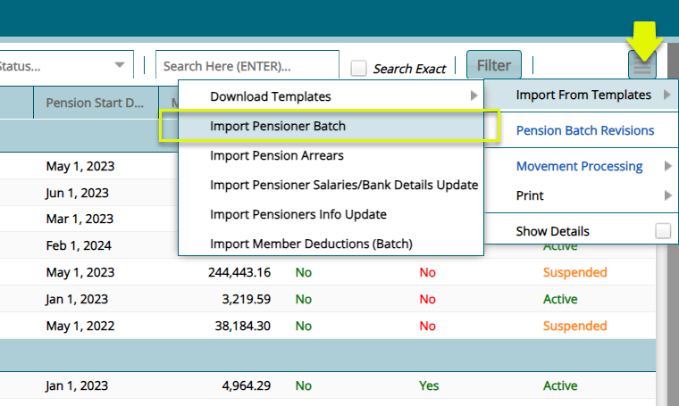
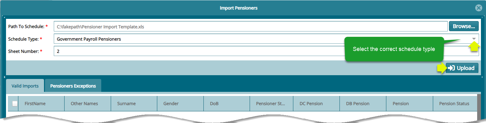

### Pensioner Upload Process

To onboard pensioners, a user must upload the pensioners in template format with verified pension details including:

-   Member No: Member number acts as a connection between the pensioners register and the member register.

-   Pension status: The status of pension, which could be either active, deferred, suspended e.tc

-   Pensioner Number: This is the unique identity number for a pensioner.

## Batch Upload Method

To upload the pensioners in batch using a template, navigate to the 'Pensioners Register' and from the hamburger icon on the right, click
**'Import From Template'** and from the dropdown menu click **'Pensioner Import template'** to download a template as shown below:

Follow the steps as shown in the above screenshot to download the template to your local machine. Fill in the template with the required data and navigate back to the **‘Import From Templates’** menu and click **‘Import Pensioners Batch’** 
to upload the pensioners as shown below:

Clicking the **‘Import Pensioner Batch’** to open the import pensioners window. From the window, click the ‘Browse’ button and navigate to where the template file is in your device. After establishing the access path, select the ‘Schedule Type’ from the dropdown list,
key in the MS Excel sheet number and then click the **‘Upload’** button as shown below:

Clicking the **‘Upload’** button will populate the grid table within the import pensioners window with ‘Valid Import’ window showing the 
names of the pensioners. Clicking the ‘Exception’ tab will open the exceptions window showing the errors that need to be corrected regarding data in the template for a successful process. See screenshot below:

A successful batch upload process will be listed on the **'New pensioner Batch Register'** where the certification process is conducted as shown on the above-mentioned register.

## Single Upload Method

The single pensioner upload method commences from the members register when scheme member retires. At exit, if the member's benefits are
successfully calculated and approved, the member will be moved directly to the **'New Pensioner Approval'** window.

