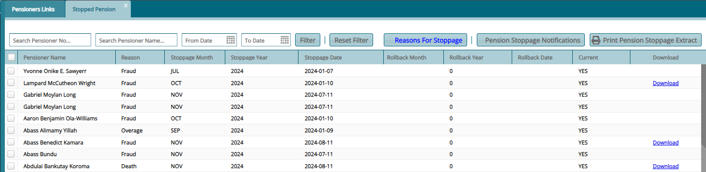
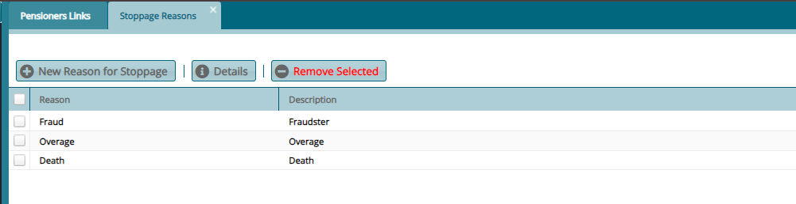

### Stoppages

## Stopped Pensioners

All pensioners stopped from receiving their monthly pension are listed in the **Stopped Pensioners** window. **Reasons for Stoppage** can be added from this window as shown below:

Clicking the **Reasons for Stoppage** button will open a window where the reasons are listed, and new ones can be added. See screenshot below:

