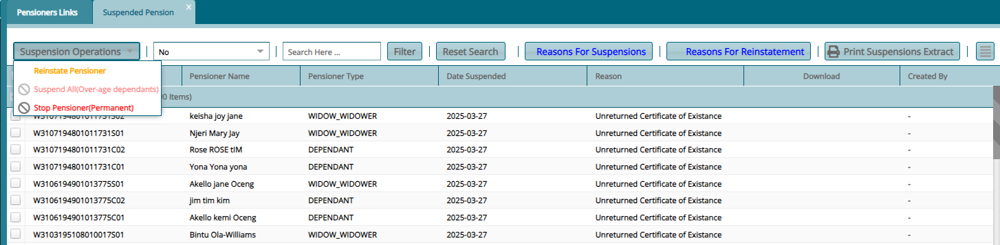
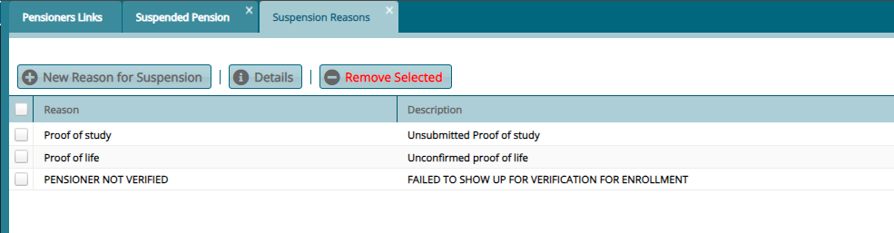
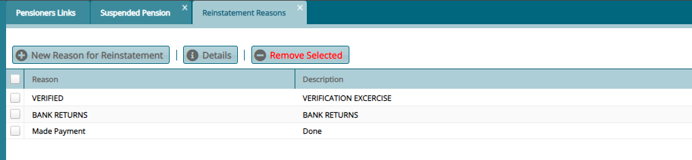

### Suspended Pensioners

All pensioners suspended from receiving their monthly pension are listed
in the **Suspended Pensioners** window. A pensioner can be reinstated,
reason for suspensions can be captured together with **reasons for
reinstatement** as shown below:

Clicking the **Reasons for Suspension** button will open a window where
the reasons are listed, and new ones can be added. See screenshot below:

Clicking the **Reasons for Reinstatement** button will open a window
where the reasons are listed, and new ones can be added. See screenshot
below:

