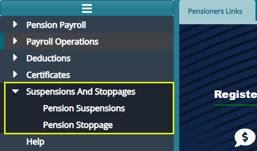
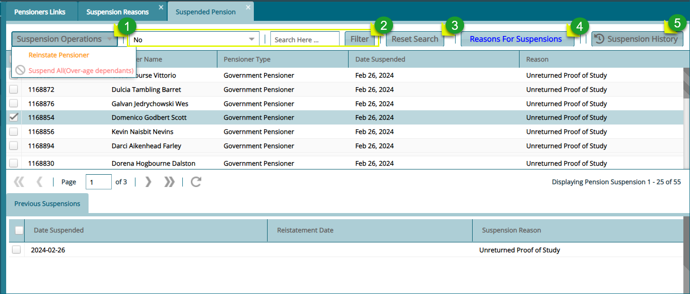
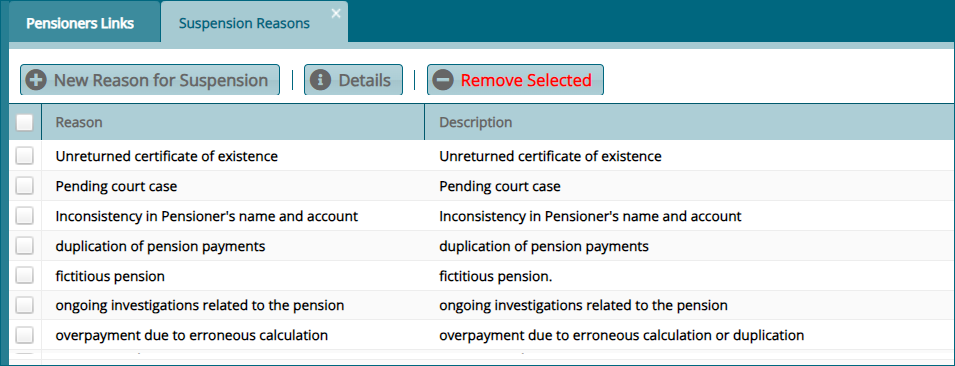
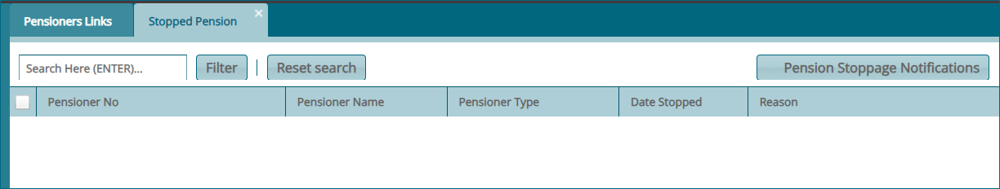

### Suspensions and Stoppages

The **'Suspensions and Stoppages'** menu gives access to the suspensions
register and stoppages register. See screenshot below:

## Pension Suspensions

The **'Pension suspension'** window lists all the pensioners who are
suspended from receiving their pensions. From this window a selected
pensioner can be reinstated, the reasons for suspensions window accessed
and suspension history of a selected pension viewed as shown below:

**Action**

-   Click **Label 1** and from the drop-down menu, select to reinstate a
    pensioner or suspend all overage dependants.

-   Click **Label 2** button to filter records based on set parameters
    on the text fields.

-   Click **Label 3** button and reset filtered records to default.

-   Click **Label 4** button to open a window showing a list of reasons
    for suspension.

-   Click **Label 5** button to via a section showing the history of the
    selected pensioners.

## Reasons for Suspension

The **'Reason for Suspension'** window displays a list of reasons for
suspension. From this window new reasons for exit can be added to the
list. See screenshot below:

## Pension Stoppage

The **'Pension Stoppage'** window displays a list of all pensionerss stopped from receiving pensions money. See sreenshot below:

