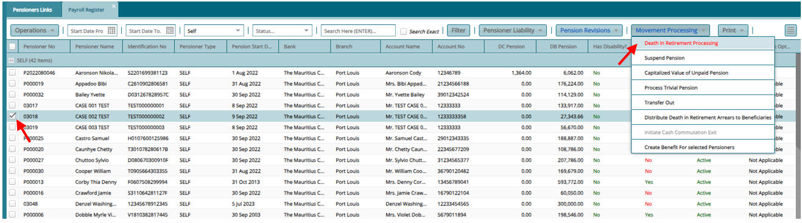
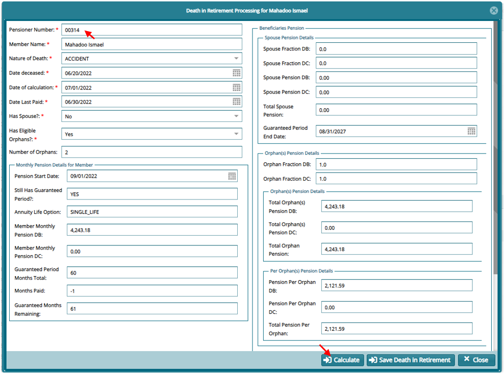
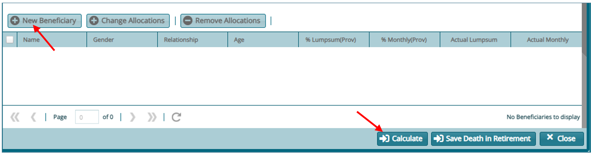
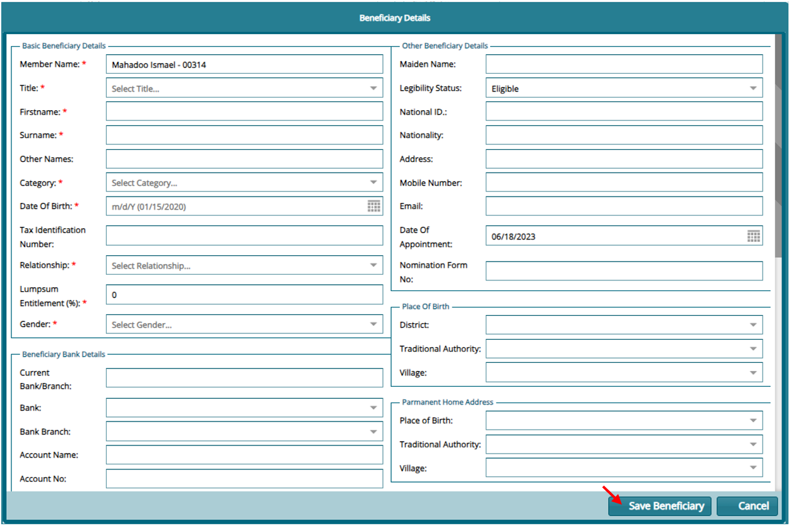

### Processing Death in Retirement

1.  From the payroll Register, select pensioner to process, click on **"Movement Processing"** then on **"Death in Retirement Processing"**

2.  On the next window fill in the first section and then click on **"Calculate"**

If there are beneficiaries to be added scroll down and click on **"New beneficiary"** and re-calculate

If all information for the beneficiaries is added click on **"Save Death in Retirement"**

The added Beneficiaries will sit on the Pensioner Approval register. Approve them and the process will be complete.

