### Other Pensions Operations

### Importing Pensioner EDF

-   On the Payroll Register.

-   Click on the Button Operations and click Import from Templates and on to Import Pensioner EDF from the drop down.

-   On the window that pops up, select the file to Upload

-   NB: Be sure to use the custom date to format effective date in the format to match MRA format

-   Click Upload and proceed to Save after confirming there are no Exceptions.

**Overriding System Calculated Figures**

-   Click on Payroll Register

-   Click on the Button Operations and click Import from Templates and click on download from templates then download -- Monthly Pension and bank details update.

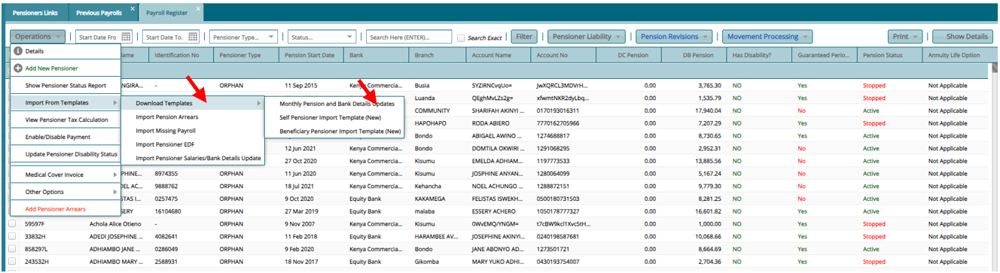

-   Fill the template with the details accordingly and save.

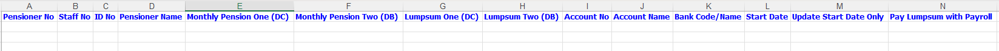

-   To import Click on the Button Operations and click Import from Templates and click on import Monthly Pension and bank details update browse and upload the template and save id there are no exceptions.

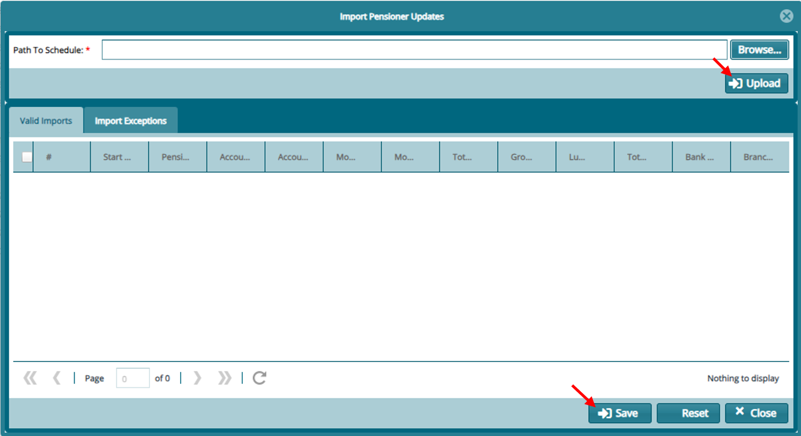

**Pensioner Linkage**

-   From Main Menu Open Pensioners Register

-   Click on Payroll Register

-   Select the pensioners that you wish to link (Orphans, Window(er)) from the register

-   Then Click on Operations, then other options then on link pensioners

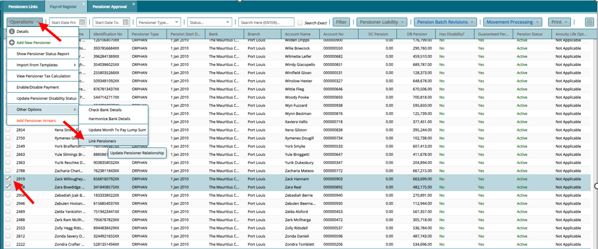

-   After linking the pensioners, they will now sit on the pensioner approval register

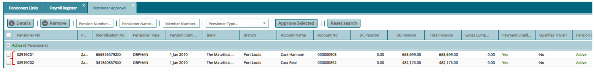

-   Proceed to approve

***NB. Note the change of their pensioner no to show the linkage***

**Pension Adjustment**

a)  From the **"Pensioner Register"** Click on **"Pension Batch Revision"**

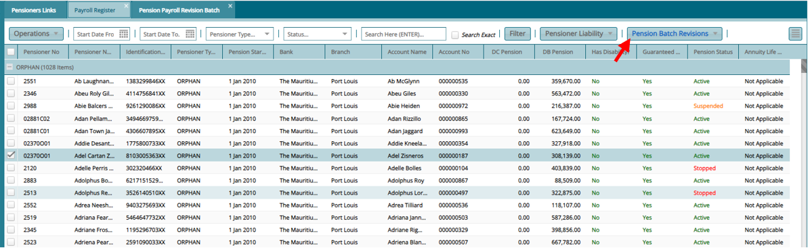

b)  On the Register That opens **"Pension Batch Revision Register".** Click on **"Revise Pension"**

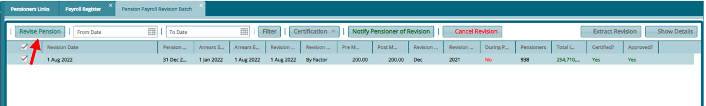

c)  On the window that opens input the details accordingly and click process Pension Revision.

**Note**

-   **Revision Pension Start Cut-off Date -** All pensioners whose start date is before this date will be in this revision.

-   **Effective Date/Arrears Start Date** -- Month which back payments should start

-   **Payroll Arrears End Date --** Month which back payments should end

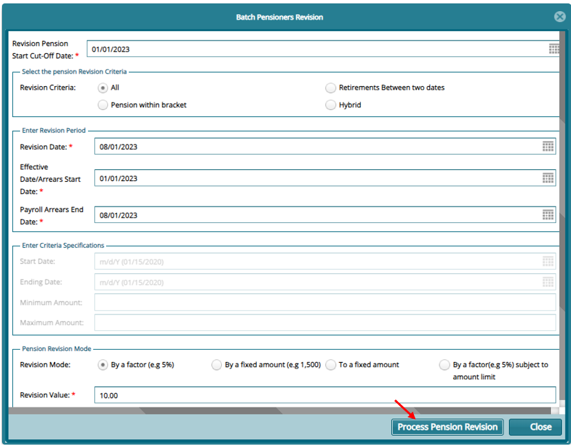

d)  Proceed to certify and approve the revision

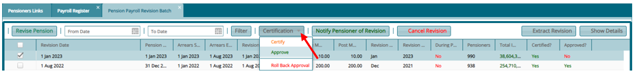

**Change Month to Pay Lumpsum**

-   From Main Menu Open Pensioners Register

-   Click on Payroll Register

-   Select the pensioners that you wish to update month to pay lumpsum

-   Then Click on Operations, then other options then on update month to pay lumpsum

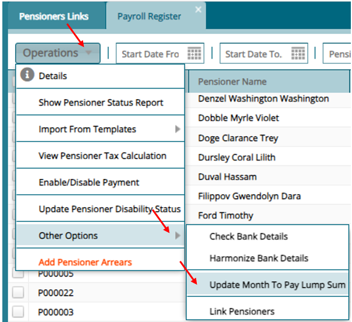

Input the new month and year on the window that opens and update

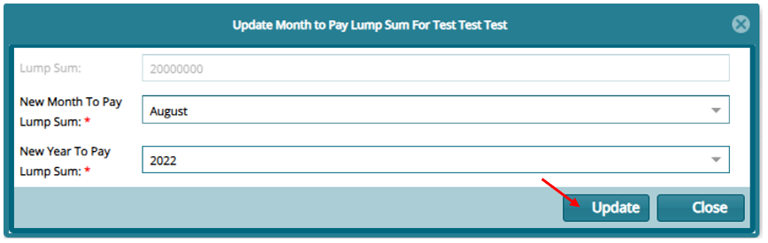

**Overriding Pensioner EDF**

To Override pensioner EDF,

-   Click on the details of a selected pensioner and on the option "Override previously submitted EDF?" select YES and save. The pensioner will now sit on the approval register.

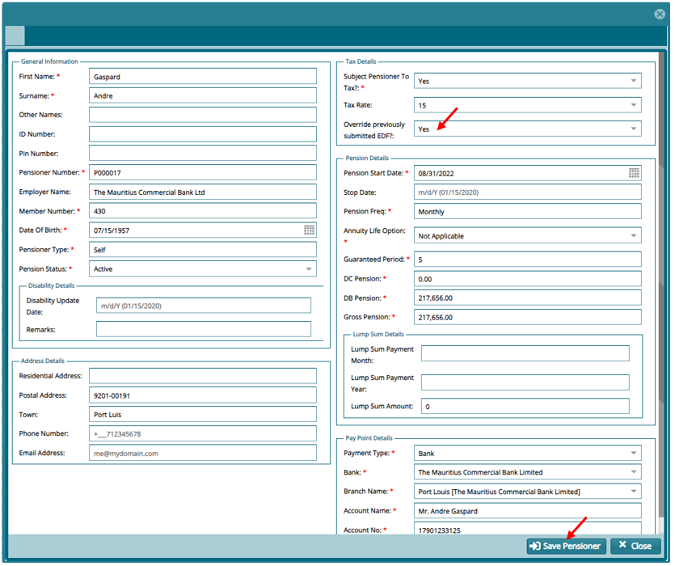

-   For the pensioner to use an EDF just upload it and the system will automatically pic it during the payroll run.