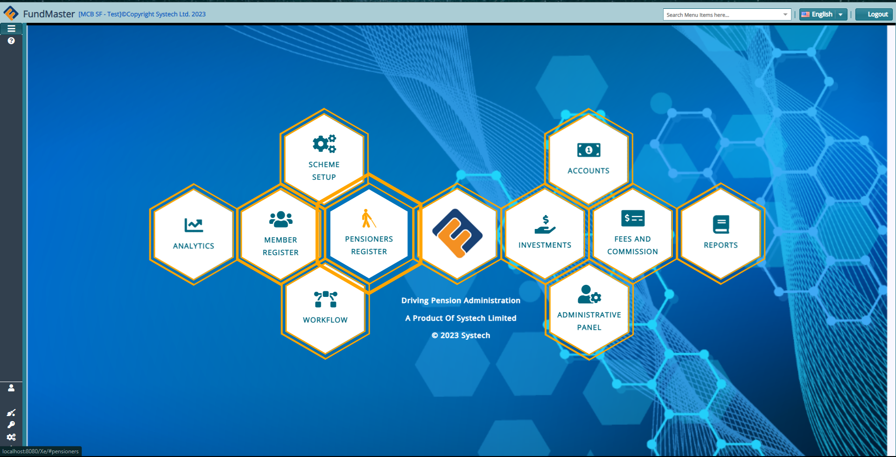
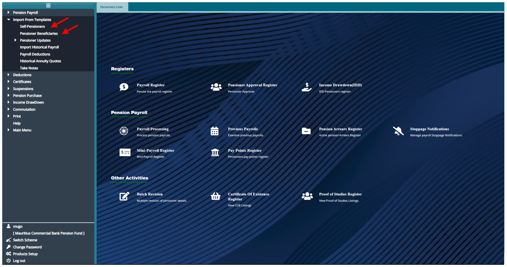
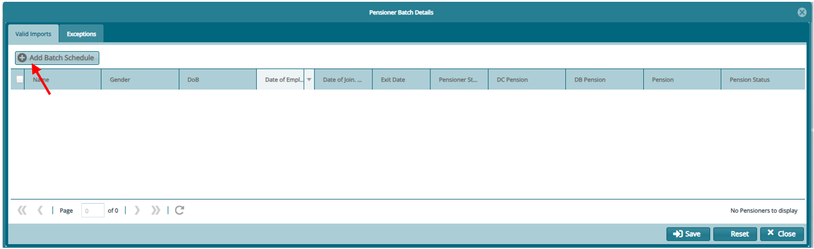
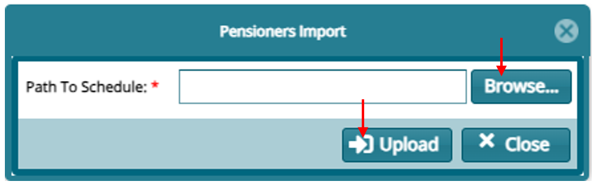
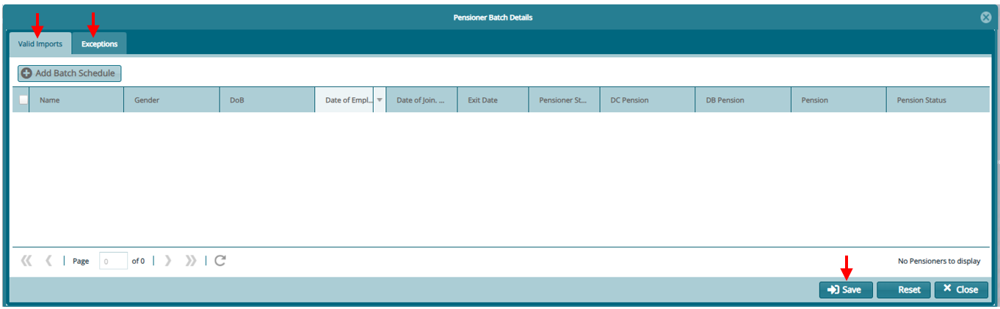
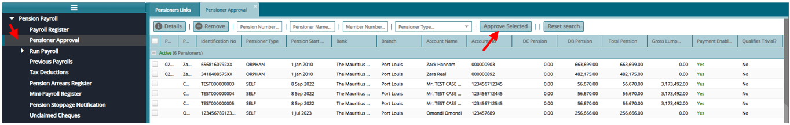
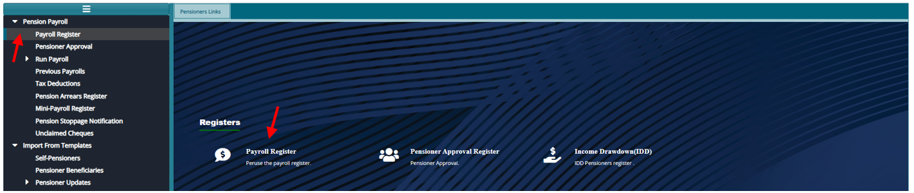

### Pensioners Register

From the Landing Menu, click on **"Pensioner Register"**

### Adding New Pensioners**

To import new Pensioners.

1.  Prepare the templates as provided: Self pensioners template or the beneficiary pensioners template (orphan & widow-widower)

2.  From the Pensioners Register

-   Click the menu item links listed on the left side pane.

-   Then click on **"Import from Templates"**

-   For importing self-pensioners click on **"Self-Pensioners"**

-   For importing beneficiary pensioners click on **"Pensioner Beneficiaries"**

3.  From the window that opens. Click on **"Add Batch Schedule"**

-   On the window that opens, click on **"Browse.."** to find your template then **"Upload"**

-   Confirm on the **"Valid Imports"** and incase of any **"Exceptions"** correct the template and repeat the process and
    click on save if all is confirmed.

-   The imported pensioners now sit on the **"Pensioner Approval"**

-   Select the pensioners to approve from the register then click on **"Approve Selected"**

When approved the pensioners will sit on the **"Payroll Register"**

