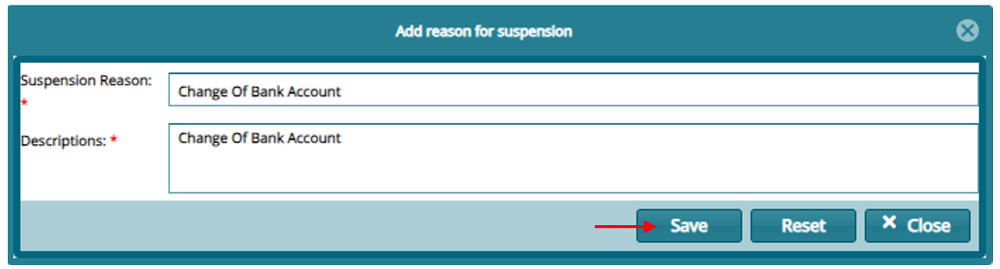

### Pensioner Suspension

Click **"Suspensions"** then on **"Reason for Suspensions"** on the Left panel from the pensioner Register.

-   On the register that opens Suspension Reason. Click on "**Add"**

-   On the window that opens provide the reason and **"Save"**

To process suspension: Proceed to the payroll register and click on **"Movement Processing"** and then on **"Suspend Pension"**

Suspend a selected pensioner by clicking the uspend Pension menu item and then click **Ok** on the dialog box as shown below:

