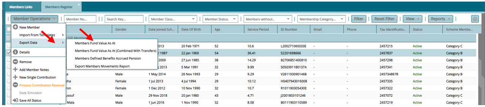

### Period End Processes

### Running of PMA

-   From the Main Menu click on **Members Register**.

-   Then Click on **Financial Years Register**.

-   On the Screen that loads, select the financial year you wish to run balances for.

-   Click on the button **Jump To** and select **Monthly Periods** from the drop down.

-   Select the Monthly period you wish to run balances for.

-   Click on **Period End Processes** then on **Income Allocation Using Interest Rate** from the drop down.

-   Click on **Batch Run** from the drop down then on **Scheme Level**.

-   On the window that pops up, select the interest rate to use either Declared or Provisional.

-   Finally click on **Run Balances**

### Accrued Pension

-   From the Main Menu click on **Members Register**.

-   Then Click on **Financial Years Register**.

-   On the Screen that loads, select the financial year you wish to run balances for.

-   Click on the button **Jump To** and select **Monthly Periods** from the drop down.

-   Select the Monthly period you wish to run balances for.

-   Click on **Period End Processes** then on **Defined Benefits Pension Accrual** from the drop down.

-   On the window that pops up, click on **Run Pension Accrual (All Members in Scheme)**

Once the two processes have completed successfully, use these additional steps to confirm the values computed by the system.

-   Open the **"Member Register"**

-   On the register that opens **"Sponsor Register".** Shows the list of employers in the scheme and members can be viewed by **Double Clicking** on the Sponsor.

-   Click on **Member operations** then on **Export Data (Members Fund Value As At, Members Fund Value As At (Combined With Transfers), Members Defined Benefits Accrued Pension)**

**Close Month**

-   From the Main Menu click on **Members Register**.

-   Then Click on **Financial Years Register**.

-   On the Screen that loads, select the financial year you wish to run balances for.

-   Click on the button **Jump To** and select **Monthly Periods** from the drop down.

-   Select the month for which you want to close.

-   Click on **Close Period** button

-   Click on This Scheme option from the drop down.

-   Select the appropriate option that applies for that month

    -   Permanently Close

    -   Soft Close

    -   Close
